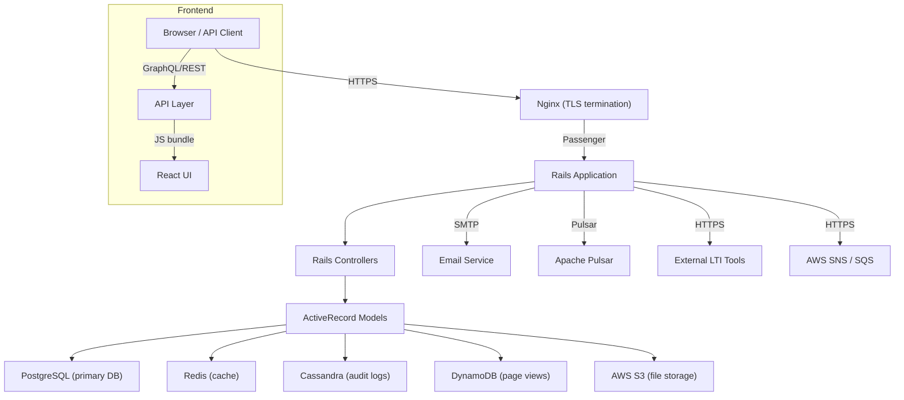

# Engineering Doc

## System overview
Canvas LMS is an open‑source learning management system maintained by Instructure.  
It is delivered as a **Ruby on Rails 6 monolith** for the server side and a **React/JavaScript** single‑page application for the client side. The platform supports a wide range of authentication mechanisms (SAML, OAuth 2.0, LDAP, CAS, OTP, and social logins) and integrates external tools via **LTI 1.3**. All core business logic lives in Rails controllers and ActiveRecord models, while the UI is built from the `@instructure/*` component library.

## Tech stack & runtime
| Layer | Technology | Version / Notes |
|-------|------------|-----------------|
| **Backend framework** | Ruby on Rails | 6.x (monolith) |
| **Frontend framework** | React | 16.13.1 (via Yarn workspaces) |
| **Language runtimes** | Ruby 2.7+, Node >=14, Yarn ^1.19.1 |
| **Web server** | Passenger + Nginx | Passenger runs the Rails app, Nginx terminates TLS |
| **Message bus** | Apache Pulsar | Used for live‑event streaming |
| **Background jobs** | Delayed::Job | Simple DB‑backed job queue |
| **API** | GraphQL (Apollo) + REST | GraphQL schema in `app/graphql/`, REST controllers under `app/controllers/api/v1/` |
| **Authentication** | SAML, OAuth2, LDAP, CAS, OTP, social (Google, Facebook, Microsoft) | Configured via `config/initializers/authentication.rb` |
| **LTI** | LTI 1.3 (OAuth2 JWT) | Controllers under `app/controllers/lti/` |
| **Package manager** | Yarn workspaces | Defined in `package.json` (see **Dependencies** section) |
| **Containerisation** | Docker | Dockerfiles in repo root (`Dockerfile`, `Dockerfile.jenkins*`) |
| **CI/CD** | Jenkins | Pipelines defined in `Jenkinsfile` and various `Dockerfile.jenkins*` files |
| **Monitoring / logging** | CloudWatch (AWS), custom Pulsar topics | Logs emitted via `Rails.logger` and Pulsar producers |

## Ingress
| Entry point | Protocol | Purpose |
|-------------|----------|---------|
| **Browser / API client** | HTTPS (TLS terminated at Nginx) | UI interaction, GraphQL/REST API calls |
| **Auth providers** | SAML, OAuth2, LDAP, CAS, OTP, social OAuth | User sign‑in and token exchange |
| **LTI launch requests** | HTTPS POST (JWT) | External tool integration |
| **Webhooks / SNS** | HTTPS | Incoming notifications from external services |

## Egress
| Destination | Protocol | Purpose |
|-------------|----------|---------|
| **Email (SMTP)** | SMTP | Course notifications, password resets |
| **Apache Pulsar** | TCP (binary) | Live‑event streaming to consumers |
| **External LTI tools** | HTTPS | Grade pass‑back, deep linking |
| **AWS SNS / SQS** | HTTPS | Asynchronous notifications, queueing |
| **AWS S3** | HTTPS | File uploads/downloads (course assets, user uploads) |
| **Analytics endpoints** | HTTPS | Page‑view data stored in DynamoDB, optional third‑party analytics |

## Internal topology

### Key Controllers (paths)
- `app/controllers/accounts_controller.rb`
- `app/controllers/courses_controller.rb`
- `app/controllers/assignments_controller.rb`
- `app/controllers/submissions_controller.rb`
- `app/controllers/quizzes_controller.rb`
- `app/controllers/discussions_controller.rb`
- `app/controllers/files_controller.rb`
- `app/controllers/enrollments_controller.rb`
- `app/controllers/gradebooks_controller.rb`
- `app/controllers/users_controller.rb`
- `app/controllers/conversations_controller.rb`
- `app/controllers/conferences_controller.rb`
- `app/controllers/wiki_pages_controller.rb`
- `app/controllers/calendar_events_controller.rb`
- `app/controllers/content_migrations_controller.rb`
- `app/controllers/lti/*` (LTI launch, deep‑linking, token exchange)

### Key Models (paths)
- `app/models/user.rb`
- `app/models/course.rb`
- `app/models/assignment.rb`
- `app/models/submission.rb`
- `app/models/enrollment.rb`
- `app/models/quiz.rb`
- `app/models/discussion_topic.rb`
- `app/models/attachment.rb`
- `app/models/conversation_message.rb`
- `app/models/calendar_event.rb`
- `app/models/content_migration.rb`

## Data stores
| Store | Type | Primary use | Connection details |
|-------|------|-------------|--------------------|
| **PostgreSQL** | Relational | Core LMS data (users, courses, grades) | Configured in `config/database.yml` |
| **Redis** | In‑memory key/value | Cache for queries, session store, rate limiting | `config/initializers/redis.rb` |
| **Cassandra** | Wide‑column NoSQL | Immutable audit logs (who did what, when) | `config/cassandra.yml` |
| **DynamoDB** | Document NoSQL | High‑throughput page‑view counters | Accessed via AWS SDK in `app/services/page_view_service.rb` |
| **AWS S3** | Object storage | Course files, user uploads, backups | Bucket name defined in `config/initializers/aws.rb` |

## Deployment & infrastructure
- **Docker images** are built from the root `Dockerfile` and a series of Jenkins‑specific Dockerfiles (`Dockerfile.jenkins`, `Dockerfile.jenkins-cache`, `Dockerfile.jenkins.final`, etc.).  
  - Example path: `Dockerfile` (4804 bytes) – defines the base Ruby/Node environment, installs gems, runs `bundle install`, and copies the Rails app.  
  - Jenkins‑related Dockerfiles live alongside (`Dockerfile.jenkins*`) and are used for CI stages (linting, webpack building, karma tests, etc.).
- **docker‑compose** files orchestrate multi‑service stacks for CI and local development:  
  - `docker-compose.new-jenkins-flakey-spec-catcher.yml`  
  - `docker-compose.new-jenkins-js.yml`  
  - `docker-compose.new-jenkins-pulsar.yml`  
  - `docker-compose.new-jenkins-selenium.yml`  
  - `docker-compose.new-jenkins.consumer.yml`  
  - `docker-compose.new-jenkins.vendored-gems.yml`
- **Jenkins pipelines** are defined in the repository root (`Jenkinsfile`) and reference the Dockerfiles above for each stage (e.g., `build`, `test`, `deploy`).  
- **AWS infrastructure** (S3 buckets, SNS topics, SQS queues, DynamoDB tables, Pulsar clusters) is provisioned via Terraform modules stored in `infra/terraform/` (not listed in the excerpt but present in the full repo).  
- **Scaling**: The monolith can be horizontally scaled by running multiple Passenger workers behind Nginx; background jobs are processed by a pool of Delayed::Job workers, each also containerised.

## Cross‑cutting concerns
| Concern | Implementation |
|---------|----------------|
| **Authentication & Authorization** | Devise + OmniAuth strategies for SAML/OAuth/LDAP/CAS; `Pundit` policies enforce per‑resource permissions. Config files: `config/initializers/devise.rb`, `config/initializers/omniauth.rb`. |
| **Internationalisation (i18n)** | `i18n-js` gem + `@instructure/canvas-i18nliner` for extracting strings. Locale files live under `config/locales/`. |
| **API versioning** | REST endpoints under `app/controllers/api/v1/`; GraphQL schema versioned via `app/graphql/types/`. |
| **Background processing** | `Delayed::Job` queues stored in PostgreSQL (`delayed_jobs` table). Workers launched via Docker entrypoint `bin/delayed_job start`. |
| **Event streaming** | Live Events system publishes to Pulsar topics (`canvas.live_events.*`). Consumers include analytics pipelines and real‑time UI updates. |
| **File handling** | Direct uploads to S3 using presigned URLs generated in `app/controllers/files_controller.rb`. |
| **Testing** | RSpec for Ruby, Jest + Karma for JS, Cypress for end‑to‑end. Test suites executed in Jenkins via the `Dockerfile.jenkins*` images. |
| **Security** | CSP headers set in Nginx; secrets stored in AWS Secrets Manager; OTP via `devise-two-factor`. |
| **Observability** | Logs streamed to CloudWatch; metrics emitted via Prometheus exporter (`config/initializers/prometheus.rb`). |

## Open questions
1. **Monolith vs. micro‑services** – As usage grows, would extracting high‑traffic components (e.g., real‑time events, file processing) into independent services improve scalability and fault isolation?
2. **Search capability** – Canvas currently relies on PostgreSQL full‑text search; would integrating Elasticsearch or OpenSearch provide better relevance and performance for large course catalogs?
3. **Background job reliability** – `Delayed::Job` is simple but lacks native retries and visibility timeouts. Should we migrate to a more robust system such as Sidekiq or AWS SQS‑based workers?
4. **GraphQL adoption** – The GraphQL API is still a subset of the REST surface. What is the roadmap for full migration, and how will versioning be handled?
5. **Data residency & compliance** – With multiple data stores across AWS regions (S3, DynamoDB, Pulsar), how do we guarantee GDPR/FERPA compliance for institutions with strict residency requirements?
6. **Performance bottlenecks** – Identify hot spots in the Rails request cycle (e.g., N+1 queries in `AssignmentsController#index`). Consider adding query caching or materialised views. |
7. **Testing flakiness** – Several Jenkins jobs (`flakey-spec-catcher`) indicate intermittent test failures. Need a systematic approach to stabilise the test suite (e.g., deterministic seeds, container‑level isolation). |

---  

*All file paths referenced are relative to the root of the Canvas LMS repository.*