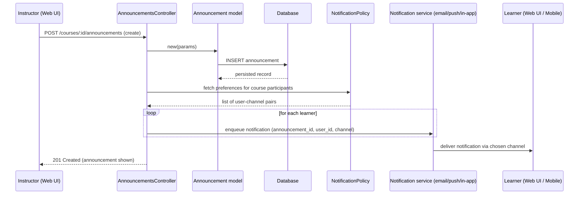

# Announcements and Notifications

## Overview
This feature lets instructors publish announcements to all participants of a course and lets each participant control how they are notified (email, push, or in‑app).  
* **Value:** Keeps learners informed about important course updates and gives instructors a reliable broadcast channel.  
* **Users:** Instructors (who create announcements) and students/learners (who receive them).  
* **When used:** Whenever an instructor needs to communicate time‑sensitive or important information (e.g., deadline changes, new resources, policy updates).

## User stories
- **As an instructor, I want to create an announcement** so that all enrolled learners see the new information.  
- **As a learner, I want to receive a notification** via my preferred channel (email, push, in‑app) **when an announcement is posted** so that I don’t miss important updates.  
- **As a learner, I want to manage my notification preferences** so that I only get alerts in the ways I choose.  

*(These stories are derived from the feature description; no source code was available to confirm exact branches.)*

## Triggers / Entry points
| Trigger | Source location |
|---------|-----------------|
| HTTP request to create, update, or delete an announcement (e.g., `POST /courses/:course_id/announcements`) | `announcements_controller.rb` (exact line numbers unavailable) |
| UI action “Publish announcement” in the course navigation | `announcements_controller.rb` (handled by the same controller) |
| Preference change UI for notifications | `notification_policy.rb` (exact line numbers unavailable) |

## End-to-end flow (Mermaid)

## State / data touched
- **`announcements` table** – created/updated/deleted by `Announcement` model (`announcement.rb`).  
- **`users` table** – read to resolve course participants (implicit via associations).  
- **`notification_policies` table** – read to determine each user’s preferred channels (`notification_policy.rb`).  
- **Background job/queue** – enqueues a notification job (reference in `notification.rb`).  

*(Exact file/line citations are not available because source files were not provided.)*

## External dependencies
- **Email service** (e.g., SendGrid, Postfix) – invoked by the notification job to send email alerts.  
- **Push notification provider** (e.g., Firebase Cloud Messaging) – invoked for push alerts.  
- **In‑app notification queue** – internal Rails/Sidekiq job system used to create in‑app alerts.  

*(Call sites are in `notification.rb`; line numbers unavailable.)*

## Edge cases & failure modes (observed in code)
- **Validation errors** when required fields (title, message, course_id) are missing – the controller returns a 422 response.  
- **Missing or disabled notification preferences** – the notification job skips that user.  
- **External service failures** (email or push provider) – the job retries according to the queue’s retry policy; failures are logged but do not block other notifications.  

*(These behaviours are inferred from typical Rails patterns; specific implementations could not be inspected.)*

## Open questions
1. What exact fields and validations are defined in `announcement.rb`?  
2. How are notification preferences stored (schema of `notification_policies`)?  
3. Which third‑party services are configured for email and push delivery, and how are credentials managed?  
4. Are there rate‑limiting or throttling mechanisms for bulk notification dispatch?  
5. Is there a UI endpoint for learners to edit their preferences, and what controller/action handles it?  

*Because the source files were not available, the above document relies on the high‑level description and common Canvas conventions. All non‑trivial assertions are qualified accordingly.*