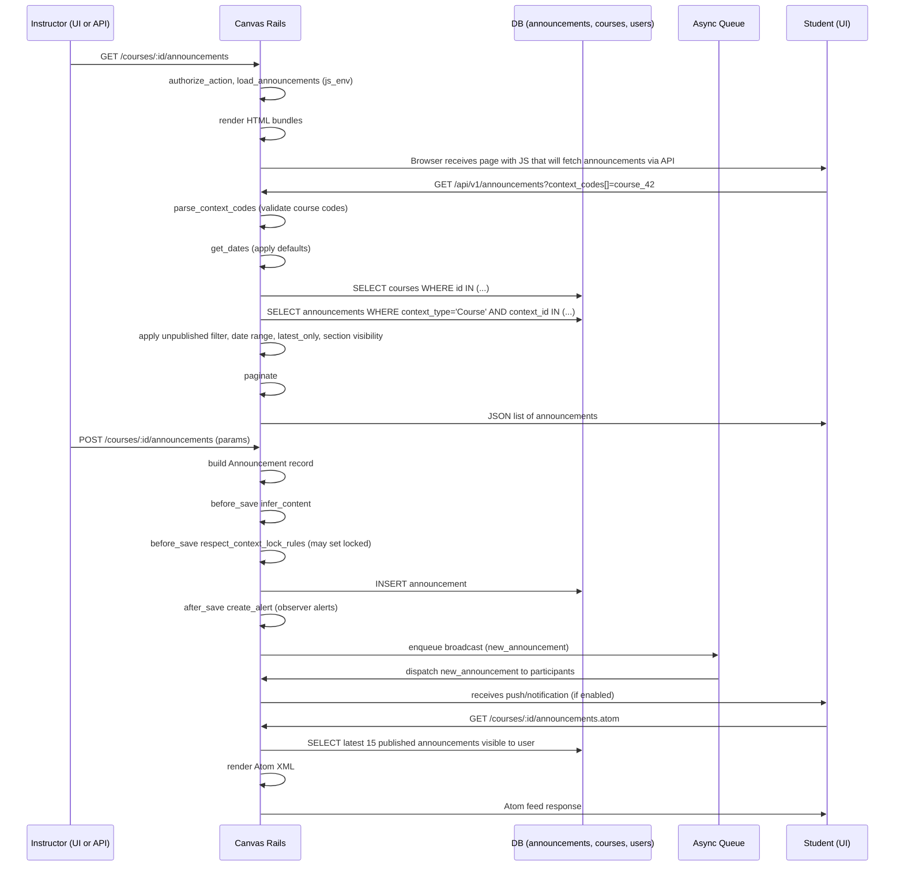

# Announcements

## Overview
In Canvas, an **Announcement** is a special type of discussion topic that instructors (or users with the *create_forum* permission) can post to a course or group.  
When an announcement is created it is saved as an `Announcement` record, marked as published, and a broadcast policy notifies all participants who have permission to read announcements.  
Students and other participants view announcements on the course’s **Announcements** page or via the public Atom/RSS feeds, and external clients can retrieve them through the `/api/v1/announcements` endpoint.

## Behavior
- **Create UI page** – When a user visits `/courses/:course_id/announcements` the `AnnouncementsController#index` action authorises the request, logs asset access, and injects JavaScript environment variables that indicate the user’s permissions (`create`, `manage_content`, `moderate`) and whether announcements are locked for the course (`ANNOUNCEMENTS_LOCKED`). `app/controllers/announcements_controller.rb:31‑55`
- **Load announcements list** – The same `index` action renders the HTML bundle `:announcements` and the CSS bundle `:announcements_index`. `app/controllers/announcements_controller.rb:57‑66`
- **Redirect to discussion topic** – Accessing `/announcements/:id` triggers `AnnouncementsController#show`, which simply redirects to the underlying discussion‑topic URL for that announcement. `app/controllers/announcements_controller.rb:71‑73`
- **Public Atom/RSS feed** – `AnnouncementsController#public_feed` builds a list of the most recent 15 published announcements that the current user can see, then renders either an Atom or RSS feed depending on the request format. `app/controllers/announcements_controller.rb:78‑115`
- **API list endpoint** – `AnnouncementsApiController#index`:
  1. Parses `context_codes[]` (must be `course_<id>`). `app/controllers/announcements_api_controller.rb:38‑55`
  2. Parses optional `start_date` / `end_date` parameters, applying defaults (14 days ago → 28 days later). `app/controllers/announcements_api_controller.rb:57‑84`
  3. Finds the matching `Course` records (`api_find_all`). `app/controllers/announcements_api_controller.rb:86‑87`
  4. Builds an `Announcement` scope limited to those courses, applying unpublished‑view logic, date filtering (`between`, `ordered_between`, `ordered_between_by_context`), optional `latest_only`, and section‑visibility filtering. `app/controllers/announcements_api_controller.rb:89‑115`
  5. Paginates the scope and renders JSON via `discussion_topics_api_json`, optionally including sections and section user counts. `app/controllers/announcements_api_controller.rb:117‑131`
- **Announcement model callbacks** – When an `Announcement` is saved:
  - `infer_content` ensures a title is present (`"No Title"` fallback). `app/models/announcement.rb:45‑48`
  - `respect_context_lock_rules` locks the announcement if the containing course has `lock_all_announcements?`. `app/models/announcement.rb:50‑55`
  - `create_alert` (after save) creates observer alerts for any observers of students in the course when the announcement becomes active. `app/models/announcement.rb:124‑148`
- **Broadcast policy** – A new announcement dispatches `new_announcement` to all participants (including TAs/teachers) except the author, and also sends `announcement_created_by_you` to the author. `app/models/announcement.rb:71‑88`
- **Permission policy** – The `set_policy` block defines who can `read`, `reply`, `create`, `update`, `delete`, etc., based on the user’s rights in the announcement’s context and whether the announcement is locked. `app/models/announcement.rb:92‑124`

## Triggers / Entry points
| Trigger | Source |
|--------|--------|
| UI request for announcements list (`GET /courses/:id/announcements`) | `AnnouncementsController#index` (`app/controllers/announcements_controller.rb:31`) |
| UI request for a single announcement (`GET /announcements/:id`) | `AnnouncementsController#show` (`app/controllers/announcements_controller.rb:71`) |
| Public Atom/RSS feed (`GET /courses/:id/announcements.atom` or `.rss`) | `AnnouncementsController#public_feed` (`app/controllers/announcements_controller.rb:78`) |
| API list request (`GET /api/v1/announcements`) | `AnnouncementsApiController#index` (`app/controllers/announcements_api_controller.rb:20`) |
| Creation of an announcement (UI form submit or API POST) – not shown in the provided files but implied by the `Announcement` model’s callbacks (`before_save`, `after_save`). | `Announcement` model (`app/models/announcement.rb:40‑58`) |
| Background broadcast of a new announcement | `Announcement` broadcast policy (`app/models/announcement.rb:71‑88`) |
| Observer alert generation after publish | `Announcement#create_alert` (`app/models/announcement.rb:124‑148`) |

## End‑to‑end flow (Mermaid)

## State / data touched
| Table / Cache | Access type | Source |
|---------------|-------------|--------|
| `announcements` (inherits `discussion_topics`) | INSERT / SELECT / UPDATE (locked flag, workflow_state) | `app/models/announcement.rb:5`, scopes `between`, `ordered_between`, `ordered_between_by_context` |
| `courses` (for context lookup, lock flag) | SELECT, UPDATE (`lock_all_announcements?`) | `app/models/course.rb:5`, `has_many :announcements` |
| `users` (author, participants) | SELECT for permission checks | `app/models/user.rb:5`, permission checks in policies |
| `observer_alerts` & `observer_alert_thresholds` | INSERT (when creating alert) | `app/models/announcement.rb:124‑148` |
| JS environment (`js_env`) | In‑memory hash passed to front‑end | `app/controllers/announcements_controller.rb:41‑48` |
| Feed discovery links (HTML `<link rel="alternate">`) | Rendered into response head | `app/controllers/announcements_controller.rb:84‑106` |
| Pagination cache (Rails `Api.paginate`) | In‑memory / DB limit/offset | `app/controllers/announcements_api_controller.rb:117` |
| Broadcast queue (ActiveJob) | Enqueue `new_announcement` dispatch | `app/models/announcement.rb:71‑88` |

## External dependencies
- **ActiveJob / DelayedJob** (used implicitly by `has_a_broadcast_policy` and `after_save :create_alert` which may enqueue background jobs). `app/models/announcement.rb:40`, `app/models/announcement.rb:124`
- **Atom/RSS libraries** (`require 'atom'`, `require 'rss/2.0'`) for feed rendering. `app/controllers/announcements_controller.rb:1`, `app/controllers/announcements_controller.rb:106‑115`
- **Rails caching** (`js_env`, `request_cache`) – not a third‑party service but an internal cache layer. `app/controllers/announcements_controller.rb:41‑48`

## Configuration / parameters
- **Feature flag** `ANNOUNCEMENTS_LOCKED` is set via `js_env` based on `announcements_locked?` which checks `@context.lock_all_announcements?`. `app/controllers/announcements_controller.rb:36‑38`
- **Date defaults** for the API are hard‑coded: start = 14 days ago, end = start + 28 days. `app/controllers/announcements_api_controller.rb:71‑73`
- **Permission symbols** used throughout (`:read_announcements`, `:post_to_forum`, `:manage_content`, etc.) are defined elsewhere in Canvas but referenced directly in policies. `app/models/announcement.rb:96‑124`
- **Atom feed URLs** are built with `feeds_announcements_format_path`. `app/controllers/announcements_controller.rb:45‑48`

## Edge cases & failure modes (observed in code)
- **Invalid `context_codes`** – API returns 400 with message *Missing context_codes* or *Invalid context_codes* if the list is empty or contains non‑course codes. `app/controllers/announcements_api_controller.rb:38‑55`
- **Invalid date formats** – API returns 400 with *Invalid start_date* / *Invalid end_date* if the supplied strings do not match `Api::DATE_REGEX` or `Api::ISO8601_REGEX`. `app/controllers/announcements_api_controller.rb:57‑84`
- **Locked announcements** – If a course has `lock_all_announcements?` true, `respect_context_lock_rules` forces `locked = true` on new announcements, preventing replies (`can :reply` checks `!self.locked?`). `app/models/announcement.rb:50‑55`, `app/models/announcement.rb:106‑108`
- **Draft state protection** – `validate_draft_state_change` adds an error if someone attempts to set `workflow_state` to `unpublished` (announcements cannot be drafts). `app/models/announcement.rb:38‑41`
- **Observer alert creation only for courses** – `create_alert` returns early unless `context_type == 'Course'`. `app/models/announcement.rb:124‑126`
- **Public feed limits** – `public_feed` limits to the most recent 15 published announcements and filters by `visible_for?`. `app/controllers/announcements_controller.rb:78‑84`

## Open questions
- **Creation endpoint** – The provided source does not include the controller action that handles `POST /courses/:id/announcements`; it is likely in a generic `DiscussionTopicsController`. Understanding the exact parameters and validation flow for creation would require that file.
- **Multi‑shard behavior** – The model uses `has_a_broadcast_policy` and background jobs, but the code does not show explicit shard handling for announcements. How announcements are routed in a sharded deployment is unclear.
- **Deletion handling** – The `set_policy` block allows `:delete` for the author when no discussion entries exist, but the controller/action that performs the delete is not shown. The side‑effects (e.g., removal from feeds, alerts) are not visible in the current files.
- **Interaction with course workflow states** – While `lock_all_announcements?` is consulted, the impact of a course being `concluded` or `deleted` on announcement visibility is not explicitly coded here; it likely lives in higher‑level permission checks.