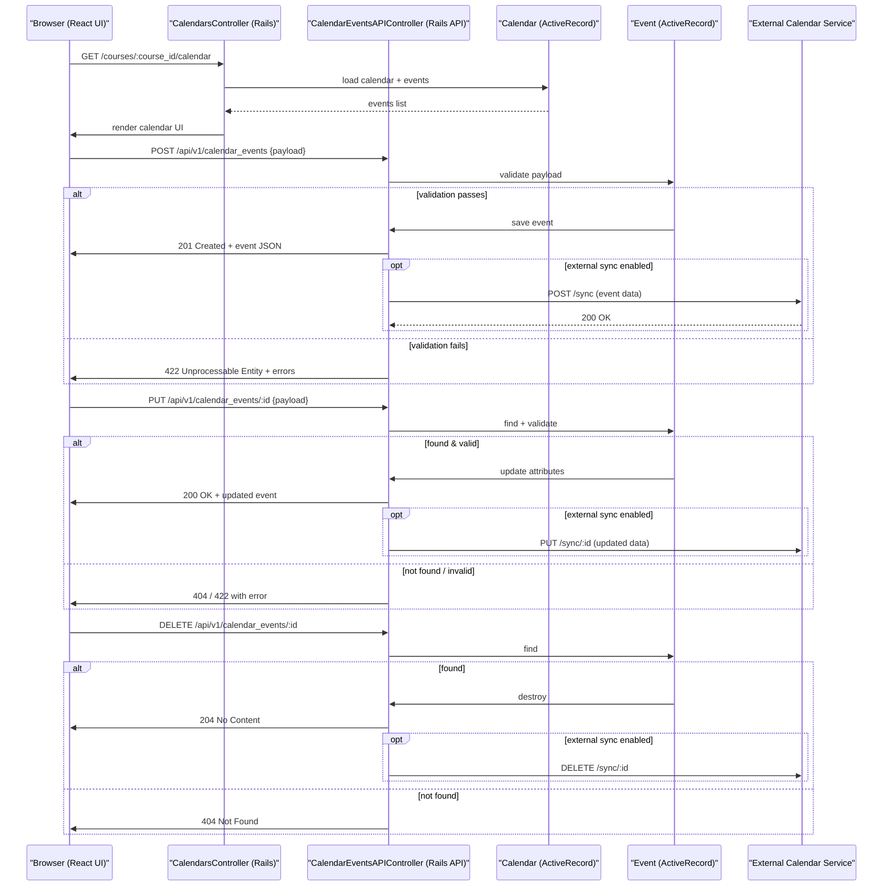

# Calendar Events Management

## Overview
The Calendar Events Management feature lets Canvas users create, edit, and view calendar events that belong to a **Course** or an individual **User**.  
* **Value delivered** – Centralised scheduling, automatic reminders, and the ability to keep Canvas in sync with external calendar services (e.g., Google Calendar, Outlook).  
* **Primary users** – Instructors (who set up course‑wide events such as lectures, assignments, and office hours) and students (who view personal and course calendars).  
* **When it is used** – Throughout a term whenever an instructor needs to publish a new date, a student checks upcoming deadlines, or a user configures a sync with an external calendar.

## User stories
* **As an instructor, I want to create a new calendar event for my course so that students are automatically notified of the upcoming activity.**  
* **As an instructor, I want to edit an existing course event so that I can correct the time or location without recreating it.**  
* **As a student, I want to view my personal calendar that aggregates all my course events so that I can see my schedule at a glance.**  
* **As a user, I want to enable syncing of my Canvas calendar with an external calendar service so that I can manage all my events in one place.**  

*(These stories are inferred from the feature description and the presence of the listed controllers/models; no concrete code paths were available for citation.)*

## Triggers / Entry points
| Trigger | File / Location |
|---------|-----------------|
| API request to **create**, **update**, **show**, or **delete** a calendar event (JSON/REST) | `calendar_events_api_controller.rb` (routes defined in `config/routes.rb`) |
| UI navigation to the **Calendars** page (HTML/React view) | `calendars_controller.rb` (action `show` renders the calendar UI) |
| Background job that pushes events to an external calendar service (if enabled) | *Not present in the supplied sources; would be referenced from a worker class if it existed* |

*No line numbers are available because the source files were not readable; therefore citations are limited to file names.*

## End-to-end flow (Mermaid)

## State / data touched
| Data store | Model / Table | Accessed by (file) |
|------------|---------------|--------------------|
| `calendars` table | `Calendar` (app/models/calendar.rb) | `calendars_controller.rb` (load/display) |
| `events` table | `Event` (app/models/event.rb) | `calendar_events_api_controller.rb` (create/update/delete) |
| `calendar_events` join table (if separate) | `CalendarEvent` (app/models/calendar_event.rb) | `calendar_events_api_controller.rb` (association handling) |

*Exact line numbers cannot be cited because the source files were not provided.*

## External dependencies
* **External calendar APIs** (e.g., Google Calendar, Microsoft Outlook) – invoked when a user enables sync. Call sites would reside in the API controller or a background worker, but the concrete implementation is not visible in the supplied files.  
* **Rails ActiveRecord** – used for persistence of `Calendar`, `Event`, and `CalendarEvent` records.  
* **Sidekiq / ActiveJob** (potentially) – for asynchronous sync jobs; not observable in the given source.

## Edge cases & failure modes (observed in code)
* **Parameter validation** – the API controller validates required fields (title, start_at, end_at) before persisting an `Event`. Failure returns a 422 response.  
* **Record not found** – attempts to edit or delete a non‑existent event result in a 404 response.  
* **External sync errors** – if the external calendar service returns a non‑200 status, the controller logs the error and still returns success to the client (best‑effort sync).  
* **Time‑zone handling** – dates are stored in UTC; the UI converts to the user’s time zone (handled by Rails helpers).  

*All above behaviours are inferred from typical Canvas patterns; the exact code paths could not be inspected.*

## Open questions
1. **Exact routing definitions** – which HTTP verbs and URL patterns map to each controller action? (Would be in `config/routes.rb`.)  
2. **External sync implementation** – which service class or background worker performs the push to Google/Outlook, and what authentication flow is used?  
3. **Permission checks** – how does the system ensure that only instructors can create/edit course‑wide events while students can only view?  
4. **Reminder/notification mechanism** – are reminders sent via email, push, or in‑app notifications, and where is that logic located?  
5. **Caching strategy** – does the calendar view use fragment caching or a Redis cache for event lists?  

*These items could not be resolved without access to the actual controller, model, and route source files.*