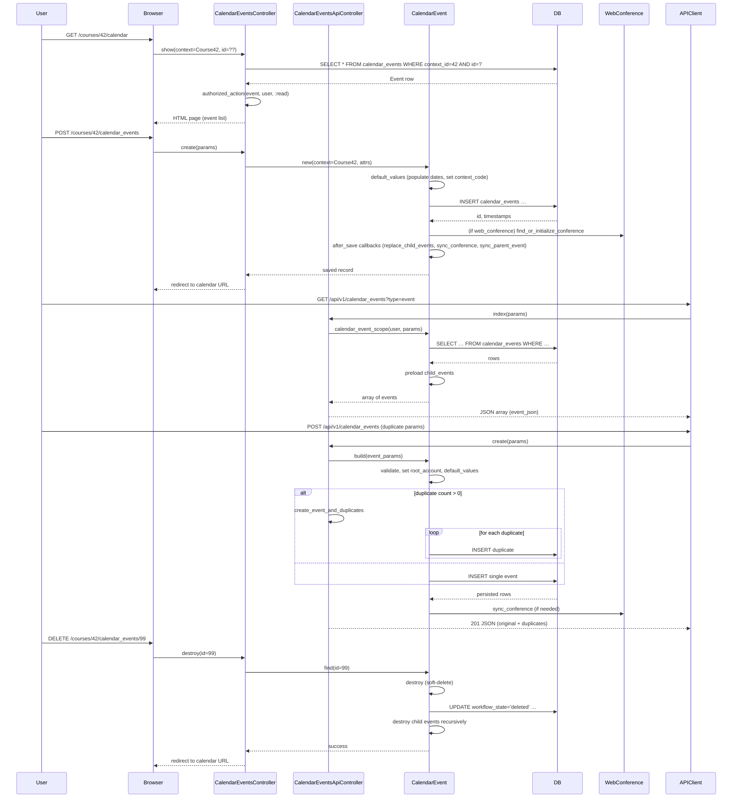

# Calendar & Scheduling

## Overview
The Calendar & Scheduling feature lets users view, create, edit, and delete calendar events (including due dates, meetings, and appointment‑group slots) that belong to a **Course**, **User**, **Group**, or **AppointmentGroup**.  
* The UI (HTML pages) and the REST API are the two entry points.  
* When a request is received the controller loads the appropriate `CalendarEvent` records, checks the current user’s permissions, runs model callbacks that keep child‑event hierarchies and web‑conference data in sync, and finally renders HTML or JSON.  

## Behavior
- **Load a calendar view** – `CalendarEventsController#show` fetches the event (`@context.calendar_events.find`) and, unless the request asks for the calendar view (`params[:calendar] == '1'`), renders the HTML page or JSON representation.  (`app/controllers/calendar_events_controller.rb:30‑38`)  
- **Create a new event (HTML form)** – `CalendarEventsController#new` builds a temporary record (`@context.calendar_events.temp_record`), assigns permitted params, injects conference‑type data for the JS env, and authorises the user. (`app/controllers/calendar_events_controller.rb:44‑53`)  
- **Persist a new event** – `CalendarEventsController#create` builds a real record (`@context.calendar_events.build(calendar_event_params)`), stamps the editing time‑zone, runs `authorized_action` and `authorize_user_for_conference`, then saves. On success it redirects to the calendar URL; on failure it re‑renders the form. (`app/controllers/calendar_events_controller.rb:58‑78`)  
- **Edit an existing event (HTML form)** – `CalendarEventsController#edit` loads the event (`CalendarEvent.find`), permits parameters, checks conference authorisation, updates the record if the user has the `:update` right, then renders the same view used for creation. (`app/controllers/calendar_events_controller.rb:84‑95`)  
- **Update an existing event** – `CalendarEventsController#update` loads the event, authorises `:update`, merges the time‑zone, authorises any conference changes, then calls `@event.update`.  If the update succeeds it logs asset access and redirects; otherwise it re‑renders the edit page. (`app/controllers/calendar_events_controller.rb:100‑119`)  
- **Delete an event** – `CalendarEventsController#destroy` finds the event via the context, authorises `:delete`, sets a cancel reason, calls `@event.destroy` (which marks the event as `deleted` and cascades to child events), then redirects. (`app/controllers/calendar_events_controller.rb:124‑134`)  
- **API list events** – `CalendarEventsApiController#index` calls `render_events_for_user(@current_user, api_v1_calendar_events_url)`. The helper builds a scope (`calendar_event_scope` or `assignment_scope`), paginates, preloads child events, and renders each event with `event_json`. (`app/controllers/calendar_events_api_controller.rb:140‑166`)  
- **API create event** – `CalendarEventsApiController#create` builds the event (`@context.calendar_events.build(params_for_create)`), sanitises HTML description, builds any web‑conference object, authorises, optionally creates duplicates, then saves all inside a transaction. On success it returns JSON with the original event and any duplicates. (`app/controllers/calendar_events_api_controller.rb:190‑236`)  
- **API show event** – `CalendarEventsApiController#show` loads the event (`get_event(true)`), authorises `:read`, and renders JSON via `event_json`. (`app/controllers/calendar_events_api_controller.rb:242‑247`)  
- **Model callbacks keep hierarchy consistent** – `CalendarEvent#replace_child_events` (after_save) creates, updates, or destroys child events based on `child_event_data`. (`app/models/calendar_event.rb:115‑150`)  
- **Locked‑state propagation** – `CalendarEvent#sync_child_events` copies locked attributes to child events after an update. (`app/models/calendar_event.rb:210‑218`)  
- **Web‑conference sync** – `CalendarEvent#sync_conference` updates the linked `WebConference` title, scheduled date, and invites participants after a save. (`app/models/calendar_event.rb:224‑236`)  
- **Parent‑event cache update** – `CalendarEvent#sync_parent_event` updates the parent’s cached start/end range when a child’s dates change. (`app/models/calendar_event.rb:240‑250`)  
- **Soft‑delete workflow** – `CalendarEvent#destroy` sets `workflow_state = 'deleted'`, timestamps `deleted_at`, saves, then recursively deletes child events and updates related appointment‑group caches. (`app/models/calendar_event.rb:260‑285`)  

## Triggers / Entry points
| Trigger | Controller / Method | Source |
|---------|--------------------|--------|
| User visits `/courses/:course_id/calendar` (HTML) | `CalendarEventsController#show` | `app/controllers/calendar_events_controller.rb:30‑38` |
| User clicks “New Event” | `CalendarEventsController#new` | `app/controllers/calendar_events_controller.rb:44‑53` |
| Form POST “Create Event” | `CalendarEventsController#create` | `app/controllers/calendar_events_controller.rb:58‑78` |
| User clicks “Edit” on an event | `CalendarEventsController#edit` | `app/controllers/calendar_events_controller.rb:84‑95` |
| Form PATCH/PUT “Update Event” | `CalendarEventsController#update` | `app/controllers/calendar_events_controller.rb:100‑119` |
| Delete button | `CalendarEventsController#destroy` | `app/controllers/calendar_events_controller.rb:124‑134` |
| API GET `/api/v1/calendar_events` | `CalendarEventsApiController#index` | `app/controllers/calendar_events_api_controller.rb:140‑166` |
| API POST `/api/v1/calendar_events` | `CalendarEventsApiController#create` | `app/controllers/calendar_events_api_controller.rb:190‑236` |
| API GET `/api/v1/calendar_events/:id` | `CalendarEventsApiController#show` | `app/controllers/calendar_events_api_controller.rb:242‑247` |

## End‑to‑end flow (Mermaid)

## State / data touched
| Table / Model | Access type | Where in code |
|---------------|-------------|---------------|
| `calendar_events` | SELECT (read) – `@context.calendar_events.find`, `calendar_event_scope` | `app/controllers/calendar_events_controller.rb:30`, `app/controllers/calendar_events_api_controller.rb:150` |
| `calendar_events` | INSERT (create) – `@context.calendar_events.build(...).save` | `app/controllers/calendar_events_controller.rb:58`, `app/controllers/calendar_events_api_controller.rb:210` |
| `calendar_events` | UPDATE (edit) – `@event.update` | `app/controllers/calendar_events_controller.rb:115` |
| `calendar_events` | UPDATE (soft‑delete) – `workflow_state='deleted'` | `app/models/calendar_event.rb:260‑285` |
| `calendar_events` | DELETE (cascade) – child events destroyed in `replace_child_events` and `destroy` | `app/models/calendar_event.rb:115‑150`, `app/models/calendar_event.rb:260‑285` |
| `web_conferences` | SELECT/INSERT/UPDATE – via `find_or_initialize_conference` and `sync_conference` | `app/controllers/calendar_events_controller.rb:46‑53`, `app/models/calendar_event.rb:224‑236` |
| `accounts` (root_account) | READ – `set_root_account` sets `root_account_id` | `app/models/calendar_event.rb:180‑197` |
| `appointment_groups` (when event is an appointment) | READ/UPDATE – `populate_appointment_group_defaults`, `sync_parent_event` | `app/models/calendar_event.rb:210‑235` |
| Caches – `participants` method, broadcast policies, request cache for `effective_context` | READ – many callbacks call `participants`, `cache_child_event_ranges!` | `app/models/calendar_event.rb:260‑285` |

## External dependencies
| Dependency | Use | Source |
|------------|-----|--------|
| **Database (ActiveRecord)** – primary persistence for `CalendarEvent`, `WebConference`, `Account`, etc. | All CRUD actions, scopes, preloads | Throughout controllers & model (`CalendarEvent` model methods, controller actions) |
| **Rails flash / redirect** – UI feedback | `flash[:notice]`, `redirect_to` in HTML actions | `app/controllers/calendar_events_controller.rb:34‑38`, `58‑78`, `115‑119`, `124‑134` |
| **Background job queue** – duplicate‑event creation runs inside a transaction but may invoke `delay` elsewhere (e.g., `CalendarEvent#destroy` touches appointment‑group caches) | `delay` calls in `destroy` and `Course#update_account_associations_if_changed` (not directly in calendar code) | `app/models/calendar_event.rb:270‑285` |
| **WebConference service** – external video‑conference provider (Zoom, BigBlueButton, etc.) | `sync_conference` updates title, scheduled date, invites participants | `app/models/calendar_event.rb:224‑236` |
| **Rails caching / RequestCache** – used for `effective_context` and `participants` | Improves repeated look‑ups | `app/models/calendar_event.rb:84‑92`, `app/models/calendar_event.rb:260‑285` |

## Configuration / parameters
| Parameter | Where defined / used |
|-----------|----------------------|
| `RECURRING_EVENT_LIMIT = 200` – caps duplicate creation in API | `app/controllers/calendar_events_api_controller.rb:30` |
| `DEFAULT_INCLUDES = %w[child_events]` – default JSON includes for API | `app/controllers/calendar_events_api_controller.rb:34` |
| `PERMITTED_ATTRIBUTES` in `CalendarEvent` – whitelist for strong params | `app/models/calendar_event.rb:45‑48` |
| Feature flag **Important Dates** – controls inclusion of `important_dates` field in JSON and scopes (`with_important_dates`) | `app/models/calendar_event.rb:260‑262`, API docs mention `important_dates` param |
| Time‑zone handling – `time_zone_edited` is set from the client (`params[:calendar_event][:time_zone_edited] = Time.zone.name`) | `app/controllers/calendar_events_controller.rb:56`, `app/controllers/calendar_events_api_controller.rb:210` |
| `calendar_event_params` merges `CalendarEvent.permitted_attributes` plus child‑event and conference data | `app/controllers/calendar_events_controller.rb:84‑92` |

## Edge cases & failure modes (observed in code)
| Situation | Handling |
|-----------|----------|
| **Deleted event accessed** – `show` redirects with a flash notice. | `app/controllers/calendar_events_controller.rb:34‑38` |
| **User lacks permission** – `authorized_action` returns false and halts the request. | All controller actions (`authorized_action(@event, @current_user, :read)` etc.) |
| **Invalid child‑event data** – `validate_each :child_event_data` adds errors if contexts are missing, duplicate, or user not set. | `app/models/calendar_event.rb:70‑92` |
| **Start > end** – `populate_missing_dates` swaps or copies dates to keep `end_at >= start_at`. | `app/models/calendar_event.rb:165‑173` |
| **All‑day flag change** – `populate_all_day_flag` normalises times to midnight. | `app/models/calendar_event.rb:180‑199` |
| **Duplicate‑event limit exceeded** – API returns 400 with a message. | `app/controllers/calendar_events_api_controller.rb:236‑242` |
| **Web‑conference validation** – `validate_conference_visibility` (not shown but called) prevents saving events with invisible conferences. | `app/models/calendar_event.rb:55‑57` |
| **Soft delete cascade** – `destroy` marks the event deleted, then recursively deletes child events and updates appointment‑group caches. | `app/models/calendar_event.rb:260‑285` |
| **Race condition on reservation** – `reserve_for` locks the slot and participant before creating a reservation. (Relevant for appointment‑group events.) | `app/models/calendar_event.rb:300‑340` |

## Open questions
* **Recurring‑event implementation details** – The controller references duplicate parameters (`calendar_event[duplicate][...]`) and a constant limit, but the actual duplication logic (`create_event_and_duplicates`) is defined elsewhere and not visible in the provided snippets.  
* **Conflict detection** – No explicit code checks for overlapping events; it appears to rely on the UI or external calendar clients to avoid conflicts.  
* **Notification delivery** – Broadcast policies are defined (`set_broadcast_policy`), but the downstream delivery mechanism (e.g., push, email) is outside the shown files.  
* **Timezone edge cases** – The model stores `time_zone_edited` as a string and uses it to build `zoned_start_at`/`zoned_end_at`, but conversion errors (invalid zone strings) are silently rescued (`rescue nil`). The impact on display is not fully documented.  
* **API pagination limits** – `Api.paginate` is used, but the default per‑page size and max limits are defined elsewhere; the exact numbers are not visible here.