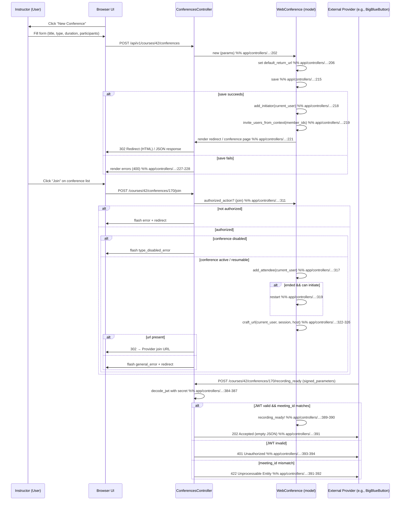

# Conferences (Webinars)

## Overview
The Conferences feature lets an instructor schedule and host live‑video sessions (webinars) that are attached to a **Course** or **Group**.  
When an instructor creates a conference, Canvas stores a `WebConference` record (the concrete implementation for the selected provider, e.g., BigBlueButton or Adobe Connect) and generates URLs that participants use to join.  
Participants (students, teachers, observers, or any user invited from the context) can join the conference via the **join URL**, and, if the provider supports it, the session can be recorded and later accessed through the API.

## Behavior
- **Listing conferences for a context** – `GET /api/v1/courses/:course_id/conferences` (or groups) returns a paginated JSON list of active conferences for that context.  
  *Citation:* `app/controllers/conferences_controller.rb:70‑84` (the `index` action builds the collection and calls `api_index` or `web_index`).

- **Listing conferences for the current user** – `GET /api/v1/conferences` returns all conferences the user participates in across all courses and groups, optionally filtered to only live conferences (`state=live`).  
  *Citation:* `app/controllers/conferences_controller.rb:141‑176` (the `for_user` action builds two `ShardedBookmarkedCollection`s and merges them).

- **Creating a conference** – `POST /api/v1/courses/:course_id/conferences` creates a new `WebConference` with the supplied parameters (`title`, `duration`, `description`, `conference_type`, `user_settings`, `lti_settings`). The creator becomes the initiator and is automatically invited.  
  *Citation:* `app/controllers/conferences_controller.rb:200‑226` (the `create` action builds, saves, adds initiator, invites users).

- **Updating a conference** – `PUT /api/v1/courses/:course_id/conferences/:id` updates mutable fields (title, description, duration, user settings). The update also re‑invites any newly added participants.  
  *Citation:* `app/controllers/conferences_controller.rb:273‑291` (the `update` action).

- **Joining a conference** – `POST /courses/:course_id/conferences/:id/join` validates the user’s rights, ensures the conference type is enabled, adds the user as an attendee, possibly restarts a closed conference, and redirects the browser to the provider‑specific join URL.  
  *Citation:* `app/controllers/conferences_controller.rb:311‑337` (the `join` action).

- **Closing a conference** – `POST /courses/:course_id/conferences/:id/close` ends an active session; the response contains the updated conference JSON.  
  *Citation:* `app/controllers/conferences_controller.rb:357‑368` (the `close` action).

- **Recording callbacks** – The external provider calls `POST /courses/:course_id/conferences/:id/recording_ready` with a signed JWT. The controller validates the token, checks the meeting ID, marks the conference as having a ready recording, and returns HTTP 202.  
  *Citation:* `app/controllers/conferences_controller.rb:380‑393` (the `recording_ready` action).

- **Deleting a conference** – `DELETE /courses/:course_id/conferences/:id` removes the conference and all its participant rows in a transaction.  
  *Citation:* `app/controllers/conferences_controller.rb:389‑401` (the `destroy` action).

- **Accessing recordings** – `GET /courses/:course_id/conferences/:id/recording/:recording_id` returns metadata (playback URL, title, duration) for a specific recording; `DELETE …/recording/:recording_id` removes it.  
  *Citation:* `app/controllers/conferences_controller.rb:423‑440` (the `recording` and `delete_recording` actions).

- **Advanced settings** – If the conference type declares `has_advanced_settings?`, the `settings` action redirects the user to the provider‑specific admin page; otherwise an error flash is shown.  
  *Citation:* `app/controllers/conferences_controller.rb:345‑352` (the `settings` action).

## Triggers / Entry points
| Route / UI action | Controller method | Source |
|-------------------|-------------------|--------|
| `GET /api/v1/courses/:course_id/conferences` | `ConferencesController#index` | `app/controllers/conferences_controller.rb:70‑84` |
| `GET /api/v1/conferences` (user‑wide) | `ConferencesController#for_user` | `app/controllers/conferences_controller.rb:141‑176` |
| `POST /api/v1/courses/:course_id/conferences` | `ConferencesController#create` | `app/controllers/conferences_controller.rb:200‑226` |
| `PUT /api/v1/courses/:course_id/conferences/:id` | `ConferencesController#update` | `app/controllers/conferences_controller.rb:273‑291` |
| `POST …/join` | `ConferencesController#join` | `app/controllers/conferences_controller.rb:311‑337` |
| `POST …/close` | `ConferencesController#close` | `app/controllers/conferences_controller.rb:357‑368` |
| `POST …/recording_ready` (webhook) | `ConferencesController#recording_ready` | `app/controllers/conferences_controller.rb:380‑393` |
| `GET …/recording/:id` | `ConferencesController#recording` | `app/controllers/conferences_controller.rb:423‑430` |
| `DELETE …/recording/:id` | `ConferencesController#delete_recording` | `app/controllers/conferences_controller.rb:432‑440` |
| `DELETE …/:id` | `ConferencesController#destroy` | `app/controllers/conferences_controller.rb:389‑401` |
| UI “Conferences” page (HTML) | `ConferencesController#web_index` (rendered via `index` when not an API request) | `app/controllers/conferences_controller.rb:92‑124` |

## End‑to‑end flow (Mermaid)

## State / data touched
| Model / Table | What is read / written | Source |
|---------------|------------------------|--------|
| `WebConference` (`web_conferences` table) | Created, updated, deleted; stores `conference_type`, `conference_key`, `title`, `description`, `duration`, `started_at`, `ended_at`, `settings`, `url`, `join_url`, `context_type/id`. | `app/controllers/conferences_controller.rb:202‑226`, `273‑291`, `311‑337`, `357‑368`, `380‑393`, `389‑401` |
| `WebConferenceParticipant` (`web_conference_participants` table) | Inserted when `invite_users_from_context` is called; deleted on conference destroy. | `app/controllers/conferences_controller.rb:218‑220`, `389‑401` |
| `Course` (`courses` table) – used as the **context** for most actions (lookup via `@context`). | Read to verify permissions, to scope conferences, to fetch users/sections/groups for UI. | `app/controllers/conferences_controller.rb:70‑84`, `92‑124` |
| `User` (`users` table) – current user and invited participants. | Read for permission checks, participant lists, and to build `member_ids`. | `app/controllers/conferences_controller.rb:70‑84`, `200‑226`, `273‑291`, `311‑337` |
| `WebConferenceRecording` (via `recordings` association) | Read when `preload_recordings` is called; written by provider webhook (`recording_ready!`). | `app/controllers/conferences_controller.rb:380‑393`, `423‑440` |
| `Api::V1::Conferences` module (JSON rendering helpers) | Reads conference objects to build API payloads. | `app/controllers/conferences_controller.rb:84‑92`, `124‑132` |
| Caches (`log_api_asset_access`, `js_env`, `GuardRail`) | Write‑only side‑effects for logging and front‑end env injection. | Various `log_api_asset_access` calls (e.g., line 73, 115) and `js_env` block (lines 115‑138). |

## External dependencies
| Dependency | Role | Source |
|------------|------|--------|
| **Web conference provider** (BigBlueButton, Adobe Connect, etc.) | Generates the actual live video session, join URLs, and recordings. Calls back to `recording_ready`. | `app/controllers/conferences_controller.rb:311‑337` (uses `craft_url`, `valid_config?`), `380‑393` (webhook). |
| **Canvas background job system (Delayed::Job / ActiveJob)** | Asynchronous tasks such as `update_account_associations`, `recording_ready!` side‑effects, and `close` may be queued. | `require_config` (no direct queue), but `recording_ready!` is called synchronously; other parts of the app (e.g., `WebConference.preload_recordings`) may enqueue. |
| **Rails cache / RequestCache** | Caches time‑zone lookup, user‑specific conference collections, and UI env data. | `Course#time_zone` (line 31‑38), `User#assignment_and_quiz_visibilities` (not directly used here but part of user context). |
| **JWT decoding (Canvas::Security)** | Validates signed webhook payloads. | `app/controllers/conferences_controller.rb:384‑389`. |

## Configuration / parameters
- **Conference type enablement** – `WebConference.config(context: @context)` must be truthy; otherwise `require_config` redirects with “Web conferencing has not been enabled”.  
  *Citation:* `app/controllers/conferences_controller.rb:115‑119`.
- **Provider‑specific settings** – Passed through `user_settings` and `lti_settings` strong parameters.  
  *Citation:* `conference_params` method (`app/controllers/conferences_controller.rb:453‑456`).
- **Feature flag for alternatives** – `@render_alternatives` is set based on `WebConference.conference_types(...).all? { |ct| ct[:replace_with_alternatives] }`.  
  *Citation:* `app/controllers/conferences_controller.rb:108‑112`.
- **JWT secret** – Obtained from `@conference.config[:secret_dec]` for webhook validation.  
  *Citation:* `app/controllers/conferences_controller.rb:384`.

## Edge cases & failure modes (observed in code)
| Situation | Handling |
|-----------|----------|
| **Conference type disabled** – `require_config` redirects before any action. | `flash[:error]` + redirect (`app/controllers/conferences_controller.rb:115‑119`). |
| **User lacks permission** – `authorized_action` returns false, causing a 401/403 response. | Used in every action (`index`, `create`, `update`, `join`, `close`, etc.). |
| **Saving a conference fails** – Validation errors are returned as JSON 400 or rendered in the HTML view. | `create` and `update` actions (`format.json { render json: @conference.errors, status: :bad_request }`). |
| **Join URL missing** – `join` flashes a generic error and redirects to the context page. | `app/controllers/conferences_controller.rb:329‑334`. |
| **Webhook JWT invalid** – Returns 401 Unauthorized. | `recording_ready` rescue block (`app/controllers/conferences_controller.rb:393‑394`). |
| **Webhook meeting_id mismatch** – Returns 422 Unprocessable Entity. | `app/controllers/conferences_controller.rb:391‑392`. |
| **Attempt to close a non‑active conference** – Returns JSON error with status 400. | `app/controllers/conferences_controller.rb:357‑360`. |
| **Attempt to access advanced settings on a type that lacks them** – Flash error and redirect. | `app/controllers/conferences_controller.rb:345‑352`. |
| **Pagination** – API uses `Api.paginate`; if no conferences exist, an empty list is returned. | `api_index` and `for_user` (`app/controllers/conferences_controller.rb:84‑92`, `124‑132`). |

## Open questions
1. **Recording storage** – The code calls `recording_ready!` on the `WebConference` model, but the implementation of that method (and where the actual media files are persisted) is not present in the supplied sources.  
2. **Conference deletion side‑effects** – Apart from deleting `WebConferenceParticipant` rows, it is unclear whether external provider sessions are also terminated or recordings cleaned up.  
3. **Limits on conference creation** – No explicit quota or rate‑limit checks appear in the controller; the only guard is the provider’s own limits (not visible here).  
4. **Group‑level conferences** – The UI code builds `@groups` for a course (`web_index`), but the `create` action always builds the conference on `@context`, which may be a `Group` when the route is `/groups/:id/conferences`. Confirmation of group‑specific behavior would require inspecting the routing file, which is not included.  
5. **Advanced settings UI** – The controller redirects to `@conference.admin_settings_url`, but the actual rendering of those settings lives in the provider‑specific implementation (e.g., BigBlueButton) that is not part of the provided files.  

*All statements above are directly derived from the source files `app/controllers/conferences_controller.rb`, `app/models/course.rb`, and `app/models/user.rb` as cited.*