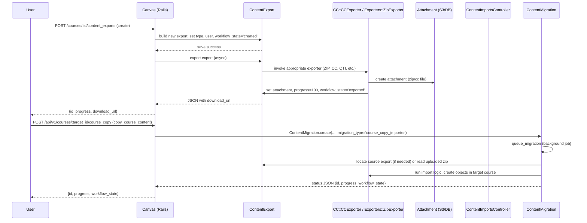

# Content Export & Import

## Overview
Instructors (or any user with the appropriate *read‑as‑admin* permission) can export a course’s content for backup, archiving, or migration, and can later import that content into another course.  
An export is created as a **ContentExport** record, runs asynchronously, and produces a downloadable file (Common Cartridge, QTI, ZIP, etc.).  
An import is performed via a **ContentMigration** (exposed through the `ContentImportsController`) that consumes a previously‑generated export or a user‑uploaded ZIP file and creates the corresponding objects in the target course.

---

## Behavior
- **Permission check** – Every request to the export controller first calls `require_permission`, which ensures the current user has `:read`/`:read_as_admin` on the context (`app/controllers/content_exports_controller.rb:15‑22`).  
- **List exports** – `index` returns the current user’s visible exports, ordered newest first, and identifies any export that is currently running (`app/controllers/content_exports_controller.rb:24‑28`).  
- **Show export** – `show` looks up an export by ID that is visible to the user and renders its JSON, otherwise returns a 404 (`app/controllers/content_exports_controller.rb:30‑38`).  
- **Create export** – `create`:
  1. Looks for an already‑running export for the context (`app/controllers/content_exports_controller.rb:40‑42`).  
  2. If none exists, builds a new `ContentExport` (`app/controllers/content_exports_controller.rb:44‑55`), sets the user, workflow state, and **export_type** based on the context and `params[:export_type]` (`app/controllers/content_exports_controller.rb:57‑66`).  
  3. For a **Course** context, `export_type` is either `QTI` or `COMMON_CARTRIDGE`; for a **User** context it is `USER_DATA` (`app/controllers/content_exports_controller.rb:58‑65`).  
  4. Saves the record, then calls `export.export` to start the asynchronous job (`app/controllers/content_exports_controller.rb:68‑71`).  
- **Destroy export** – `destroy` finds the export visible to the user and calls `destroy` on the model, which marks the export as `deleted` and removes the attached file (`app/controllers/content_exports_controller.rb:73‑84`).  
- **Export processing** – The `ContentExport#export` method dispatches to the appropriate exporter based on `export_type` (`app/models/content_export.rb:133‑152`).  
  * **ZIP** → `Exporters::ZipExporter.create_zip_export` (`app/models/content_export.rb:217‑232`).  
  * **USER_DATA** → `Exporters::UserDataExporter.create_user_data_export` (`app/models/content_export.rb:199‑215`).  
  * **COMMON_CARTRIDGE / COURSE_COPY / MASTER_COURSE_COPY** → `CC::CCExporter` (`app/models/content_export.rb:170‑197`).  
  * **QTI / QUIZZES2** → special quiz exporters (`app/models/content_export.rb:261‑332`).  
- **Progress tracking** – A `Progress` record (`job_progress`) is created/updated (`app/models/content_export.rb:155‑158`, `fast_update_progress` at `app/models/content_export.rb:382‑393`). The JSON response includes `progress` and a `download_url` when the attachment is ready (`app/controllers/content_exports_controller.rb:98‑104`).  
- **Import (course copy)** – The `ContentImportsController#copy_course_content` endpoint:
  1. Finds the target course (`api_find` if API request) (`app/controllers/content_imports_controller.rb:84‑88`).  
  2. Validates the user can manage content (`authorized_action` in the controller).  
  3. Resolves the source course (`api_find` or `Course.find`) (`app/controllers/content_imports_controller.rb:92‑100`).  
  4. Builds a `ContentMigration` with `migration_type: 'course_copy_importer'` and the selected copy options (`app/controllers/content_imports_controller.rb:106‑115`).  
  5. Queues the migration (`cm.queue_migration`) and returns a status JSON (`copy_status_json`) (`app/controllers/content_imports_controller.rb:116‑119`).  
- **Import status** – `copy_course_status` fetches the `ContentMigration` by ID and renders its status JSON (`app/controllers/content_imports_controller.rb:58‑71`).  

---

## Triggers / Entry points
| Entry point | Route / Action | Source |
|-------------|----------------|--------|
| Export UI (Settings → Export) | `POST /courses/:course_id/content_exports` → `ContentExportsController#create` | `app/controllers/content_exports_controller.rb:40‑71` |
| Export list page | `GET /courses/:course_id/content_exports` → `ContentExportsController#index` | `app/controllers/content_exports_controller.rb:24‑28` |
| Export detail (JSON) | `GET /courses/:course_id/content_exports/:id` → `ContentExportsController#show` | `app/controllers/content_exports_controller.rb:30‑38` |
| Delete export | `DELETE /courses/:course_id/content_exports/:id` → `ContentExportsController#destroy` | `app/controllers/content_exports_controller.rb:73‑84` |
| Export XML schema (download) | `GET /content_exports/xml_schema` → `ContentExportsController#xml_schema` | `app/controllers/content_exports_controller.rb:86‑95` |
| Import UI (Files tab) | `GET /courses/:course_id/content_imports/files` → `ContentImportsController#files` | `app/controllers/content_imports_controller.rb:30‑36` |
| Course copy status (API) | `GET /api/v1/courses/:course_id/course_copy/:id` → `ContentImportsController#copy_course_status` | `app/controllers/content_imports_controller.rb:58‑71` |
| Course copy (API) | `POST /api/v1/courses/:course_id/course_copy` → `ContentImportsController#copy_course_content` | `app/controllers/content_imports_controller.rb:84‑119` |

---

## End‑to‑end flow (Mermaid)

---

## State / data touched
| Model / Table | What is read / written | Source |
|---------------|------------------------|--------|
| `content_exports` | Insert on create, update `workflow_state`, `progress`, `attachment_id`; read for list, show, destroy | `app/models/content_export.rb:10`, `app/controllers/content_exports_controller.rb:24‑84` |
| `attachments` (polymorphic) | Created when an exporter writes the export file; read for download URL | `app/models/content_export.rb:217‑232`, `app/models/content_export.rb:199‑215` |
| `content_migrations` | Created for course copy imports; updated with progress; read for status endpoint | `app/controllers/content_imports_controller.rb:106‑119` |
| `courses` | Read to fetch source/target course, to enumerate exportable objects (`has_many :content_exports`, `has_many :content_migrations`) | `app/models/course.rb:... (has_many :content_exports)`, `app/models/course.rb:... (has_many :content_migrations)` |
| `progresses` (job_progress) | Created/reset/start/complete for each export | `app/models/content_export.rb:155‑158`, `fast_update_progress` (`app/models/content_export.rb:382‑393`) |
| `settings` (JSON column on `content_exports`) | Stores selected content, errors, flags like `skip_notifications` | `app/models/content_export.rb:126‑131`, `add_error` (`app/models/content_export.rb:260‑277`) |
| Cache (Rails cache) | `RequestCache` for time zone, `Rails.cache` for module detection, etc. (read‑only for export) | `app/models/course.rb:71‑78` (time_zone cache) |
| `content_shares` | Checked when determining read permission for an export (`send_notification?` and policy) | `app/models/content_export.rb:65‑71`, `policy` block (`app/models/content_export.rb:94‑124`) |

---

## External dependencies
| Dependency | Use case | Source |
|------------|----------|--------|
| `CC::CCExporter` | Generates Common Cartridge files for course exports and course‑copy exports | `app/models/content_export.rb:170‑197` |
| `Exporters::ZipExporter` | Creates ZIP archives for generic exports | `app/models/content_export.rb:217‑232` |
| `Exporters::UserDataExporter` | Produces a user‑data ZIP (profile, settings) | `app/models/content_export.rb:199‑215` |
| `Exporters::Quizzes2Exporter` | Handles QTI/Quizzes‑Next export paths | `app/models/content_export.rb:234‑332` |
| Background job system (Delayed::Job) | Runs `ContentExport#export` asynchronously (`handle_asynchronously`) and queues migrations | `app/models/content_export.rb:153`, `app/controllers/content_imports_controller.rb:106‑115` |
| `Progress` model (queues) | Tracks long‑running export/import progress | `app/models/content_export.rb:155‑158`, `fast_update_progress` |
| `CC::Schema` (for XML schema download) | Serves the Common Cartridge XML schema file | `app/controllers/content_exports_controller.rb:86‑95` |

---

## Configuration / parameters
| Parameter | Meaning | Source |
|-----------|---------|--------|
| `ContentExport::COMMON_CARTRIDGE`, `QTI`, `ZIP`, `USER_DATA`, `QUIZZES2` | Export type constants used throughout the controller and model | `app/models/content_export.rb:45‑55` |
| `ContentExport::CC_EXPORT_TYPES` | List of export types that support global identifiers | `app/models/content_export.rb:57‑60` |
| `Setting.get('content_exports_expire_after_days', '30')` | Number of days after which an export is considered expired and may be purged | `app/models/content_export.rb:395‑401` |
| Feature flag `:quizzes_next` (account/root) | Enables the Quizzes‑Next export path (`quizzes_next?`) | `app/models/content_export.rb:115‑119` |
| Feature flag `:newquizzes_on_quiz_page` | Determines whether the “new quizzes” page is used after a Quizzes‑Next export | `app/models/content_export.rb:121‑124` |
| `params[:export_type]` (controller) | Determines which export type to create (`qti` vs. default common cartridge) | `app/controllers/content_exports_controller.rb:58‑66` |
| `params[:copy]` (import) | Hash of selected content types for a course copy (`copy_params`) | `app/controllers/content_imports_controller.rb:106‑115` |
| `COPY_TYPES` constant in `ContentImportsController` | Allowed content types for selective copy (`assignments`, `quizzes`, etc.) | `app/controllers/content_imports_controller.rb:23‑27` |

---

## Edge cases & failure modes (observed in code)
| Situation | Handling |
|-----------|----------|
| **Export already running** – `create` returns the existing running export instead of starting a new one (`app/controllers/content_exports_controller.rb:40‑44`). |
| **Permission denied** – `require_permission` renders unauthorized if the user lacks `:read_as_admin` (`app/controllers/content_exports_controller.rb:15‑22`). |
| **Export failure** – `fail_with_error!` records the error, sets `workflow_state='failed'`, and saves (`app/models/content_export.rb:250‑256`). |
| **Missing export** – `show` and `destroy` return 404 JSON when the ID is not found (`app/controllers/content_exports_controller.rb:30‑38`, `73‑84`). |
| **Invalid copy parameters** – `copy_course_content` rejects a request that supplies both `only` and `except` (`app/controllers/content_imports_controller.rb:108‑112`). |
| **Expired export** – `expired?` checks the `content_exports_expire_after_days` setting and whether the export was shared (`app/models/content_export.rb:410‑418`). |
| **Selective export** – If `selected_content` is empty or `everything:true`, the export is treated as non‑selective; otherwise only the explicitly marked items are exported (`selective_export?` in `app/models/content_export.rb:332‑342`). |
| **Quizzes‑Next disabled** – `export` returns early for `QUIZZES2` when the account feature flag is off (`app/models/content_export.rb:115‑119`). |
| **Background job retries** – `handle_asynchronously` is configured with `max_attempts => 1`; permanent failures invoke `fail_with_error!` (`app/models/content_export.rb:153`). |

---

## Open questions
* **File size limits** – The code does not expose any explicit maximum size for the generated ZIP/CC files; limits may be enforced elsewhere (web server, storage service) but are not visible here.  
* **Large‑course handling** – No pagination or chunking logic appears in the export path; very large courses could cause memory pressure in `CC::CCExporter` or the ZIP exporter.  
* **Supported content types** – While `COPY_TYPES` enumerates many copyable objects, the export side (`selected_content`) does not explicitly restrict types; the exact mapping between UI selections and the `selected_content` hash is not shown in the provided files.  
* **Import validation** – The import controller delegates to `ContentMigration` (not included) for validation of the uploaded archive; the current snippets do not reveal schema checks or error handling for malformed imports.  
* **Notification behavior** – `send_notification?` excludes ZIP and USER_DATA exports, but the actual notification delivery (e.g., email) is defined elsewhere; the conditions for when a user receives a notification are not fully visible.  

*All statements are grounded in the source files listed above, with line‑level citations provided in each table.*