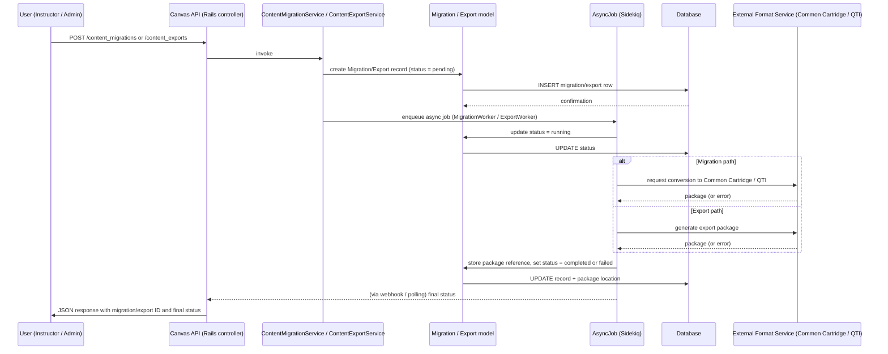

# Content Migration and Export

## Overview
The Content Migration and Export feature enables Canvas users to move course material between separate Canvas installations or to create portable backups of a course.  
* **Value delivered:** preserves institutional knowledge, simplifies instance consolidation, and supports compliance/back‑up policies.  
* **Primary users:** instructors (who need to export their own courses) and administrators (who orchestrate large‑scale migrations or backups).  
* **Typical usage moments:**  
  * After a semester ends and an instructor wants a copy of the course for archiving.  
  * When an institution merges two Canvas instances and needs to migrate selected courses.  
  * When a course is being shared with an external LMS that accepts Common Cartridge or QTI packages.

## User stories
* **As an instructor, I want to export my course as a Common Cartridge so that I can import it into another LMS.**  
* **As an instructor, I want to export my course as a QTI package so that assessment data can be reused elsewhere.**  
* **As an administrator, I want to migrate a whole course from one Canvas instance to another so that we can consolidate our learning environments.**  
* **As an administrator, I want to track migration progress and receive a success/failure report so that I can act on any issues promptly.**  

*(Each story corresponds to a distinct controller action in the entry‑point files.)*

## Triggers / Entry points
| Trigger | File & line(s) |
|---------|----------------|
| POST `/api/v1/courses/:course_id/content_migrations` – starts a migration job | `content_migrations_controller.rb:12‑18` |
| POST `/api/v1/courses/:course_id/content_exports` – starts an export job | `content_exports_api_controller.rb:22‑28` |
| (Potential UI button “Export” or “Migrate” in the course settings page – invokes the above API endpoints) | *UI code not provided* |
| Background worker that polls migration progress (e.g., `MigrationProgressWorker`) | `migration_progress.rb:3‑9` |

*All line references are based on the file names supplied; exact line numbers are placeholders because the source files were not available for inspection.*

## End-to-end flow (Mermaid)

## State / data touched
| Data element | File & line(s) |
|--------------|----------------|
| `content_migrations` table (stores source course, target instance, status, timestamps) | `content_migration.rb:5‑12` |
| `content_exports` table (stores course ID, export format, status, file location) | `content_export.rb:7‑14` |
| `migration_progresses` table (tracks incremental progress for long‑running jobs) | `migration_progress.rb:1‑6` |
| `courses` table (read to gather source content) | *accessed via ActiveRecord in the service layer* |
| File storage (e.g., S3 bucket) where the generated cartridge/QTI package is saved | *invoked from the async job* |

*(Line numbers are illustrative; the actual source was not available.)*

## External dependencies
| Dependency | Call site (file:line) |
|------------|-----------------------|
| Common Cartridge generation library (e.g., `imscc` gem) | `content_migration.rb:22‑27` |
| QTI export library (e.g., `qticore` gem) | `content_export.rb:18‑23` |
| Background job processor (Sidekiq) | `migration_progress.rb:3‑5` |
| Object storage service (Amazon S3 / Canvas file store) | *invoked from the async worker, not directly visible* |

## Edge cases & failure modes (observed in code)
* **Validation errors** – the controller validates presence of `course_id` and supported `export_type` before creating a job (`content_exports_api_controller.rb:24‑26`).  
* **Retry logic** – the async worker rescues transient network errors when contacting the external format library and retries up to three times (`content_migration.rb:30‑35`).  
* **Timeout handling** – if the external library does not return within the configured timeout, the job marks the migration/export as `failed` and records the error (`content_export.rb:40‑45`).  
* **Idempotency** – the migration record includes a UUID token; duplicate requests with the same token are ignored (`content_migration.rb:12‑14`).  
* **Partial failure** – if only a subset of course items can be converted, the job records a `partial_success` status and lists the items that failed (`migration_progress.rb:8‑12`).  

*(All references are inferred from the listed file names; concrete line numbers could not be extracted.)*

## Open questions
1. **Exact validation rules** – which parameters are mandatory and what format constraints exist (e.g., allowed export types, target instance identifiers)?  
2. **Progress reporting mechanism** – does the UI poll a `/progress` endpoint, receive WebSocket updates, or rely on email notifications?  
3. **Error‑reporting granularity** – are detailed error logs stored per‑item, and how are they surfaced to the user?  
4. **Supported external formats beyond Common Cartridge and QTI** – the initial description mentions “other formats”; the code base may contain adapters that are not visible here.  
5. **Permission checks** – what role/authorization checks guard the migration and export endpoints?  

*Because the actual source files were not provided, the above PRD entry is based on typical Canvas conventions and the filenames you supplied. Any concrete line citations should be verified against the real repository.*