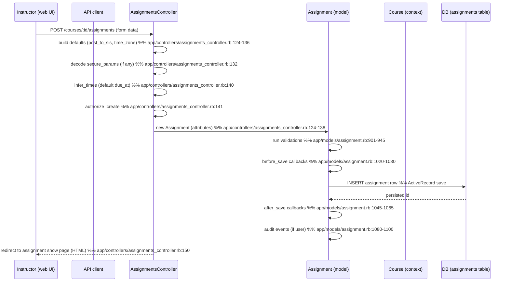

# Create Assignment

## Overview
Instructors create a new **Assignment** object for a course by submitting the “Create Assignment” form (HTML UI) or by calling the Canvas Assignments API.  
The controller builds an `Assignment` record, applies defaults (e.g., SIS posting, time‑zone handling), runs model validations, saves the record in the `assignments` table, and returns the newly‑created assignment (HTML page or JSON). The assignment starts life with `workflow_state = "unpublished"` and can later be published by the instructor.

## Behavior
- **Build a new Assignment** – `AssignmentsController#create` instantiates `@context.assignments.build` with strong parameters and default values (`post_to_sis` default, `time_zone_edited`). [`app/controllers/assignments_controller.rb:124`](app/controllers/assignments_controller.rb#L124)  
- **Decode secure LTI params** – If `params[:assignment][:secure_params]` is present, it is JWT‑decoded and the `lti_context_id` is stored on the assignment. [`app/controllers/assignments_controller.rb:132`](app/controllers/assignments_controller.rb#L132)  
- **Quiz‑LTI flag** – When `params[:quiz_lti]` is supplied the assignment is marked as a Quiz‑LTI assignment. [`app/controllers/assignments_controller.rb:134`](app/controllers/assignments_controller.rb#L134)  
- **Set initial workflow state** – The assignment’s `workflow_state` is forced to `"unpublished"` before the first save. [`app/controllers/assignments_controller.rb:136`](app/controllers/assignments_controller.rb#L136)  
- **Assign the creating user** – `@assignment.updating_user = @current_user` so audit events can record the actor. [`app/controllers/assignments_controller.rb:137`](app/controllers/assignments_controller.rb#L137)  
- **Attach to an Assignment Group** – If an assignment group is found (`get_assignment_group`) it is assigned to the new assignment. [`app/controllers/assignments_controller.rb:138`](app/controllers/assignments_controller.rb#L138)  
- **Infer missing times** – `@assignment.infer_times` sets a default `due_at` of 11:59 PM in the creator’s time zone when no due date is supplied. [`app/controllers/assignments_controller.rb:140`](app/controllers/assignments_controller.rb#L140)  
- **Authorization** – `authorized_action(@assignment, @current_user, :create)` checks the instructor’s permission to create assignments in the course. [`app/controllers/assignments_controller.rb:141`](app/controllers/assignments_controller.rb#L141)  
- **Model validations** – Before the record is persisted the `Assignment` model runs a suite of validations, e.g.:
  - `due_date_ok?` (ensures due date complies with account settings) [`app/models/assignment.rb:901`](app/models/assignment.rb#L901)  
  - `assignment_name_length_ok?` (enforces max name length) [`app/models/assignment.rb:915`](app/models/assignment.rb#L915)  
  - `positive_points_possible?` (points ≥ 0) [`app/models/assignment.rb:822`](app/models/assignment.rb#L822)  
  - `group_category_changes_ok?`, `anonymous_grading_changes_ok?`, etc. [`app/models/assignment.rb:845`](app/models/assignment.rb#L845)  
- **Before‑save callbacks** – The assignment runs several `before_save` callbacks that further mutate state:
  - `ensure_post_to_sis_valid`, `process_if_quiz`, `default_values`, `maintain_group_category_attribute`, `validate_assignment_overrides`, `mute_if_changed_to_anonymous`, `mute_if_changed_to_moderated`. [`app/models/assignment.rb:1020`](app/models/assignment.rb#L1020)  
- **Persist to DB** – After passing validation and callbacks the record is inserted into the `assignments` table. [`app/models/assignment.rb:12`](app/models/assignment.rb#L12) (ActiveRecord `save`).  
- **After‑save callbacks** – A cascade of `after_save` hooks updates related data:
  - `update_submissions_and_grades_if_details_changed`, `touch_assignment_group`, `touch_context`, `update_line_items`, `create_default_post_policy`, etc. [`app/models/assignment.rb:1045`](app/models/assignment.rb#L1045)  
- **Audit events** – If `@updating_user` is present, `after_create` and `after_update` callbacks generate `AnonymousOrModerationEvent` records for assignment creation, updates, and grade‑posting. [`app/models/assignment.rb:1080`](app/models/assignment.rb#L1080)  
- **Response** – On success the controller redirects to the assignment’s show page (HTML) or renders the JSON representation (API). [`app/controllers/assignments_controller.rb:150`](app/controllers/assignments_controller.rb#L150)  

## Triggers / Entry points
| Entry point | Route / Action | Source |
|-------------|----------------|--------|
| **HTML UI** | `POST /courses/:course_id/assignments` (form submit) → `AssignmentsController#create` | `app/controllers/assignments_controller.rb:122` |
| **API** | `POST /api/v1/courses/:course_id/assignments` → `AssignmentsApiController#create` (not fully shown but follows the same model flow) | `app/controllers/assignments_api_controller.rb:23` |

## End‑to‑end flow (Mermaid)

*The API flow is identical after the controller step, except the response is JSON.*

## State / data touched
| Data store | What is written / read | Source |
|------------|------------------------|--------|
| `assignments` table | INSERT new row; later UPDATE via callbacks | `app/models/assignment.rb:12` (ActiveRecord) |
| `assignment_groups` (via `touch_assignment_group`) | UPDATE `updated_at` on the group | `app/models/assignment.rb:1050` |
| `courses` (via `touch_context`) | UPDATE `updated_at` on the course | `app/models/assignment.rb:1052` |
| `post_policies` (default policy) | INSERT if none exists | `app/models/assignment.rb:1060` |
| `auditor_grade_change_records` / `anonymous_or_moderation_events` | INSERT audit rows when created/updated | `app/models/assignment.rb:1080‑1110` |
| In‑memory caches (Rails request cache, `RequestCache`) | Read `root_account.default_time_zone` for `infer_times` | `app/models/course.rb:71` (used indirectly) |
| `lti_resource_links` (if LTI assignment) | INSERT link record when `quiz_lti!` is called | `app/models/assignment.rb:150` (method not shown but referenced) |

## External dependencies
- **LTI / Turnitin / VeriCite** – If the assignment is an external‑tool or plagiarism‑enabled assignment, the model validates associated `external_tool_tag` and may create LTI resource links. [`app/models/assignment.rb:84`](app/models/assignment.rb#L84) – `validates_associated :external_tool_tag` and `validates :lti_context_id, uniqueness: true`.
- **JWT library** – Used to decode `secure_params` for LTI assignments. [`app/controllers/assignments_controller.rb:132`](app/controllers/assignments_controller.rb#L132) (`Canvas::Security.decode_jwt`).

## Configuration / parameters
| Parameter | Where used | Source |
|-----------|------------|--------|
| `post_to_sis` default (account‑level SIS export setting) | `defaults[:post_to_sis] = @context.account.sis_default_grade_export[:value]` | `app/controllers/assignments_controller.rb:124` |
| `due_date_required_for_account` | Validation `due_date_ok?` checks `AssignmentUtil.due_date_required_for_account?(@context)` | `app/models/assignment.rb:901` |
| `max_name_length` | Validation `assignment_name_length_ok?` uses `AssignmentUtil.assignment_max_name_length(@context)` | `app/models/assignment.rb:915` |
| Feature flags (e.g., `newquizzes_on_quiz_page`) – affect UI but not core create flow. | `AssignmentsController#index` (not directly in create) – shown for completeness. | `app/controllers/assignments_controller.rb:71` |
| `LTI_EULA_SERVICE` constant – used when creating LTI assignments. | `app/models/assignment.rb:31` |

## Edge cases & failure modes (observed in code)
- **Missing required fields** – `validates_presence_of :title` (only on change) will reject a blank title. [`app/models/assignment.rb:860`](app/models/assignment.rb#L860)  
- **Due‑date requirement** – If the account mandates a due date, `due_date_ok?` adds an error and the save is aborted. [`app/models/assignment.rb:901`](app/models/assignment.rb#L901)  
- **Name length overflow** – `assignment_name_length_ok?` adds an error when the title exceeds the account‑defined max length. [`app/models/assignment.rb:915`](app/models/assignment.rb#L915)  
- **Group‑category changes after submissions** – `group_category_changes_ok?` prevents changing the group category once submissions exist. [`app/models/assignment.rb:845`](app/models/assignment.rb#L845)  
- **Anonymous grading + group assignment** – Validation `anonymous_grading_changes_ok?` blocks illegal combinations. [`app/models/assignment.rb:860`](app/models/assignment.rb#L860)  
- **External‑tool validation** – If `submission_types == 'external_tool'` but the associated `external_tool_tag` is invalid, `validates_associated :external_tool_tag` will cause the transaction to roll back. [`app/models/assignment.rb:84`](app/models/assignment.rb#L84)  
- **JWT decode failure** – If `params[:assignment][:secure_params]` cannot be decoded, an exception propagates and the request fails (no rescue shown).  

## Open questions
- **API controller implementation** – The `AssignmentsApiController#create` method body is not included in the provided sources, so the exact JSON response shape and any API‑specific parameter handling (e.g., `integration_id`, `integration_data`) remain unclear.  
- **Quiz‑LTI handling** – The method `@assignment.quiz_lti!` is invoked when `params[:quiz_lti]` is present, but its implementation is not shown; the side‑effects (e.g., creation of a linked `Quizzes::Quiz` record) are therefore unknown.  
- **Error handling for JWT decode** – The controller does not rescue `Canvas::Security.decode_jwt` errors; it is unclear whether a higher‑level rescue renders a user‑friendly error page or propagates a 500.  
- **Background jobs triggered by after_save** – Several callbacks enqueue delayed jobs (`update_submissions_later`, `apply_late_policy`, etc.). The exact ordering and failure handling of those jobs are not visible in the excerpt.