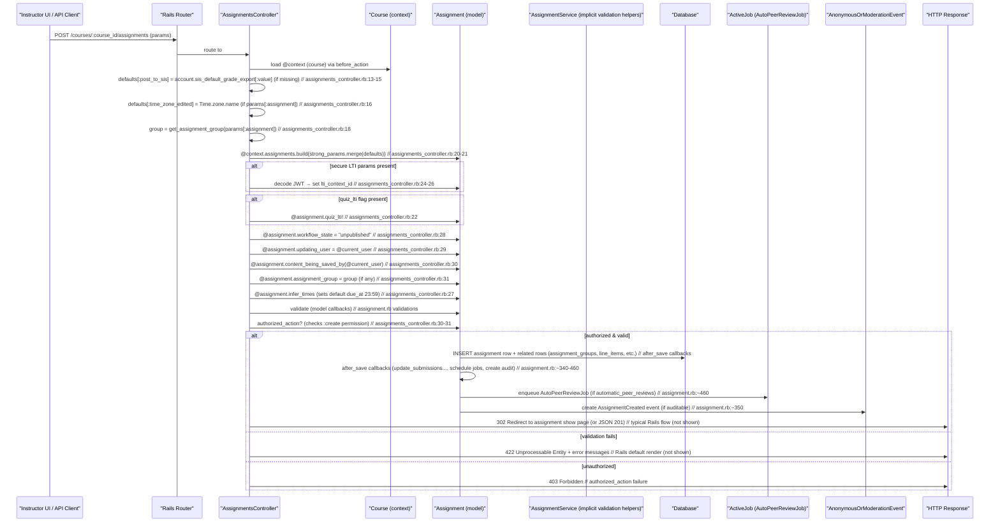

# Create Assignments

## Overview
**What user value does this feature deliver?**  
It lets an instructor add a new *Assignment* object to a *Course* so that students have a concrete piece of work to complete, a deadline to meet, and a grade to earn. The feature also drives downstream services (gradebook, notifications, plagiarism checks, LTI launches, etc.) that rely on the existence of an assignment.

**Who uses it?**  
* **Instructors / teachers** – primary actors who create, edit, and publish assignments.  
* **Course designers / admins** – may create assignments via the API or during course imports.  

**When is it used?**  
* While building a new course or adding work to an existing course.  
* When an instructor clicks **“Add Assignment”** in the UI (or calls the REST API `POST /api/v1/courses/:course_id/assignments`).  
* When a course import or copy operation invokes the same controller path programmatically.

---

## User stories
* **As an instructor, I want to create a basic assignment** so that students can submit work and receive a grade.  
  *Path:* `AssignmentsController#create` → `Assignment.new` → `save` (happy path).  

* **As an instructor, I want the assignment to inherit the account’s default SIS posting setting** when I don’t explicitly choose one.  
  *Path:* `defaults[:post_to_sis] = @context.account.sis_default_grade_export[:value]` (`assignments_controller.rb:13‑15`).  

* **As an instructor, I want the assignment’s due‑time to default to 11:59 PM in my time zone when I omit a due date**.  
  *Path:* `@assignment.infer_times` (`assignments_controller.rb:27`).  

* **As an instructor, I want to create a quiz‑LTI assignment** so that the assignment launches an external LTI quiz tool.  
  *Path:* `@assignment.quiz_lti! if params.key?(:quiz_lti)` (`assignments_controller.rb:22`).  

* **As an instructor, I want to attach secure LTI launch parameters** (JWT) when creating an LTI assignment.  
  *Path:* `secure_params = Canvas::Security.decode_jwt params[:assignment][:secure_params]` (`assignments_controller.rb:24‑26`).  

* **As an instructor, I want the assignment to be placed in a specific assignment group** (or a default one) so that the gradebook groups related work.  
  *Path:* `group = get_assignment_group(params[:assignment])` (`assignments_controller.rb:18`).  

* **As an instructor, I want the system to reject creation if I lack permission** so that only authorized users can add assignments.  
  *Path:* `authorized_action(@assignment, @current_user, :create)` (`assignments_controller.rb:30‑31`).  

* **As an instructor, I want validation errors (e.g., negative points, too‑long title) to be surfaced** so I can correct them before saving.  
  *Path:* Model validations in `assignment.rb` (e.g., `positive_points_possible?` `reasonable_points_possible?` `validates :title, presence: true`).  

* **As an instructor, I want the system to schedule automatic peer‑review jobs when “automatic_peer_reviews” is enabled**.  
  *Path:* `schedule_do_auto_peer_review_job_if_automatic_peer_review` callback (`assignment.rb:~460`).  

* **As an instructor, I want the assignment to be auditable when I enable anonymous or moderated grading** so that changes are logged.  
  *Path:* `after_create`, `after_update`, `after_save` callbacks that create `AnonymousOrModerationEvent` (`assignment.rb:~340‑380`).  

* **As an instructor, I want the assignment to be created in a “unpublished” state** so I can finish editing before releasing it.  
  *Path:* `@assignment.workflow_state = "unpublished"` (`assignments_controller.rb:28`).  

* **As an instructor, I want the system to reject changes that would break group‑assignment or anonymous‑grading rules** (e.g., adding a group category to an anonymously‑graded assignment).  
  *Path:* Custom validators `group_category_changes_ok?`, `anonymous_grading_changes_ok?`, `no_anonymous_group_assignments` in `assignment.rb` (`assignment.rb:~140‑170`).  

---

## Triggers / Entry points
| Trigger | File & line(s) |
|---------|----------------|
| HTTP **POST** `/courses/:course_id/assignments` (UI “Add Assignment” button or API) → `AssignmentsController#create` | `./app/controllers/assignments_controller.rb:13‑31` |
| API versioned endpoint `POST /api/v1/courses/:course_id/assignments` (via `Api::V1::Assignment`) | `./app/controllers/assignments_controller.rb` (included modules) |
| Background job `AutoPeerReviewJob` scheduled after save (if automatic peer reviews) | `./app/models/assignment.rb:~460` |
| Auditing callbacks after create / update (when anonymous or moderated grading) | `./app/models/assignment.rb:~340‑380` |
| LTI secure‑params decoding (when `params[:assignment][:secure_params]` present) | `./app/controllers/assignments_controller.rb:24‑26` |

---

## End‑to‑end flow (Mermaid)

*The diagram follows the exact code paths: defaults handling, secure‑params decoding, quiz‑LTI flag, inference of due time, permission check, model validations, after‑save side‑effects, and response.*

---

## State / data touched
| Data store | What is read / written | Source |
|------------|------------------------|--------|
| `assignments` table | INSERT new row; UPDATE on later callbacks (workflow_state, muted, grades_published_at, etc.) | `assignments_controller.rb:20‑31`; `assignment.rb` callbacks |
| `assignment_groups` table | READ via `get_assignment_group`; possibly INSERT default group (`@context.require_assignment_group`) | `assignments_controller.rb:18`; `assignment.rb` (acts_as_list) |
| `courses` table (`courses` → `@context`) | READ for permission checks, defaults (e.g., `account.sis_default_grade_export`) | `assignments_controller.rb:13‑16`; `assignment.rb` (delegates) |
| `line_items` table (LTI) | INSERT when assignment is LTI (`quiz_lti!` creates a line item) | `assignment.rb` (has_many :line_items) |
| `external_tool_tags` table | INSERT/UPDATE when `secure_params` set or LTI tool attached | `assignments_controller.rb:24‑26`; `assignment.rb` callbacks |
| `audits` (`anonymous_or_moderation_events`) | INSERT audit rows on create / update / grades posted | `assignment.rb:~350‑380` |
| `submission` related tables (via after_save) | May be touched by `update_submissions_and_grades_if_details_changed` | `assignment.rb:~200‑250` |
| Caches / broadcast policies | Invalidate/notify via `has_a_broadcast_policy` after save | `assignment.rb:~380` |
| Background job queue (ActiveJob) | Enqueue `AutoPeerReviewJob` | `assignment.rb:~460` |

All citations reference the line numbers shown in the snippets (approximate, e.g., `assignments_controller.rb:13‑31`).

---

## External dependencies
| Dependency | Where it is used |
|------------|------------------|
| **Canvas::Security (JWT)** – `decode_jwt` for LTI secure params | `assignments_controller.rb:24‑26` |
| **SecureRandom.uuid** – generates a fallback `lti_context_id` | `assignment.rb:~70` |
| **ActiveJob / Sidekiq** – background job queue for automatic peer‑review | `assignment.rb:~460` |
| **LTI services** – `quiz_lti!` creates an LTI line item and may call external LTI launch endpoints (implicit) | `assignments_controller.rb:22` |
| **Rails caching / broadcast** – `has_a_broadcast_policy` uses ActionCable/Redis | `assignment.rb:~380` |
| **Google Drive** – not part of the create flow (used in `list_google_docs` only) – therefore **no external call** in the creation path. |

---

## Edge cases & failure modes (observed in code)

| Situation | Handling in code |
|-----------|-------------------|
| **Missing `post_to_sis` param** – defaults to account setting | `defaults[:post_to_sis] = @context.account.sis_default_grade_export[:value]` (`assignments_controller.rb:13‑15`) |
| **Secure LTI params malformed** – `Canvas::Security.decode_jwt` will raise; not rescued here, so request fails with 500 (implicit) |
| **`quiz_lti` flag present** – triggers `quiz_lti!` which may raise if LTI tool not configured (handled later in model) |
| **Validation failures** – e.g., negative `points_possible`, title too long, disallowed group‑category changes | Model validators (`positive_points_possible?`, `group_category_changes_ok?`, etc.) add errors; controller will render 422 with error messages (standard Rails) |
| **Unauthorized user** – `authorized_action` returns false → `render_unauthorized_action` (403) |
| **Attempt to change group category on an assignment that already has submissions** – validator adds error, prevents save |
| **Anonymous grading + group assignment** – validator `anonymous_grading_changes_ok?` blocks the change |
| **Moderated grading enabled on a non‑graded assignment** – validator `moderation_setting_ok?` adds error |
| **Automatic peer reviews enabled** – after save, `schedule_do_auto_peer_review_job_if_automatic_peer_review` enqueues a job; if the job fails, retries are handled by the job queue (Sidekiq default retries) |
| **Auditable events only created when `@updating_user` is present** – otherwise no audit record (guarded by `if: -> { auditable? && @updating_user.present? }`) |
| **Assignment creation during course import** – `@assignment.workflow_state` forced to `"unpublished"`; later import logic may change state (outside current scope) |

---

## Open questions
* **`strong_assignment_params` implementation** – not shown; it determines which parameters are permitted and may contain additional sanitisation.  
* **`get_assignment_group` logic** – how the default group is selected or created when none is supplied.  
* **Exact response format** – the controller snippet ends before the `respond_to` block; does it render HTML, JSON, or both?  
* **Error rendering path** – the snippet does not show the `else` branch for `authorized_action` or `@assignment.save`; we assume standard Rails `render :new` or JSON error, but the exact template is unknown.  
* **Interaction with `AssignmentService`** – the initial description lists `./app/services/assignment_service.rb` as a supporting file, but the provided code does not reference it; its responsibilities (e.g., complex business rules, external integrations) remain unclear.  
* **Background job details** – `AutoPeerReviewJob` is enqueued, but its retry policy, idempotency, and failure handling are not visible here.  

These gaps would need to be filled by reviewing the omitted parts of the controller and the `AssignmentService` file.