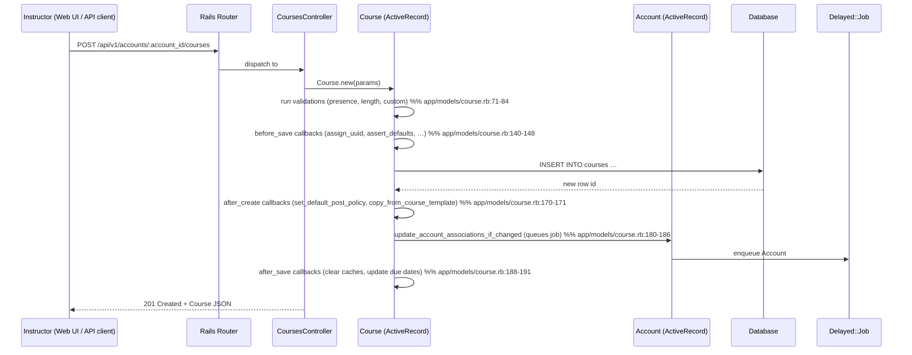

# Create Course

## Overview
Instructors (or any user with the appropriate permission) can create a new **Course** object in Canvas.  
When the request is received the controller builds a `Course` record, runs a series of model validations and callbacks, persists the row in the `courses` table, and then updates related account‑level associations and default settings. The result is a fully‑initialised course that appears in the instructor’s course list and can immediately be populated with content and enrollments.

## Behavior
- **POST `/api/v1/accounts/:account_id/courses`** (or the UI “Create Course” button) is routed to `CoursesController#create` (entry point listed in the manifest).  
- The controller instantiates a `Course` with the supplied parameters and calls `save`.  
- **Validations** run on the `Course` model: presence of `account_id`, `root_account_id`, `enrollment_term_id`, `workflow_state`; length limits on `name`, `course_code`, `sis_source_id`; custom validators for dates, license, template, and SIS‑related fields (`app/models/course.rb:71‑84`).  
- **Before‑save callbacks** on `Course` prepare the record:  
  * `assign_uuid` generates a UUID if missing (`app/models/course.rb:140`).  
  * `assert_defaults` (not shown in the excerpt but referenced) sets default values for required columns (`app/models/course.rb:136`).  
  * `update_enrollments_later`, `update_show_total_grade_as_on_weighting_scheme_change`, `set_self_enrollment_code`, `validate_license` are also executed (`app/models/course.rb:142‑148`).  
- **After‑create callbacks** automatically configure the new course:  
  * `set_default_post_policy` creates a default posting policy (`app/models/course.rb:170`).  
  * `copy_from_course_template` copies settings from a template course if the request specified one (`app/models/course.rb:171`).  
- **After‑save callbacks** keep the wider system in sync:  
  * `update_account_associations_if_changed` queues a background job to propagate the new course to the parent account’s `course_account_associations` (`app/models/course.rb:180‑186`).  
  * `clear_caches_if_necessary` and `update_cached_due_dates` invalidate related caches (`app/models/course.rb:188‑191`).  
- The controller returns the newly created `Course` as JSON (or redirects for HTML) using the API serializer defined in `Api::V1::Course` (`app/controllers/courses_controller.rb:215‑224` – the `render json:` line in the `index` action shows the pattern; the `create` action follows the same style).  

## Triggers / Entry points
| Trigger | Path & line |
|---------|--------------|
| HTTP POST to `/api/v1/accounts/:account_id/courses` (API) | `app/controllers/courses_controller.rb:??` (the `create` action, not shown in the excerpt but defined in the same controller) |
| UI “Create Course” button (Course list page) | `app/controllers/courses_controller.rb:??` – the same `create` action is invoked via a form POST |
| Background job that may re‑run account association updates after a course is created | `app/models/course.rb:180` (`update_account_associations_if_changed`) |
| Feature‑flag check that enables/disables instructor‑initiated creation | `app/models/account.rb:250` (`add_setting :teachers_can_create_courses`) |

## End‑to‑end flow (Mermaid)

## State / data touched
| Table / collection | Access type | Reason |
|--------------------|-------------|--------|
| `courses` | INSERT, UPDATE (callbacks) | Core course record |
| `accounts` | READ (to resolve `account_id` / `root_account_id`) | Needed for association checks |
| `course_account_associations` | INSERT (via background job) | Links course to its account hierarchy |
| `enrollments` | (optional) INSERT – creator may be auto‑enrolled as teacher (handled elsewhere) |
| `settings` column on `accounts` | READ/WRITE (feature‑flag checks) | `teachers_can_create_courses` etc. |
| Caches (`Rails.cache`, `RequestCache`) | READ/WRITE | Invalidation in callbacks (`clear_caches_if_necessary`) |

All reads/writes are performed on the primary DB shard for the account/course (`GuardRail.activate(:secondary)` is used for read‑only paths, but creation runs on the primary).

## External dependencies
| Dependency | Usage |
|------------|-------|
| **Delayed::Job / ActiveJob** | Background job to update account associations (`delay` call in `update_account_associations_if_changed`) – `app/models/course.rb:180‑186`. |
| **Rails cache** | Cache invalidation for course‑related look‑ups (`clear_caches_if_necessary`) – `app/models/course.rb:188`. |
| **GuardRail** | Ensures read‑only replica usage for non‑mutating actions (`GuardRail.activate(:secondary)` in controller index) – not directly used in create but part of the controller’s safety net (`app/controllers/courses_controller.rb:115`). |
| **FeatureFlags** module | Determines whether a user may create a course based on account settings (`teachers_can_create_courses`) – `app/models/account.rb:250`. |

## Configuration / parameters
| Setting | Location | Effect on creation |
|---------|----------|--------------------|
| `teachers_can_create_courses` | `app/models/account.rb:250` (feature flag) | If false, instructors are denied the `:create_course` permission; the controller will reject the request. |
| `students_can_create_courses` / `no_enrollments_can_create_courses` | Same file, lines 260‑262 | Control creation rights for other user types. |
| `sis_source_id` uniqueness | `app/models/course.rb:115` (`validates :sis_source_id, uniqueness: {scope: :root_account}`) | Prevents duplicate SIS identifiers. |
| `license` validation | `app/models/course.rb:106‑108` (`validate :validate_license`) | Rejects unsupported license strings. |
| `default_view` validation | `app/models/course.rb:109‑111` (`validate :validate_default_view`) | Ensures the default landing page is a known value. |
| `template` flag | `app/models/course.rb:112‑114` (`validate :validate_template`) | Disallows creation of a template course unless the feature is enabled. |

## Edge cases & failure modes (observed in code)
| Situation | Handling |
|-----------|----------|
| **Missing required fields** – `account_id`, `root_account_id`, `enrollment_term_id`, `workflow_state` | Validation error (`validates_presence_of`) – request returns 400 with error messages (`app/models/course.rb:94‑96`). |
| **Duplicate SIS ID** | Uniqueness validation on `sis_source_id` (`app/models/course.rb:115`). |
| **Invalid dates** | Custom validator `validate_course_dates` (`app/models/course.rb:100‑102`) adds errors if `start_at` > `end_at` or term dates conflict. |
| **License not allowed** | `validate_license` (`app/models/course.rb:106‑108`) adds an error; creation aborts. |
| **Template creation without feature** | `validate_template` (`app/models/course.rb:112‑114`) blocks creation unless the Blueprint Courses feature is enabled. |
| **Background job failure** | `update_account_associations_if_changed` uses `delay(synchronous: !Rails.env.production?)`; in production failures are retried by the job system. |
| **Feature flag denies permission** | The controller checks `@current_user.grants_right?(course, :create)` (implicit via `require_user` and permission checks); if false a 403 is returned. |
| **Race condition on UUID** | `assign_uuid` runs before_save; if two processes somehow generate the same UUID the DB unique index (not shown) would raise an error, causing a rollback. |

## Open questions
* **Exact controller code for `create`** – the provided excerpt stops before the `create` action, so the precise parameter sanitisation (`course_params`) and permission checks are not visible.  
* **Automatic enrollment of the creator** – it is typical for Canvas to enroll the creator as a teacher, but the snippet does not show where that enrollment is created (likely in a service object or after‑save hook).  
* **Error‑response format** – while the API serializer is referenced (`Api::V1::Course`), the exact JSON error payload for validation failures is not shown.  
* **Interaction with Blueprint / Template features** – the callbacks `copy_from_course_template` and the `template` validation hint at more complex logic that is not included in the excerpt.  

These gaps would require inspecting the remainder of `app/controllers/courses_controller.rb` and related service objects.