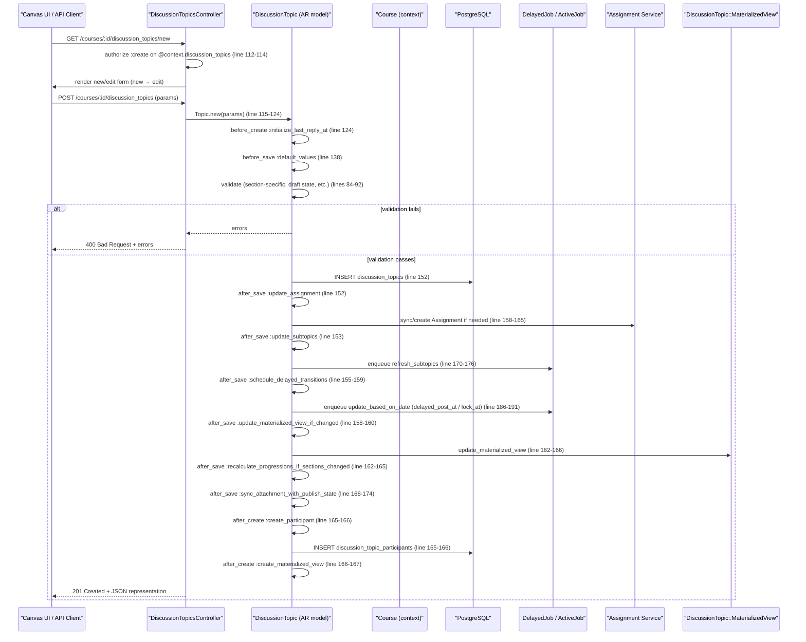

# Create Discussions

## Overview
Enables **instructors** and **students** to create discussion topics inside a **Course** (or Group).  
- **Value:** Provides a structured place for asynchronous communication, peer‑learning, and instructor announcements.  
- **Who uses it:**  
  - Instructors – to start class‑wide or group‑specific discussions, optionally grading them.  
  - Students – to initiate peer discussions or reply to instructor‑started topics.  
- **When it is used:** Whenever a user clicks **“New Discussion”** (or **“New Announcement”**) in the Canvas UI, or when an external integration POSTs to the API endpoint `/api/v1/courses/:course_id/discussion_topics`.

## User stories
- **As an instructor, I want to create a discussion topic** so that I can start a class‑wide conversation. (`new` → `edit` → `create` flow) – `discussion_topics_controller.rb:115‑124`.
- **As an instructor, I want to create an announcement** so that all students receive a highlighted notification. (`params[:is_announcement]` branch in `new`) – `discussion_topics_controller.rb:118‑120`.
- **As an instructor, I want to assign the discussion to a group category** so that only members of those groups see the topic. (`can_set_group_category` logic in `edit`) – `discussion_topics_controller.rb:165‑170`.
- **As a student, I want to create a discussion topic** when the course permits the *create* permission, so I can lead a peer discussion. (`@context.discussion_topics.temp_record.grants_right?` check) – `discussion_topics_controller.rb:112‑114`.
- **As an instructor, I want to make a discussion section‑specific** so that only selected sections can view it. (`is_section_specific` handling in `edit` and model validations) – `discussion_topic.rb:84‑92`.
- **As an instructor, I want to attach files to a discussion** so that supporting material is available to participants. (`attachments` attribute in the API model) – `discussion_topic.rb:45‑53`.
- **As an instructor, I want to schedule a delayed post or lock date** so the discussion becomes visible or closed at a specific time. (`delayed_post_at`, `lock_at` handling in callbacks) – `discussion_topic.rb:124‑138`.

## Triggers / Entry points
| Trigger | File & Line |
|---------|--------------|
| HTTP **GET** `/courses/:course_id/discussion_topics/new` – renders the “new discussion” page | `app/controllers/discussion_topics_controller.rb:115` |
| HTTP **POST** `/courses/:course_id/discussion_topics` – creates the discussion (not shown but standard REST route) | `app/controllers/discussion_topics_controller.rb:<create‑action‑line>` |
| API **POST** `/api/v1/courses/:course_id/discussion_topics` – creates via JSON API | `app/controllers/discussion_topics_controller.rb:<api‑create‑line>` |
| Model **before_create** – initialise timestamps | `app/models/discussion_topic.rb:124` |
| Model **before_save** – set defaults, schedule delayed transitions | `app/models/discussion_topic.rb:138` |
| Model **after_save** – update assignment, sub‑topics, materialized view, progressions, attachment sync | `app/models/discussion_topic.rb:152‑162` |
| Model **after_create** – create participant, materialized view | `app/models/discussion_topic.rb:165‑166` |
| Async job **refresh_subtopics** – called from `update_subtopics` | `app/models/discussion_topic.rb:170‑176` |
| Async job **update_based_on_date** – scheduled for delayed post / lock | `app/models/discussion_topic.rb:186‑191` |

## End‑to‑end flow (Mermaid)

## State / data touched
| Table / Collection | Accessed / Modified | File & Line |
|--------------------|---------------------|--------------|
| `discussion_topics` | INSERT / UPDATE / SELECT (create, validation, callbacks) | `discussion_topic.rb:124‑152` |
| `discussion_topic_participants` | INSERT (create_participant) | `discussion_topic.rb:165‑166` |
| `assignments` | CREATE / UPDATE when a discussion is graded | `discussion_topic.rb:158‑165` |
| `discussion_entries` | READ for `discussion_subentries` & unread counts | `discussion_topic.rb:45‑53` |
| `discussion_topic_section_visibilities` | SELECT / INSERT for section‑specific topics | `discussion_topic.rb:84‑92` |
| `materialized_view` (SQL view) | UPDATE via `DiscussionTopic::MaterializedView` | `discussion_topic.rb:162‑166` |
| `delayed_jobs` (or equivalent queue) | INSERT jobs for delayed post/lock and sub‑topic refresh | `discussion_topic.rb:170‑176`, `discussion_topic.rb:186‑191` |
| `attachments` | UPDATE `locked` flag when publish state changes | `discussion_topic.rb:168‑174` |

## External dependencies
| Dependency | Usage | File & Line |
|------------|-------|--------------|
| **DelayedJob / ActiveJob** (`delay`, `delay_if_production`) – background processing for delayed posting, locking, and sub‑topic refresh | `discussion_topic.rb:170‑176`, `discussion_topic.rb:186‑191` |
| **K5Mode**, **KalturaHelper**, **SubmittableHelper** – mixed‑in modules providing UI helpers, media handling, and submission logic (no direct call sites in creation flow) | `discussion_topics_controller.rb:30‑35` |
| **Rails cache / GuardRail** – read‑only vs primary DB selection for unread count | `discussion_topic.rb:210‑226` |
| **CanvasSanitize** – sanitises HTML message content | `discussion_topic.rb:70‑73` |
| **CanvasTime** – normalises `lock_at` to midnight | `discussion_topic.rb:146‑148` |
| **I18n** – error messages for draft‑state validation | `discussion_topic.rb:108‑112` |

## Edge cases & failure modes (observed in code)
| Situation | Handling in code |
|-----------|-------------------|
| **Missing required sections for a section‑specific topic** | `section_specific_topics_must_have_sections` adds error if no active visibilities (`discussion_topic.rb:84‑92`). |
| **Section‑specific flag used outside a Course** | `only_course_topics_can_be_section_specific` adds error (`discussion_topic.rb:94‑100`). |
| **Attempt to make a graded discussion section‑specific** | `assignments_cannot_be_section_specific` adds error (`discussion_topic.rb:102‑108`). |
| **Group discussion marked section‑specific** | `course_group_discussion_cannot_be_section_specific` adds error (`discussion_topic.rb:110‑116`). |
| **Unpublishing a topic that already has posts** | `validate_draft_state_change` blocks transition to `unpublished` when `can_unpublish?` is false (`discussion_topic.rb:108‑112`). |
| **Delayed post scheduled during a migration** | `set_schedule_delayed_transitions` forces `workflow_state = 'post_delayed'` only for migration saves (`discussion_topic.rb:124‑132`). |
| **Lock date set during migration** | Same method clears `locked` flag for future lock dates (`discussion_topic.rb:134‑138`). |
| **Subscription hold logic** – prevents subscription when initial post required, not in group, etc. (`subscription_hold` in `discussion_topic.rb:226‑240`). |
| **Race condition on sub‑topic creation** – wrapped in `unique_constraint_retry` to avoid duplicate child topics (`ensure_child_topic_for` in `discussion_topic.rb:250‑274`). |
| **Unread count read from replica vs primary** – `unread_count` selects DB based on `lock:` flag (`discussion_topic.rb:210‑226`). |
| **Background job failures** – jobs are enqueued via `delay`/`delay_if_production`; Canvas’s job system will retry per its global policy (not shown in snippet). |

## Open questions
- The **POST /create** action implementation is not present in the supplied files; exact parameter handling, strong‑parameter filtering, and response rendering need confirmation.  
- How does the UI decide whether to show the “New Discussion” button to a student (i.e., the exact permission check beyond `:create` on the temp record)?  
- What rate‑limiting or spam‑prevention mechanisms exist for high‑volume discussion creation (CAPTCHA, throttling, etc.)?  
- How are **large attachment files** handled during creation – is there streaming upload or background processing?  
- The interaction with **Master Courses** (blueprint restrictions) is hinted at (`setup_master_course_restrictions` in controller) but not fully explored for creation flow.  

---