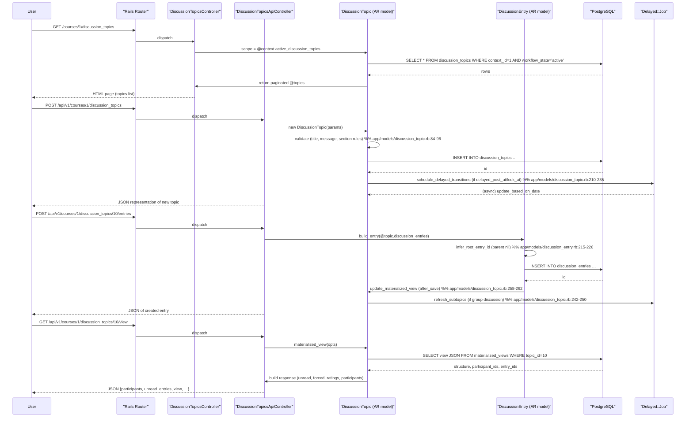

# Discussion Forums

## Overview
The Discussion Forums feature lets users start discussion topics, post replies, and take part in threaded conversations inside a **Course** or **Group**.  
* Instructors (or any user with the appropriate permission) create a topic by submitting a title, HTML‑formatted message, optional attachments, and settings such as *pinned*, *locked*, or *require_initial_post*.  
* Students and other participants view the list of topics, read the initial post, and add entries (replies) that can be nested (threaded) or flat depending on the topic’s `discussion_type`.  
* The system records read/unread state, subscription status, and optional rating information for each user.

All actions occur in the current request context (`@context`) and are persisted to the database tables described below.

---

## Behavior
- **List topics** – `GET /api/v1/courses/:course_id/discussion_topics` (or groups) returns a paginated collection of `DiscussionTopic` objects with metadata such as `title`, `message`, `posted_at`, `last_reply_at`, `read_state`, `subscribed`, etc.  (`app/controllers/discussion_topics_controller.rb:71‑115`)  
- **Create a new topic** – `POST /api/v1/courses/:course_id/discussion_topics` (handled by `new`/`edit` UI actions; the actual `create` action is defined elsewhere but uses the same controller).  The controller builds a `DiscussionTopic` (`@context.discussion_topics.new`) and saves it after validation (`app/controllers/discussion_topics_controller.rb:124‑138`).  
- **Edit an existing topic** – `GET /courses/:course_id/discussion_topics/:id/edit` loads the topic (`@context.all_discussion_topics.find`) and renders the edit UI (`app/controllers/discussion_topics_controller.rb:140‑176`).  
- **View a single topic** – `GET /api/v1/courses/:course_id/discussion_topics/:id` returns the JSON representation of the topic (`DiscussionTopicsApiController#show`, `app/controllers/discussion_topics_api_controller.rb:30‑48`).  
- **View the full threaded view** – `GET …/view` builds a materialized view of the whole discussion (`DiscussionTopic#materialized_view`) and returns participants, unread entry IDs, ratings, and the nested `view` structure (`app/controllers/discussion_topics_api_controller.rb:71‑124`).  
- **Add a top‑level entry** – `POST …/entries` creates a `DiscussionEntry` via `build_entry(@topic.discussion_entries)` and saves it (`DiscussionTopicsApiController#add_entry`, `app/controllers/discussion_topics_api_controller.rb:150‑162`).  
- **Add a reply to an entry** – `POST …/entries/:entry_id/replies` builds a child entry under the parent (`@parent.discussion_subentries`) and saves it (`DiscussionTopicsApiController#add_reply`, `app/controllers/discussion_topics_api_controller.rb:176‑186`).  
- **List top‑level entries** – `GET …/entries` paginates `root_entries(@topic)` and renders JSON (`DiscussionTopicsApiController#entries`, `app/controllers/discussion_topics_api_controller.rb:199‑206`).  
- **List replies for a top‑level entry** – `GET …/entries/:entry_id/replies` paginates `reply_entries(@parent)` (`DiscussionTopicsApiController#replies`, `app/controllers/discussion_topics_api_controller.rb:219‑226`).  
- **Mark topic/entry read or unread** – `PUT /read`, `DELETE /read`, `PUT /read_all`, `DELETE /read_all`, `PUT /entries/:id/read`, `DELETE /entries/:id/read` invoke `change_topic_read_state`, `change_topic_all_read_state`, or `change_entry_read_state` which update `DiscussionTopicParticipant` and `DiscussionEntryParticipant` rows (`app/controllers/discussion_topics_api_controller.rb:238‑280`).  
- **Duplicate a topic** – `POST …/duplicate` creates a copy of the topic (and optionally its assignment) while preserving pinned position (`DiscussionTopicsApiController#duplicate`, `app/controllers/discussion_topics_api_controller.rb:115‑150`).  
- **Subscription handling** – `DiscussionTopic#subscription_hold` determines why a user cannot subscribe (e.g., `initial_post_required`, `not_in_group_set`, `topic_is_announcement`).  `subscribe`/`unsubscribe` toggle the `subscribed` flag on `DiscussionTopicParticipant` (`app/models/discussion_topic.rb:306‑340`).  
- **Rating** – If `allow_rating` is true, `DiscussionEntry#change_rating` updates the entry’s `rating_sum`/`rating_count` and the materialized view (`app/models/discussion_entry.rb:254‑285`).  

---

## Triggers / Entry points
| Trigger | Route / UI action | Source |
|--------|-------------------|--------|
| List topics (HTML) | `GET /courses/:id/discussion_topics` (HTML) | `DiscussionTopicsController#index` – `app/controllers/discussion_topics_controller.rb:71‑115` |
| List topics (API) | `GET /api/v1/courses/:id/discussion_topics` | same as above |
| Show single topic (API) | `GET /api/v1/courses/:id/discussion_topics/:topic_id` | `DiscussionTopicsApiController#show` – `app/controllers/discussion_topics_api_controller.rb:30‑48` |
| View full thread (API) | `GET /api/v1/courses/:id/discussion_topics/:topic_id/view` | `DiscussionTopicsApiController#view` – `app/controllers/discussion_topics_api_controller.rb:71‑124` |
| Create topic (UI) | `POST /courses/:id/discussion_topics` (form) | `DiscussionTopicsController#new` / `edit` – `app/controllers/discussion_topics_controller.rb:124‑138` |
| Create entry (API) | `POST /api/v1/courses/:id/discussion_topics/:topic_id/entries` | `DiscussionTopicsApiController#add_entry` – `app/controllers/discussion_topics_api_controller.rb:150‑162` |
| Create reply (API) | `POST /api/v1/courses/:id/discussion_topics/:topic_id/entries/:entry_id/replies` | `DiscussionTopicsApiController#add_reply` – `app/controllers/discussion_topics_api_controller.rb:176‑186` |
| Mark topic read | `PUT /api/v1/.../read` | `DiscussionTopicsApiController#mark_topic_read` – `app/controllers/discussion_topics_api_controller.rb:238‑242` |
| Mark entry unread | `DELETE /api/v1/.../entries/:id/read` | `DiscussionTopicsApiController#mark_entry_unread` (method not shown but follows same pattern) |
| Duplicate topic | `POST /api/v1/.../duplicate` | `DiscussionTopicsApiController#duplicate` – `app/controllers/discussion_topics_api_controller.rb:115‑150` |
| Background jobs | `DiscussionTopic#schedule_delayed_transitions` (delayed post/lock) | `app/models/discussion_topic.rb:210‑235` |
| Materialized view refresh | `DiscussionTopic#create_materialized_view` (after_create) | `app/models/discussion_topic.rb:258‑262` |

---

## End‑to‑end flow (Mermaid)

---

## State / data touched
| Table / Model | When written | When read | Source |
|---------------|--------------|-----------|--------|
| `discussion_topics` | create, update (title, message, settings, `pinned`, `locked`, `delayed_post_at`, `lock_at`), delete (workflow_state) | list, show, view, permission checks | `app/models/discussion_topic.rb:12‑30`, `app/controllers/discussion_topics_controller.rb:71‑115` |
| `discussion_entries` | create (top‑level or reply), update (message, attachment), delete (soft‑delete) | view, materialized view generation, reply listings | `app/models/discussion_entry.rb:12‑30`, `app/controllers/discussion_topics_api_controller.rb:150‑186` |
| `discussion_topic_participants` | created on topic creation (`create_participant`), updated on read/unread/subscribe changes | read for `read_state`, `unread_count`, subscription checks | `app/models/discussion_topic.rb:306‑340`, `app/models/discussion_topic.rb:376‑410` |
| `discussion_entry_participants` | created on entry creation (`create_participants`), updated on read/unread/rating changes | read for per‑entry read state, rating aggregation | `app/models/discussion_entry.rb:140‑170`, `app/models/discussion_entry.rb:254‑285` |
| `materialized_views` (internal table) | refreshed after any entry change (`update_materialized_view`) | read by `DiscussionTopic#materialized_view` in `view` API | `app/models/discussion_topic.rb:258‑262`, `app/controllers/discussion_topics_api_controller.rb:71‑124` |
| `group_categories` / `groups` | read when a topic has a `group_category_id` to generate child topics | used in `refresh_subtopics` and `ensure_child_topic_for` | `app/models/discussion_topic.rb:140‑165`, `app/models/discussion_topic.rb:242‑250` |
| `assignments` (when a topic is graded) | created/updated when a topic is linked to an assignment (`update_assignment`) | read for grading UI, due dates, overrides | `app/models/discussion_topic.rb:376‑410` |

---

## External dependencies
| Dependency | How it is used | Source |
|------------|----------------|--------|
| **Delayed::Job** (background queue) – used for `schedule_delayed_transitions`, `refresh_subtopics`, and materialized‑view updates. | `delay(...).update_based_on_date` and `delay_if_production` calls. | `app/models/discussion_topic.rb:210‑235`, `app/models/discussion_topic.rb:242‑250`, `app/models/discussion_topic.rb:258‑262` |
| **K5Mode / SubmittableHelper / KalturaHelper** – mixed into the controller for UI helpers, not directly part of core discussion logic. | Included modules at top of `DiscussionTopicsController`. | `app/controllers/discussion_topics_controller.rb:30‑38` |
| **CanvasSanitize** – sanitizes HTML in `message` fields. | `sanitize_field :message, CanvasSanitize::SANITIZE` in both models. | `app/models/discussion_topic.rb:84`, `app/models/discussion_entry.rb:84` |
| **Atom** – used to generate ATOM feeds for entries (not part of the main UI flow). | `to_atom` method in `DiscussionEntry`. | `app/models/discussion_entry.rb:150‑170` |

---

## Configuration / parameters
| Config / constant | Default / source | Meaning |
|-------------------|------------------|---------|
| `DiscussionEntry.max_depth` | `Setting.get('discussion_entry_max_depth', '50').to_i` | Maximum nesting depth for replies. (`app/models/discussion_entry.rb:40‑44`) |
| Feature flag `react_discussions_post` | Checked in `DiscussionTopic#threaded?` and `DiscussionEntry#populate_legacy`. Determines whether the UI uses the new React‑based discussion UI and whether entries are marked as `legacy`. (`app/models/discussion_topic.rb:115‑124`, `app/models/discussion_entry.rb:115‑124`) |
| Feature flag `usage_rights_discussion_topics` | Used in the edit UI to decide whether to include usage‑rights data. (`app/controllers/discussion_topics_controller.rb:210‑224`) |
| `DiscussionTopic::DiscussionTypes` constants (`SIDE_COMMENT`, `THREADED`, `FLAT`) | Defined in `DiscussionTopic` model. (`app/models/discussion_topic.rb:46‑53`) |
| `DiscussionTopic#default_values` sets many boolean defaults (`could_be_locked`, `podcast_enabled`, `require_initial_post`, etc.) if nil. (`app/models/discussion_topic.rb:140‑158`) |

---

## Edge cases & failure modes (observed in code)
| Situation | Code path | Behaviour |
|-----------|-----------|-----------|
| **Locked topic** – users without `moderate_forum` cannot reply. | `DiscussionTopic#locked_for?` is consulted in permission policies (`app/models/discussion_entry.rb:210‑236`). | `authorized_action` fails, API returns 403. |
| **Initial post required** – a user must post once before seeing others’ replies. | `DiscussionTopic#subscription_hold` returns `:initial_post_required`; `require_initial_post` filter in `DiscussionTopicsApiController` blocks actions (`app/controllers/discussion_topics_api_controller.rb:13‑15`). | API returns 403 with body `require_initial_post`. |
| **Section‑specific topics without sections** – validation error. | `DiscussionTopic#section_specific_topics_must_have_sections` adds error if no active visibilities. (`app/models/discussion_topic.rb:84‑92`) |
| **Maximum reply depth exceeded** – `DiscussionEntry.validate_depth` adds error. (`app/models/discussion_entry.rb:48‑55`) |
| **Duplicate announcement** – `duplicate` action rejects announcements. (`app/controllers/discussion_topics_api_controller.rb:115‑122`) |
| **Delayed posting** – if `delayed_post_at` is in the future, the topic is saved with `workflow_state = 'post_delayed'` and a delayed job is scheduled. (`app/models/discussion_topic.rb:210‑218`) |
| **Soft delete of entry** – `DiscussionEntry#destroy` marks `workflow_state = 'deleted'` and updates unread counts. (`app/models/discussion_entry.rb:190‑208`) |
| **Race condition on participant rows** – `DiscussionTopicParticipant.upsert` and `DiscussionEntryParticipant.upsert_for_entries` use `unique_constraint_retry` to avoid duplicate‑key errors. (`app/models/discussion_topic.rb:376‑410`, `app/models/discussion_entry.rb:254‑285`) |
| **Materialized view not ready** – `view` API returns HTTP 503 if the view is not yet built. (`app/controllers/discussion_topics_api_controller.rb:106‑112`) |

---

## Open questions
* **Materialized view schema** – The code calls `DiscussionTopic::MaterializedView.for(self).update_materialized_view`, but the actual table name and columns are defined elsewhere (not in the provided files). Understanding the exact columns would clarify what is cached.  
* **Exact pagination URLs** – Helper methods like `topic_pagination_url` and `entry_pagination_url` generate URLs used for API pagination, but their implementations are not shown.  
* **How `DiscussionTopic#recalculate_progressions_if_sections_changed` interacts with the module progression system** – The method touches `context_module_tags` and calls `invalidate_progressions`, but the downstream effects on the learner’s progress are not visible in the supplied snippets.  
* **Behavior of `DiscussionTopic#refresh_subtopics` when group categories are deleted** – The method deletes child topics whose `root_topic_id` matches, but the impact on existing entries in those child topics is not detailed.  
* **Rate‑limit or throttling for entry creation** – No explicit limits are present in the code, but production environments may rely on external middleware; this is not visible here.