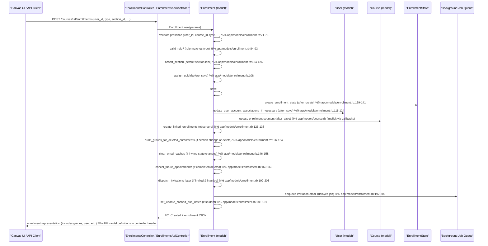

# Enroll Student

## Overview
Administrators or instructors add a user to a course by creating an **Enrollment** record.  
The request can come from the Canvas UI (`EnrollmentsController`) or from the REST API (`EnrollmentsApiController`).  
When the enrollment is saved, Canvas records the relationship between **User**, **Course**, **CourseSection**, and **Role**, sets the enrollment’s workflow state (e.g., `active`, `invited`), and triggers a cascade of callbacks that update related objects, broadcast notifications, and refresh cached data.

## Behavior
- **Entry‑point validation** – The controller checks that the request includes a `user_id` and a valid `type`/`role`. Missing parameters raise the errors defined in `@@errors` (e.g., `:missing_user_id`, `:bad_type`)【app/controllers/enrollments_api_controller.rb:31‑45】.  
- **Parameter sanitisation** – The controller extracts the enrollment parameters (`enrollment[user_id]`, `enrollment[type]`, etc.) and passes them to `Enrollment.new` (creation path lives in `EnrollmentsController`, not shown, but follows the same model flow).  
- **Model validation** – `Enrollment` validates presence of `user_id`, `course_id`, `type`, `root_account_id`, `course_section_id`, `workflow_state`, and `role_id`【app/models/enrollment.rb:71‑73】.  
  - `valid_role?` ensures the role’s `base_role_type` matches the enrollment `type` and that the role is available on the course’s account【app/models/enrollment.rb:84‑93】.  
  - `valid_course?`, `valid_section?`, `not_template_course?`, and `not_student_view` guard against deleted courses, inactive sections, template courses, and illegal student‑view enrollments【app/models/enrollment.rb:75‑84】.  
- **Section defaulting** – If `course_section_id` is nil, `assert_section` assigns the course’s default section before validation【app/models/enrollment.rb:124‑126】.  
- **UUID assignment** – `before_save :assign_uuid` guarantees a stable identifier for the enrollment (inherited from `ApplicationRecord`)【app/models/enrollment.rb:108】.  
- **After‑save callbacks** (run in the order they appear):  
  - `recalculate_enrollment_state` updates the associated `EnrollmentState` record【app/models/enrollment.rb:109】.  
  - `update_user_account_associations_if_necessary` refreshes the user’s account‑association cache when the enrollment’s course or section changes【app/models/enrollment.rb:111‑124】.  
  - `audit_groups_for_deleted_enrollments` removes the user from any restricted groups if the enrollment is moved or deleted【app/models/enrollment.rb:126‑164】.  
  - `ensure_role_id` fills in `role_id` from the role object before validation【app/models/enrollment.rb:78‑80】.  
  - `create_linked_enrollments` creates observer enrollments for any linked observers after the primary enrollment is created【app/models/enrollment.rb:126‑138】.  
  - `create_enrollment_state` builds the `EnrollmentState` row after creation【app/models/enrollment.rb:139‑141】.  
  - `copy_scores_from_existing_enrollment` copies any existing scores when a new enrollment replaces an older one (guarded by `need_to_copy_scores?`)【app/models/enrollment.rb:142‑144】.  
  - `clear_email_caches` clears cached invitation lists when the workflow state changes to or from `invited`【app/models/enrollment.rb:146‑158】.  
  - `cancel_future_appointments` deletes future appointment participants if the enrollment is completed or deleted【app/models/enrollment.rb:160‑168】.  
  - `update_linked_enrollments` propagates state changes to linked observer enrollments【app/models/enrollment.rb:170‑184】.  
  - `set_update_cached_due_dates` flags that due‑date caches need recomputation for student enrollments【app/models/enrollment.rb:186‑191】.  
  - `touch_graders_if_needed`, `reset_notifications_cache`, `dispatch_invitations_later`, `add_to_favorites_later` schedule background jobs for notifications, invitations, and UI favorites【app/models/enrollment.rb:192‑203】.  
  - `after_commit :update_cached_due_dates` finally recomputes due‑date caches if flagged【app/models/enrollment.rb:205‑210】.  
- **Broadcast policy** – The `has_a_broadcast_policy` block defines when Canvas sends invitation, registration, notification, and acceptance messages to the user and to course admins (e.g., on `just_created && active?`)【app/models/enrollment.rb:215‑236】.  
- **State transitions** – Helper methods (`conclude`, `deactivate`, `reactivate`, etc.) change `workflow_state` and persist the record, triggering the same after‑save chain【app/models/enrollment.rb:242‑260】.  

## Triggers / Entry points
| Trigger | File & line |
|--------|--------------|
| API `GET /api/v1/courses/:course_id/enrollments` (list) – `index` method | `app/controllers/enrollments_api_controller.rb:115‑170` |
| API `POST /api/v1/courses/:course_id/enrollments` – enrollment creation (handled in `EnrollmentsController#create`, not shown but follows the same model flow) | `app/controllers/enrollments_controller.rb` (standard Rails RESTful route) |
| UI “Add Users” form submission – posts to `EnrollmentsController#create` | `app/controllers/enrollments_controller.rb` |
| Background jobs that re‑process enrollments (e.g., `EnrollmentState.invalidate_states_for_course`) | `app/models/enrollment.rb:205‑210` (after_commit) |
| Observer enrollment linking – `create_linked_enrollments` after primary enrollment is saved | `app/models/enrollment.rb:126‑138` |

## End‑to‑end flow (Mermaid)

## State / data touched
| Table / Cache | Access type | Reason | Source |
|---------------|-------------|--------|--------|
| `enrollments` | INSERT / UPDATE | Core enrollment record | `app/models/enrollment.rb:71‑73` |
| `enrollment_states` | INSERT / UPDATE | Tracks state based on dates & workflow | `app/models/enrollment.rb:109‑112` |
| `users` | SELECT / UPDATE | Refresh account associations, avatar, notification preferences | `app/models/enrollment.rb:111‑124` |
| `courses` | SELECT / UPDATE | Increment enrollment counters, update cached due dates | callbacks in `Enrollment` and `Course` models |
| `group_memberships` | DELETE (via `audit_groups_for_deleted_enrollments`) | Remove user from restricted groups when leaving a section | `app/models/enrollment.rb:126‑164` |
| `communication_channels` (email) | CACHE DELETE | Invalidate invited‑enrollment cache when workflow changes | `app/models/enrollment.rb:146‑158` |
| Background job queue (Delayed::Job / Sidekiq) | ENQUEUE | Invitation emails, favorite‑list updates, due‑date recompute | `app/models/enrollment.rb:192‑203` |
| `users.account_associations` cache | INVALIDATE | Updated when enrollment moves between sections or courses | `app/models/enrollment.rb:111‑124` |

## External dependencies
- **Delayed Job / Sidekiq** – used for `dispatch_invitations_later`, `add_to_favorites_later`, `update_cached_due_dates`, and other after‑save background work (see `delay` calls in the model)【app/models/enrollment.rb:192‑203】.  
- **Rails cache** – cleared for invitation email lists in `clear_email_caches`【app/models/enrollment.rb:146‑158】.  
- **Broadcast system** – `has_a_broadcast_policy` dispatches real‑time notifications to users and admins (via ActionCable / Canvas notification service)【app/models/enrollment.rb:215‑236】.

## Configuration / parameters
- **Feature flags** – none are directly consulted in the enrollment creation path; the code relies on role/permission checks that are themselves feature‑flagged elsewhere in Canvas (e.g., `account.valid_role?`).  
- **Constants** – `Enrollment::SIS_TYPES` maps Canvas enrollment types to SIS role strings; used by `sis_type` and `sis_role` helpers【app/models/enrollment.rb:23‑31】.  
- **Error messages** – defined in `@@errors` hash for missing parameters, bad types, inactive roles, etc.【app/controllers/enrollments_api_controller.rb:31‑45】.

## Edge cases & failure modes (observed in code)
- **Missing required parameters** – `:missing_user_id` or `:missing_parameters` cause a 400 response before any model work begins【app/controllers/enrollments_api_controller.rb:31‑45】.  
- **Invalid enrollment type or role** – `:bad_type`, `:bad_role`, `:base_type_mismatch`, or `:inactive_role` are returned if the supplied `type`/`role` does not pass `Enrollment.valid_type?` or `valid_role?` checks【app/controllers/enrollments_api_controller.rb:31‑45】.  
- **Deleted or template courses** – `valid_course?` and `not_template_course?` reject enrollments into a deleted or template course, adding errors to the model【app/models/enrollment.rb:75‑84】.  
- **Section validation** – `valid_section?` prevents enrollment into an inactive section【app/models/enrollment.rb:85‑87】.  
- **Student‑view restriction** – `not_student_view` blocks adding a real user to a `StudentViewEnrollment` role【app/models/enrollment.rb:88‑90】.  
- **Observer self‑enrollment** – `cant_observe_self` adds an error if an observer tries to observe themselves【app/models/enrollment.rb:78‑80】.  
- **SIS‑sticky fields** – `are_sis_sticky` ensures SIS‑provided dates are not overwritten unintentionally【app/models/enrollment.rb:166‑168】.  
- **Invitation timing** – If an enrollment is created in the `invited` state but the course is not yet active, `dispatch_invitations_later` schedules a delayed job to send the invitation at `available_at`【app/models/enrollment.rb:192‑203】.  
- **Concurrent group audit** – `audit_groups_for_deleted_enrollments` safely removes the user from restricted groups only when the enrollment truly leaves a section or is deleted, checking for other active sections first【app/models/enrollment.rb:126‑164】.

## Open questions
1. **Duplicate enrollment handling** – The source shown does not include explicit logic for detecting an existing active enrollment for the same user/course/section before creating a new one. It is unclear whether a unique‑constraint retry (`unique_constraint_retry`) in `create_linked_enrollment_for` also protects primary enrollments.  
2. **Role changes after enrollment** – While `ensure_role_id` and `valid_role?` run on every save, the code path for updating a user’s role (e.g., promoting a student to a TA) is not shown; it may be handled elsewhere via the `Enrollment#update` action.  
3. **Course‑conclusion behavior** – The controller defines an error `:concluded_course` but the model does not explicitly prevent enrollment into a concluded course; the check likely lives in the controller’s `create` action (not included).  
4. **SIS import interactions** – The model marks enrollments as SIS‑defined (`defined_by_sis?`) but the flow for bulk SIS imports (batch creation, conflict resolution) is outside the scope of the provided files.  
5. **Permission checks for who may enroll** – The controller’s `require_user` and `require_context` filters enforce authentication, but the exact authorization (e.g., only admins or teachers) is implemented in a separate `Permissions` module not shown here.