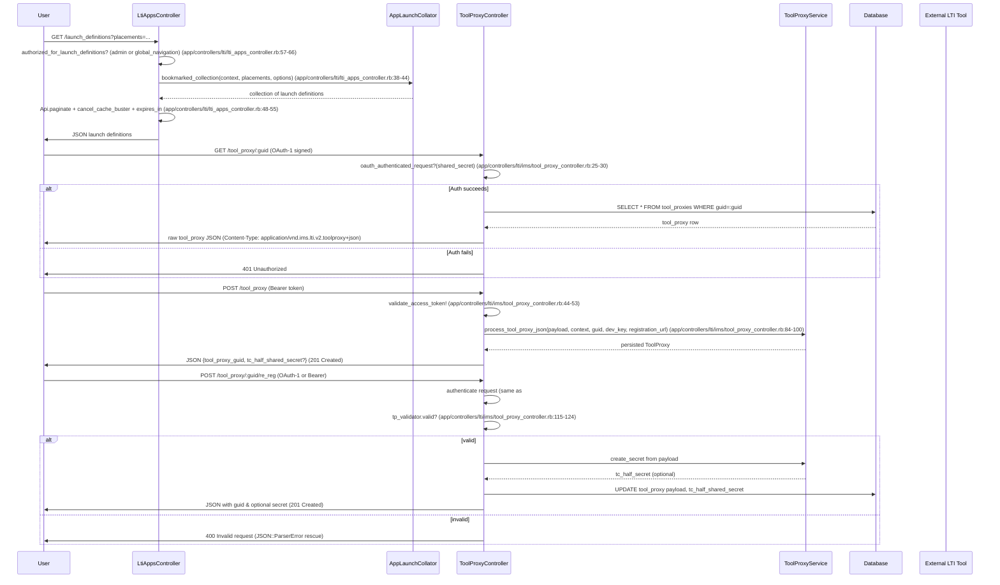

# External Tool Integration (LTI)

## Overview
The External Tool Integration (LTI) feature lets a Canvas course launch and interact with external learning tools that implement the IMS LTI specifications. When a user (student, teacher, or admin) clicks an LTI link or a tool is listed in the course UI, the system builds a launch definition, validates the request, and returns a signed launch URL that the external tool consumes. The feature therefore produces JSON launch definitions for the UI and, on creation or re‑registration, persists a **ToolProxy** that stores the shared secret and GUID used for subsequent launches.

## Behavior
- **List available LTI apps** – `LtiAppsController#index` checks that the caller can read the course as an admin, gathers the bookmarked collection of apps, paginates it, and returns JSON with the app definitions. `app/controllers/lti/lti_apps_controller.rb:15‑27`  
- **Provide launch definitions** – `LtiAppsController#launch_definitions` validates the caller (students are allowed for the *global_navigation* placement), selects the appropriate `AppLaunchCollator` collection (visible only or all), paginates it, sets a short cache, and renders JSON launch definitions. `app/controllers/lti/lti_apps_controller.rb:31‑55`  
- **Create a new ToolProxy** – `ToolProxyController#create` accepts either an OAuth 2.0 bearer token or an OAuth 1.0 signed request, validates the token or signature, retrieves the registration password, and, if valid, calls `render_new_tool_proxy` which parses the incoming JSON payload, stores the proxy, and returns a JSON response containing the new `tool_proxy_guid`. `app/controllers/lti/ims/tool_proxy_controller.rb:38‑66`  
- **Re‑register an existing ToolProxy** – `ToolProxyController#re_reg` authenticates the request (OAuth 2.0 token or OAuth 1.0 signature), loads the existing proxy, validates it with `tp_validator`, builds a response containing the proxy ID and (if generated) a “tc_half_shared_secret”, updates the proxy payload, and saves it. `app/controllers/lti/ims/tool_proxy_controller.rb:71‑108`  
- **Show a ToolProxy** – `ToolProxyController#show` looks up a proxy by GUID, checks the OAuth 1.0 signature against the stored shared secret, and returns the raw JSON representation with the correct LTI media type, or a 401 if authentication fails. `app/controllers/lti/ims/tool_proxy_controller.rb:23‑31`  

## Triggers / Entry points
| Route / Action | File & Line |
|----------------|--------------|
| `GET /api/v1/courses/:course_id/app_definitions` → `LtiAppsController#index` | `app/controllers/lti/lti_apps_controller.rb:15` |
| `GET /api/v1/courses/:course_id/launch_definitions` → `LtiAppsController#launch_definitions` | `app/controllers/lti/lti_apps_controller.rb:31` |
| `POST /api/lti/:context_type/:context_id/tool_proxy` → `ToolProxyController#create` | `app/controllers/lti/ims/tool_proxy_controller.rb:38` |
| `GET /api/lti/tool_proxy/:tool_proxy_guid` → `ToolProxyController#show` | `app/controllers/lti/ims/tool_proxy_controller.rb:23` |
| `POST /api/lti/tool_proxy/:tool_proxy_guid/re_reg` → `ToolProxyController#re_reg` | `app/controllers/lti/ims/tool_proxy_controller.rb:71` |

## End‑to‑end flow (Mermaid)

## State / data touched
| Model / Table | Interaction | File & Line |
|---------------|-------------|--------------|
| `ContextExternalTool` (LTI app definition) | Queried in `index` to filter app definitions for master‑course restrictions | `app/controllers/lti/lti_apps_controller.rb:22‑24` |
| `Lti::ResourceLink` | `Course` has `has_many :lti_resource_links` – used by launch collators (not shown directly) | `app/models/course.rb:274` |
| `Lti::ToolProxy` | Created, read, updated in `ToolProxyController` (`show`, `create`, `re_reg`) | `app/controllers/lti/ims/tool_proxy_controller.rb:23‑31`, `84‑108` |
| `DeveloperKey` / `DeveloperKeyAccountBinding` | `dev_keys` helper builds the list of usable developer keys for LTI 1.3 tools | `app/controllers/lti/lti_apps_controller.rb:135‑152` |
| `User` | `user_in_account?` checks `user.associated_accounts` for global navigation access | `app/controllers/lti/lti_apps_controller.rb:71‑73` |
| `Course` (the context) | Provides `root_account`, `account`, and `settings` used throughout the flow | `app/models/course.rb:84‑115` (associations) |
| `Api.paginate` | Reads from the underlying collection and writes pagination metadata to the response | `app/controllers/lti/lti_apps_controller.rb:48‑50` |
| Caches | `cancel_cache_buster` and `expires_in 10.minutes` control HTTP caching for launch definitions | `app/controllers/lti/lti_apps_controller.rb:53‑55` |
| Background jobs | `setup_master_course_restrictions` may enqueue jobs; `ToolProxy` creation does not enqueue but may trigger downstream LTI launches | `app/controllers/lti/lti_apps_controller.rb:24‑26` |

## External dependencies
- **IMS LTI specifications** – the controller declares the service definitions (`TOOL_PROXY_COLLECTION`, `TOOL_PROXY_ITEM`) with the required media types (`application/vnd.ims.lti.v2.toolproxy+json`). `app/controllers/lti/ims/tool_proxy_controller.rb:18‑30`
- **OAuth 1.0** – signature verification via `oauth_authenticated_request?` (inherited from `Lti::ApiServiceHelper`). `app/controllers/lti/ims/tool_proxy_controller.rb:25‑30`
- **OAuth 2.0 / JWT** – bearer‑token validation performed by `validate_access_token!` (included from `Lti::Ims::AccessTokenHelper`). `app/controllers/lti/ims/tool_proxy_controller.rb:44‑53`
- **DeveloperKey / DeveloperKeyAccountBinding** – used to locate LTI 1.3 developer keys. `app/controllers/lti/lti_apps_controller.rb:135‑152`
- **Background job system (ActiveJob / Delayed::Job)** – `setup_master_course_restrictions` may enqueue jobs; `ToolProxy` updates are saved synchronously. `app/controllers/lti/lti_apps_controller.rb:24‑26`

## Configuration / parameters
- **`dev_keys`** – builds the list of usable developer keys for the current account; depends on `DeveloperKeyAccountBinding.active_in_account` and `DeveloperKey.site_admin_lti`. `app/controllers/lti/lti_apps_controller.rb:135‑152`
- **`only_visible` flag** – passed to `AppLaunchCollator.bookmarked_collection` to restrict launch definitions to those the user can see (except for `global_navigation`). `app/controllers/lti/lti_apps_controller.rb:38‑44`
- **Pagination limit** – `max_per_page: 100` for launch definitions. `app/controllers/lti/lti_apps_controller.rb:46‑48`
- **Cache‑control** – `expires_in 10.minutes` for launch definitions responses. `app/controllers/lti/lti_apps_controller.rb:53‑55`
- **Feature flag `lti_1_3`** – referenced indirectly via `DeveloperKeyAccountBinding.lti_1_3_tools`; the flag gates LTI 1.3 key selection. (source in `dev_keys` method). `app/controllers/lti/lti_apps_controller.rb:138‑141`

## Edge cases & failure modes (observed in code)
- **Invalid ToolProxy JSON** – `ToolProxyController#re_reg` rescues `JSON::ParserError` and returns a 400 error. `app/controllers/lti/ims/tool_proxy_controller.rb:124‑126`
- **Invalid OAuth signatures** – `show` returns 401 when `oauth_authenticated_request?` fails. `app/controllers/lti/ims/tool_proxy_controller.rb:27‑31`
- **Missing or invalid access token** – `create` catches `Lti::Oauth2::InvalidTokenError` and returns 401. `app/controllers/lti/ims/tool_proxy_controller.rb:46‑50`
- **ToolProxy validation failure** – `re_reg` raises `Lti::Errors::InvalidToolProxyError` which is rescued by the controller’s `rescue_from` block and rendered as JSON with status 400. `app/controllers/lti/ims/tool_proxy_controller.rb:123‑126`
- **Authorization for launch definitions** – students can only retrieve launch definitions for the `global_navigation` placement; otherwise `authorized_for_launch_definitions` falls back to a normal `read` permission check. `app/controllers/lti/lti_apps_controller.rb:66‑73`
- **Empty launch definition collection** – if a non‑admin requests `only_visible` without specifying placements, the method returns an empty array (comment in code). `app/controllers/lti/lti_apps_controller.rb:34‑36`

## Open questions
- The exact contents and construction of the `AppLaunchCollator` and `AppCollator` objects are not visible in the provided files; their internal queries to `LtiTool`, `LtiResourceLink`, and other models are inferred but not shown.  
- How the system handles network failures when an external LTI tool endpoint is unreachable is not present in the controller code; such handling likely lives in the client side of the launch (browser redirects) or in background jobs not included here.  
- The role of the `User` model in the launch flow (e.g., how user attributes are mapped into the LTI launch payload) is not shown in the snippets; it is probably performed by the `AppLaunchCollator` or by the LTI launch service outside the controller scope.