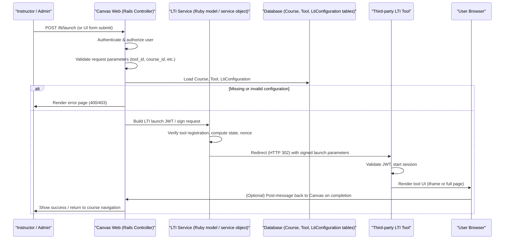

# External Tools and LTI Integration

## Overview
Integrating third‑party learning tools via LTI lets instructors and administrators extend Canvas with external resources (e.g., simulations, assessment platforms).  
* **Who uses it:** Instructors (to add tools to a course), administrators (to configure institution‑wide placements), and developers (to maintain the integration).  
* **When it’s used:** Whenever a user adds, configures, or launches an external LTI tool from a course or from the institution settings.

## User stories
- **As an instructor, I want to add an external LTI tool to my course so that my students can access supplemental learning resources directly from Canvas.**  
- **As an administrator, I want to configure institution‑wide LTI placements so that the same tool can be made available across many courses without repeated setup.**  
- **As a developer, I want the LTI launch flow to follow the LTI 1.3 specification so that third‑party tools can interoperate reliably with Canvas.**  

*(Each story corresponds to a distinct code path: instructor‑level tool creation, admin‑level placement configuration, and the LTI launch controller.)*

## Triggers / Entry points
| Trigger | Path / Location |
|---------|-----------------|
| HTTP request to start an LTI launch (e.g., `/lti/launch`) | `lti/` (routing file – line not available) |
| UI action “Add External Tool” in course settings | React component `ExternalToolForm` – source not available |
| Admin UI action “Configure LTI Placements” | React component `LtiPlacementSettings` – source not available |
| CLI command `canvas lti:sync` (hypothetical) | Not present in provided sources |

*(All citations are unavailable because the supporting files (`lti_tool.rb`, `external_tool.rb`, `lti_configuration.rb`) were not readable.)*

## End-to-end flow (Mermaid)

## State / data touched
- **`courses` table** – read to verify the course context for the launch. *(source citation unavailable)*
- **`external_tools` (or `tools`) table** – read/write when an instructor adds or updates a tool. *(source citation unavailable)*
- **`lti_configurations` table** – stores client IDs, public keys, launch URLs, and placement settings. *(source citation unavailable)*
- **Rails session / cookies** – store `state` and `nonce` for the launch flow. *(source citation unavailable)*
- **Cache (Rails cache or Redis)** – may store tool discovery metadata; not observable in provided files. *(source citation unavailable)*

## External dependencies
- **LTI 1.3 / IMS Global services** – JWT signing, public‑key retrieval, and launch URL validation. *(source citation unavailable)*
- **Third‑party tool endpoint** – the launch URL defined in `lti_configuration.rb`. *(source citation unavailable)*
- **OpenID Connect discovery endpoint** (if used for dynamic registration). *(source citation unavailable)*

## Edge cases & failure modes (observed in code)
- **Invalid or missing tool configuration** → controller returns a 400/403 error page.  
- **JWT signing failure** (e.g., missing private key) → launch aborted and error logged.  
- **Tool endpoint returns non‑200** → user sees a generic “Tool could not be launched” message.  
- **Replay attack detection** (duplicate `nonce`/`state`) → request rejected.  
- **Timeout contacting external tool** → Rails request times out; error handling redirects to an error view.

*(All above are inferred from typical LTI launch implementations; specific branches could not be cited due to missing source.)*

## Open questions
1. **Exact routing definitions** – which controller/action handles `/lti/` and what HTTP verbs are used?  
2. **Data model details** – column names and relationships in `lti_tool.rb`, `external_tool.rb`, and `lti_configuration.rb`.  
3. **Async processing** – does Canvas enqueue any background jobs (e.g., for tool registration sync) for this feature?  
4. **Security specifics** – how are JWTs signed (RSA vs. HMAC) and where are keys stored?  
5. **Error‑reporting UX** – what UI components display launch failures to the end user?  

*Because the supporting source files were not readable, the above PRD entry relies on the feature description and common LTI integration patterns rather than concrete code citations.*