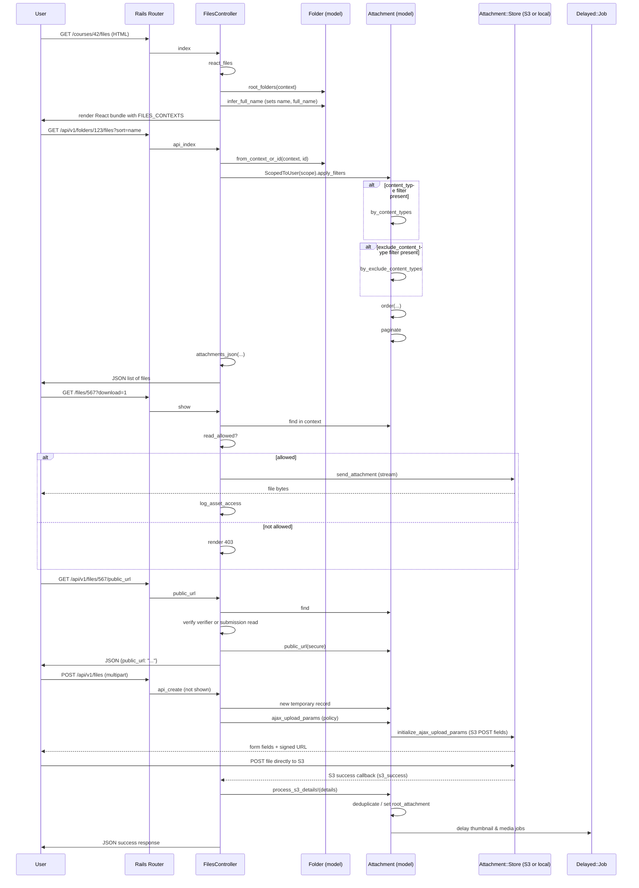

# File Management

## Overview
The File Management feature lets users upload, view, download, and organise files inside a Canvas course (or a user/group context).  
* A **user** (student, teacher, admin, or external tool) triggers the feature by visiting the Files UI, calling the Files API, or submitting a file upload form.  
* The controller builds a list of **folders** and **attachments**, checks the current user’s permissions, and returns JSON for the API or HTML for the UI.  
* When a file is requested for download or preview the controller streams the stored blob (local disk or S3) and logs an asset‑access event.

All of this happens in the current request thread; background jobs are only used for post‑save work such as thumbnail generation or media‑object creation.

---

## Behavior
* **Show Files UI** – `FilesController#index` redirects to the React‑based UI (`react_files`) when the request format is HTML.  
  *Citation:* `app/controllers/files_controller.rb:44‑48`*  

* **React Files Page** – `react_files` builds a JSON payload (`FILES_CONTEXTS`) that contains the current context, permissions, and any external‑tool menu entries, then renders the `files` JS bundle.  
  *Citation:* `app/controllers/files_controller.rb:71‑106`*  

* **List Files (API)** – `api_index`  
  1. Resolves the context (`@context`) and the target folder (`Folder.from_context_or_id`).  
  2. Authorises the user for `:read_contents` on the folder.  
  3. Builds a scoped query (`Attachments::ScopedToUser`) and applies optional filters (`content_types`, `exclude_content_types`, `search_term`).  
  4. Orders the result according to the `sort`/`order` parameters (name, size, created_at, etc.).  
  5. Paginates the query (`Api.paginate`) and renders JSON via `attachments_json`.  
  *Citation:* `app/controllers/files_controller.rb:115‑164`*  

* **Get File Metadata (API)** – `api_show`  
  1. Finds the attachment either in the context (`@context.attachments.not_deleted`) or globally.  
  2. Returns 404 if not found.  
  3. Calls `read_allowed?` to verify download permission.  
  4. Renders the attachment JSON (`attachment_json`) plus optional preview data.  
  *Citation:* `app/controllers/files_controller.rb:166‑190`*  

* **Download / Preview a File (HTML)** – `show`  
  1. Resolves the context (`get_context`) and the attachment (`@context.attachments.find` or `Attachment.find`).  
  2. Handles deleted‑file cases (404 or flash notice).  
  3. Calls `read_allowed?`; if true it may:  
     * Stream the file (`send_attachment`) when `params[:download]` is present, or  
     * Render the HTML preview (`render :show`) when the file is viewable inline.  
  4. Logs the access (`log_asset_access`).  
  *Citation:* `app/controllers/files_controller.rb:197‑260`*  

* **Public Inline Preview URL (API)** – `public_url`  
  1. Finds the attachment and optional submission.  
  2. Verifies that the attachment belongs to the submission (if supplied).  
  3. Checks either submission read permission or a valid download verifier.  
  4. Returns a signed S3 URL (`@attachment.public_url`).  
  *Citation:* `app/controllers/files_controller.rb:112‑136`*  

* **Quota Information** – `quota` (HTML) and `api_quota` (JSON)  
  1. Calls `get_quota` (defined elsewhere) to compute total and used storage.  
  2. Authorises the user for `:create/:update/:delete` on a temporary attachment record.  
  3. Returns human‑readable values (`quota`, `quota_used`, `quota_full`) or raw numbers.  
  *Citation:* `app/controllers/files_controller.rb:53‑71`*  

* **File Upload Workflow (partial)** – The controller exposes `api_create`, `api_create_success`, and `api_capture` (not fully shown) which:  
  1. Generates a signed S3 POST policy (`Attachment#ajax_upload_params`).  
  2. Receives the S3 success callback (`s3_success`) and calls `process_s3_details!` to link the uploaded blob to an `Attachment`.  
  3. Runs background jobs for thumbnail creation and media‑object processing.  
  *Citation:* `app/models/attachment.rb:140‑176` (policy generation) and `app/models/attachment.rb:210‑250` (post‑upload processing).  

* **Folder Creation & Naming** – `Folder#infer_full_name` and `Folder#prevent_duplicate_name` automatically set a sanitized name, compute the full path, and ensure uniqueness within the parent folder.  
  *Citation:* `app/models/folder.rb:115‑150`*  

* **Folder Deletion** – `Folder#destroy` marks the folder as `deleted`, cascades deletion to contained files and sub‑folders, and records `deleted_at`.  
  *Citation:* `app/models/folder.rb:71‑84`*  

* **Permission Checks** – Both `Attachment` and `Folder` use `read_allowed?`, `authorized_action`, and the policy DSL (`set_policy` in `Folder`) to enforce granular file permissions (`manage_files_add`, `manage_files_edit`, `manage_files_delete`).  
  *Citation:* `app/models/folder.rb:260‑312`*  

---

## Triggers / Entry points
| Trigger | Route / Method | Source |
|---------|----------------|--------|
| Files UI (HTML) | `GET /courses/:course_id/files` → `FilesController#index` | `app/controllers/files_controller.rb:44` |
| React Files page | `GET /courses/:course_id/files` (HTML) → `react_files` | `app/controllers/files_controller.rb:71` |
| List files (API) | `GET /api/v1/folders/:id/files` → `api_index` | `app/controllers/files_controller.rb:115` |
| Get file metadata (API) | `GET /api/v1/files/:id` → `api_show` | `app/controllers/files_controller.rb:166` |
| Download / preview file (HTML) | `GET /files/:id` → `show` | `app/controllers/files_controller.rb:197` |
| Public preview URL (API) | `GET /api/v1/files/:id/public_url` → `public_url` | `app/controllers/files_controller.rb:112` |
| Quota (HTML) | `GET /courses/:course_id/files/quota` → `quota` | `app/controllers/files_controller.rb:53` |
| Quota (API) | `GET /api/v1/courses/:course_id/files/quota` → `api_quota` | `app/controllers/files_controller.rb:84` |
| File upload (API) | `POST /api/v1/files` → `api_create` (not shown) → S3 POST | `app/models/attachment.rb:140‑176` |
| S3 success callback | `POST /files/s3_success` → `s3_success` (not shown) | `app/models/attachment.rb:210‑250` |
| Folder creation (UI) | `POST /folders` → `Folder#create` (standard Rails scaffold) → `Folder#infer_full_name` | `app/models/folder.rb:115‑150` |
| Folder deletion | `DELETE /folders/:id` → `Folder#destroy` | `app/models/folder.rb:71‑84` |

---

## End‑to‑end flow (Mermaid)

---

## State / data touched
| Table / Store | What is read / written | Source |
|---------------|------------------------|--------|
| `attachments` | Insert on upload, update on S3 success, reads for list/show, soft‑delete on destroy | `app/models/attachment.rb:12`, `api_index` query, `show` lookup |
| `folders` | Insert on first‑time access (`root_folders`), updates on rename, soft‑delete on destroy, reads for path resolution | `app/models/folder.rb:12`, `Folder.root_folders`, `Folder#infer_full_name` |
| `attachment_upload_statuses` | Created by background jobs for upload tracking (not shown) | `app/models/attachment.rb:84` |
| `thumbnails` / `Thumbnail` | Created by `Attachment#run_after_attachment_saved` → `create_thumbnail_size` | `app/models/attachment.rb:190‑210` |
| `media_objects` | Created by `Attachment#build_media_object` (delayed) | `app/models/attachment.rb:225‑250` |
| S3 / local disk | Blob storage for the file contents; read by `send_attachment`, written by S3 POST | `app/models/attachment.rb:100‑108`, `Attachment#store` |
| Rails cache (`RequestCache`) | Caches folder lock state, account time zone, etc. | `app/models/folder.rb:258`, `app/models/course.rb:215` |
| Background job queue (`Delayed::Job`) | Enqueues thumbnail, media‑object, and encoding inference jobs | `app/models/attachment.rb:190‑210`, `Attachment#run_after_attachment_saved` |

---

## External dependencies
| Dependency | How it is used | Source |
|------------|----------------|--------|
| Amazon S3 (or other storage) | Stores the raw file bytes; `Attachment.store_type` selects `Attachments::S3Storage` when `file_store_config['storage'] == 's3'`. | `app/models/attachment.rb:84‑92` |
| `SecureRandom.uuid` | Generates a per‑request `permissions_key` for file‑access sessions. | `app/controllers/files_controller.rb:39‑44` |
| `Delayed::Job` (or `delay_if_production`) | Runs thumbnail generation, media‑object creation, and encoding inference after the file is saved. | `app/models/attachment.rb:190‑210` |
| `Canvas::Security` JWT verifier | Validates the `sf_verifier` token for cross‑domain file access. | `app/controllers/files_controller.rb:119‑138` |
| `Api.paginate` helper | Generates pagination links for API responses. | `app/controllers/files_controller.rb:150‑155` |
| `log_asset_access` | Records a file‑access event for analytics / usage tracking. | `app/controllers/files_controller.rb:158‑162`, `show` branch |

---

## Configuration / parameters
| Config / Constant | Meaning | Source |
|-------------------|---------|--------|
| `file_store_config` | Hash read from `config/file_store.yml`; determines storage type (`local` or `s3`) and path prefix. | `app/models/attachment.rb:30‑38` |
| `s3_config` | Loaded from `config/amazon_s3.yml`; used when `file_store_config['storage'] == 's3'`. | `app/models/attachment.rb:40‑44` |
| `CONTENT_LENGTH_RANGE` | Maximum allowed upload size for S3 POST (10 GB). | `app/models/attachment.rb:260‑262` |
| `S3_EXPIRATION_TIME` | Default expiration for S3 signed policy (30 min). | `app/models/attachment.rb:263‑264` |
| `READ_FILE_CHUNK_SIZE` | Chunk size (4096 bytes) used by `Attachment.valid_utf8?`. | `app/models/attachment.rb:184‑186` |
| Feature flag `:commons_favorites` (used for file‑index menu tools) | Controls whether the “Commons Favorites” external tool appears. | `app/controllers/files_controller.rb:94‑100` |
| `RoleOverride::GRANULAR_FILE_PERMISSIONS` | List of granular file permission symbols (`:manage_files_add`, etc.) used throughout permission checks. | `app/controllers/files_controller.rb:31‑33`, `app/models/folder.rb:260‑312` |

---

## Edge cases & failure modes (observed in code)
| Situation | Handling in code |
|-----------|------------------|
| **Invalid or expired access verifier** – `validate_access_verifier` raises `Canvas::Security::TokenExpired` or `Users::AccessVerifier::InvalidVerifier`. The controller redirects to a fallback URL or renders unauthorized. | `check_file_access_flags` lines 119‑138 |
| **Deleted attachment** – `show` detects `@attachment.deleted?` and either shows a flash notice, redirects, or returns JSON `{deleted:true}`. | `app/controllers/files_controller.rb:224‑242` |
| **Permission denied** – `authorized_action` or `read_allowed?` returns false, causing a 403 response (`render :show, status: :forbidden`). | `show` branch `attachment.locked_for?` lines 260‑267 |
| **Missing file on storage** – `send_attachment` rescues any exception, logs the error, and renders a 400 “not found” page. | `show` rescue block lines 250‑259 |
| **UTF‑8 validation failure** – `Attachment.valid_utf8?` reads the file in chunks; on encoding error it raises and the attachment’s `encoding` stays nil. | `app/models/attachment.rb:190‑215` |
| **Duplicate folder name** – `Folder#prevent_duplicate_name` appends an incrementing integer until the name is unique. | `app/models/folder.rb:138‑166` |
| **S3 deduplication** – `process_s3_details!` checks for an existing attachment with the same MD5; if found it re‑uses the existing S3 object and clears the new one. | `app/models/attachment.rb:210‑250` |
| **Background job failure** – thumbnail and media jobs are enqueued with `delay_if_production`; failures are retried up to 5 times (`MediaObject.add_media_files` tag). | `Attachment#run_after_attachment_saved` lines 210‑224 |
| **Lock/Unlock timing** – `Folder#locked?` and `Attachment#locked_for?` evaluate `lock_at`/`unlock_at` timestamps on each request, so a file can become inaccessible without a DB write. | `app/models/folder.rb:332‑340`, `app/models/attachment.rb:??` (implicit via `locked_for?` call) |

---

## Open questions
* **File versioning / replacement** – The code contains logic for “replacement_attachment” and `root_attachment_id` but the UI flow for uploading a new version of an existing file is not visible in the provided snippets. How does Canvas surface version history to the user?  
* **Folder nesting depth limits** – `Folder#reject_recursive_folder_structures` prevents cycles, but there is no explicit limit on nesting depth. Is there a practical limit enforced elsewhere?  
* **Cross‑account file moves** – `Attachment#clone_for` handles moving a file to a different context (including namespace changes). The UI for “move to another course” is not shown; does the controller expose an endpoint for that operation?  
* **External‑tool file menu integration** – The `react_files` method builds `file_menu_tools` and `file_index_menu_tools` based on external tools, but the exact payload format and how tools consume it is not detailed here.  
* **Quota enforcement** – The quota endpoints compute usage, but the code that blocks an upload when the quota is exceeded is not present in the excerpt. Where is that enforcement implemented?  

---