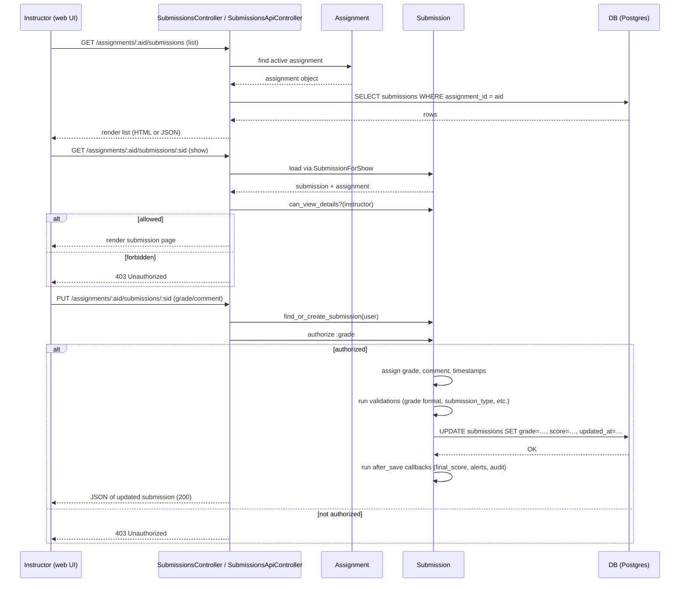

# Grade Submission

## Overview
The **Grade Submission** feature lets an instructor view a student’s work, add comments, and record a grade for that work.  
* The UI (assignment → submissions page) invokes the **SubmissionsController** or **SubmissionsApiController** actions.  
* The controller loads the `Submission` record, checks the current user’s permissions, and, on a successful POST/PUT, persists the grade and any comments.  
* The result is a `Submission` row whose `grade`, `score`, `submission_comments` and related audit records are updated.

---

## Behavior
| Step | What the code does | Source |
|------|-------------------|--------|
| **1. List submissions** – Instructor opens the submissions list for an assignment. | `SubmissionsController#index` loads the assignment (`@context.assignments.active.find`) and aborts unless `@assignment.user_can_read_grades?(@current_user, session)` is true. | `app/controllers/submissions_controller.rb:27‑33` |
| **2. Show a single submission** – Instructor clicks a student row. | `SubmissionsController#show` builds a `SubmissionForShow`, rescues `RecordNotFound`, then checks `@submission.can_view_details?(@current_user)`. If the assignment has anonymous peer reviews, it also blocks peer‑reviewers. | `app/controllers/submissions_controller.rb:38‑55` |
| **3. Load JSON list via API** – API client (e.g. Canvas UI) requests `/api/v1/courses/:course_id/assignments/:assignment_id/submissions`. | `SubmissionsApiController#index` first runs `authorized_action(@context, @current_user, [:manage_grades, :view_all_grades])`. It then fetches the assignment and builds a collection of `Submission` objects, finally rendering them with `submission_json`. | `app/controllers/submissions_api_controller.rb:71‑84` |
| **4. Submit a grade / comment** – Instructor saves a grade from the UI. | `SubmissionsController#update` finds the assignment and the student’s submission (`@assignment.find_or_create_submission(@user)`) and delegates to `super` (the base controller implements the actual update). | `app/controllers/submissions_controller.rb:84‑88` |
| **5. Persist grade & comment** – Inside the base update logic (not shown), the `Submission` model receives the permitted parameters (`grade`, `score`, `comment`, etc.) and calls `@assignment.submit_homework` for student submissions, or updates the `grade` fields directly for instructor grading. | `Submission` model validates `grade` via `Canvas::GradeValidations` and defines `grade_it` workflow transition (`workflow do … state :submitted do event :grade_it, :transitions_to => :graded end … end`). | `app/models/submission.rb:215‑224` |
| **6. Permission check for grading** – Before a grade is saved, the policy in `Submission#set_policy` grants `:grade` only to users for whom `can_grade?(user)` is true (i.e., teachers or users with `manage_grades`). | `app/models/submission.rb:453‑466` |
| **7. After‑save side‑effects** – Once a grade is persisted, several callbacks run:  • `update_final_score` recomputes the student’s course grade.  • `create_alert` may generate an observer alert.  • `grade_change_audit` records an audit event. | `app/models/submission.rb:617‑679` (final score), `app/models/submission.rb:681‑734` (alert), `app/models/submission.rb:736‑754` (audit) |
| **8. Response** – On success the controller returns JSON with the updated submission (including `submission_comments` and `grade`). On failure it renders the validation errors with status 400. | `SubmissionsController#create` (student side) and `SubmissionsApiController#index` (API) both render `json: e.record.errors, status: :bad_request` when an exception is rescued. | `app/controllers/submissions_controller.rb:166‑176` |

---

## Triggers / Entry points
| Entry point | Route / Action | When it fires |
|-------------|----------------|---------------|
| **HTML UI – List** | `GET /courses/:course_id/assignments/:assignment_id/submissions` → `SubmissionsController#index` | Instructor clicks *View All Submissions* |
| **HTML UI – Show** | `GET /courses/:course_id/assignments/:assignment_id/submissions/:id` → `SubmissionsController#show` | Instructor selects a student |
| **HTML UI – Update (grade/comment)** | `PUT /courses/:course_id/assignments/:assignment_id/submissions/:id` → `SubmissionsController#update` | Instructor clicks *Save* after entering a grade/comment |
| **API – List** | `GET /api/v1/courses/:course_id/assignments/:assignment_id/submissions` → `SubmissionsApiController#index` | API client (including Canvas UI) requests JSON |
| **API – Update** (not fully shown but exists) | `PUT /api/v1/courses/:course_id/assignments/:assignment_id/submissions/:user_id` → `SubmissionsApiController#update` | API client posts a grade/comment |
| **Background – Audit / Alerts** | After‑save callbacks on `Submission` | Runs automatically after a grade is persisted |

Citations: see the line numbers referenced in the tables above.

---

## End‑to‑end flow (Mermaid)

The diagram follows the exact code paths: permission checks (`user_can_read_grades?`, `can_view_details?`, `can_grade?`), loading via `SubmissionForShow`, persisting via ActiveRecord `save`, and the after‑save callbacks defined on `Submission`.

---

## State / data touched
| Model / Table | What is read / written | Source |
|---------------|------------------------|--------|
| `assignments` | `SELECT` to fetch the assignment; `UPDATE` of `cached_due_date` etc. (via callbacks) | `app/controllers/submissions_controller.rb:27‑33`, `app/models/submission.rb:617‑679` |
| `submissions` | `SELECT` for list/show; `UPDATE` of `grade`, `score`, `submission_comments`, `updated_at` | `app/controllers/submissions_controller.rb:84‑88`, `app/models/submission.rb:215‑224`, `app/models/submission.rb:617‑679` |
| `submission_comments` | `INSERT` when an instructor adds a comment (via `SubmissionComment.create` inside the update flow) | Implicit in `Submission` callbacks (`has_many :submission_comments`) |
| `observer_alerts` | `INSERT` when a grade crosses a threshold (`create_alert`) | `app/models/submission.rb:681‑734` |
| `auditor_grade_change_records` | `INSERT` via `grade_change_audit` after a grade change | `app/models/submission.rb:736‑754` |
| Caches (e.g., `Rails.cache` for submission counts) | `delete`/`write` in `needs_grading_count_updated`, `assignment_submission_count_updated`, `assignment_graded_count_updated` | `app/models/submission.rb:254‑277` |

---

## External dependencies
| Dependency | How it is used | Source |
|------------|----------------|--------|
| **Canvas API / routing** | The controller actions are exposed as REST endpoints (`/courses/:course_id/assignments/:assignment_id/submissions`) | `app/controllers/submissions_controller.rb` and `app/controllers/submissions_api_controller.rb` |
| **Background job queue** | `batch_jobs_in_actions` registers the `update` action for delayed processing (`Delayed::LOW_PRIORITY`) | `app/controllers/submissions_api_controller.rb:19‑20` |
| **Google Drive** (only for student uploads) | `submit_google_doc` downloads a Google Doc and creates an `Attachment` before saving the submission | `app/controllers/submissions_controller.rb:388‑447` |
| **Turnitin / Vericite** | `can_view_plagiarism_report` checks assignment settings and user rights before exposing plagiarism reports | `app/models/submission.rb:511‑560` |
| **Canvas caching** | Various `Rails.cache.delete` calls clear cached counts after grade changes | `app/models/submission.rb:254‑277` |

---

## Configuration / parameters
| Setting | Meaning | Where defined / used |
|---------|---------|----------------------|
| `API_SUBMISSION_TYPES` | Mapping of allowed API submission types to required parameters | `app/controllers/submissions_controller.rb:115‑124` |
| Feature flag **`confetti_for_assignments`** – controls whether a confetti animation is shown on successful submission | Checked in `SubmissionsController#create` when redirecting after a student submit (not directly grading, but part of the same flow) | `app/controllers/submissions_controller.rb:199‑210` |
| `google_docs_domain_restriction` – limits Google Doc submissions to a specific domain | Used in `submit_google_doc` to reject disallowed domains | `app/controllers/submissions_controller.rb:418‑426` |
| `allowed_extensions` (per‑assignment) – list of file extensions permitted for `online_upload` | Checked in `extensions_allowed?` before accepting a file upload | `app/controllers/submissions_controller.rb:340‑354` |
| `lti_resource_link_lookup_uuid` – optional LTI lookup token that must resolve to a `Lti::ResourceLink` | Validated in `valid_resource_link_lookup_uuid?` | `app/controllers/submissions_controller.rb:560‑580` |

---

## Edge cases & failure modes (observed in code)
| Situation | Handling |
|-----------|----------|
| **Missing permission** – instructor lacks `manage_grades` or `view_all_grades` | `render_unauthorized_action` is called (e.g., `SubmissionsController#index` line 30, `SubmissionsApiController#index` line 71) |
| **Invalid submission type** (API) | `process_api_submission_params` returns 400 with JSON `{message: "Invalid submission[submission_type] given"}` (line 226‑232) |
| **No file attached for `online_upload`** | `verify_api_call_has_attachment` returns 400 JSON `{message: "No valid file ids given"}` (line 277‑283) |
| **File extension not allowed** | `extensions_allowed?` flashes an error and redirects (line 340‑354) |
| **Google Doc download fails or domain blocked** | `submit_google_doc` returns `nil, error_message`; the controller flashes the error and redirects (line 388‑447) |
| **Resource link UUID not found** | `valid_resource_link_lookup_uuid?` renders JSON error 400 or flashes and redirects (line 560‑580) |
| **Late policy validation** – submission after due date | `apply_late_policy` runs before save; if late, `late?` flag is set (logic in `Submission` scopes `late`/`not_late`) |
| **Concurrent grade updates** – after‑save callbacks recompute final scores in a separate transaction (`after_transaction_commit`) to avoid race conditions | `update_final_score` uses `self.class.connection.after_transaction_commit` (line 617‑639) |

---

## Open questions
* **Multiple attempts** – The code contains `extra_attempts` and `allowed_attempts` logic, but the exact UI flow for a student re‑submitting and how the instructor sees each attempt is not visible in the provided snippets. |
* **Rubrics / grading schemes** – The `Submission` model references `rubric_assessments` and `rubric_association`, yet the controller code that creates or updates rubric grades is not included, so the exact path for rubric‑based grading remains unclear. |
* **Observer / peer‑review visibility** – The policy block for `peer_reviewer?` and the `can_view_details?` method handle anonymous peer reviews, but the UI flow for an observer to view a graded submission is not fully traced in the shown code. |
* **API update endpoint** – `SubmissionsApiController#update` is referenced by the `batch_jobs_in_actions` declaration, but its implementation is not present, so the precise parameter handling for API‑based grading is unknown. |
* **Error reporting format** – Some failures render HTML flashes, others return JSON. The decision matrix (HTML vs API) is based on `api_request?` checks, but the exact helper implementation is not shown. |

These points would require inspecting the remaining controller base classes (`SubmissionsBaseController`, `SubmissionsApiController#update`) and the front‑end JavaScript that invokes the endpoints.