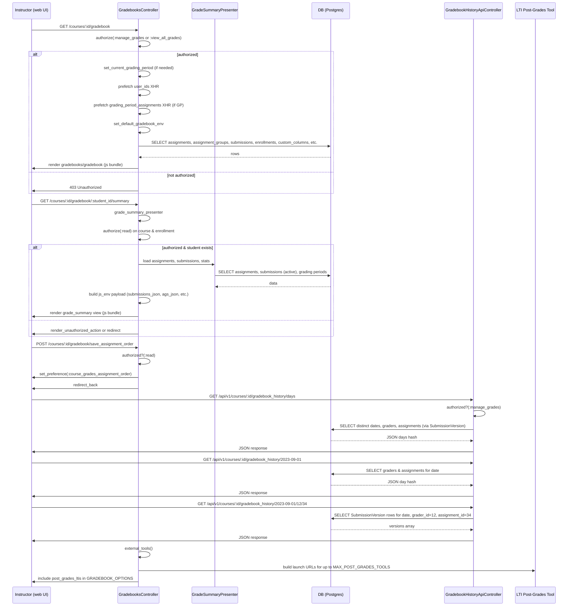

# Gradebook

## Overview
The Gradebook feature provides instructors with a **centralized, interactive view of all student grades** for every assignment in a course.  
When an instructor navigates to the gradebook UI (`GET /courses/:course_id/gradebook`), the controller gathers the current grading period (if any), the list of assignments, assignment groups, and each student’s submission data, then renders a JavaScript‑driven page that lets the instructor view, edit, and export grades, as well as access grade‑history APIs. The feature is read‑only for users without the `manage_grades` permission and produces JSON payloads (`GRADEBOOK_OPTIONS`) that power the front‑end gradebook bundles.

## Behavior
- **Permission gating** – The controller checks that the user can `:manage_grades` or `:view_all_grades` before rendering the gradebook (`show` action). If the check fails, `render_unauthorized_action` is called. (`app/controllers/gradebooks_controller.rb:71‑78`)  
- **Grading period selection** – If the course uses grading periods, `set_current_grading_period` determines the active period from `params[:grading_period_id]` or defaults to the current period. (`app/controllers/gradebooks_controller.rb:210‑224`)  
- **Data pre‑fetch** – For the default gradebook view, the controller issues XHR pre‑fetches for the list of user IDs and, when grading periods are enabled, for period‑specific assignments. (`app/controllers/gradebooks_controller.rb:250‑259`)  
- **Environment assembly** – `set_default_gradebook_env` builds a large `GRADEBOOK_OPTIONS` hash that includes:
  - Course metadata (name, SIS ID, URL)  
  - Grading settings (group weighting, grading scheme, final‑grade‑override flag)  
  - URLs for API endpoints (enrollments, custom columns, export CSV, etc.)  
  - Feature‑flag checks (`new_gradebook_development_enabled?`, `post_grades_feature?`, etc.)  
  - Recent gradebook CSV export info (`GradebookCsv.last_successful_export`).  
  (`app/controllers/gradebooks_controller.rb:285‑363`)  
- **Student‑specific summary** – The `grade_summary` action builds a presenter, validates the student enrollment, logs asset access, loads submissions, assignment groups, rubric data, and finally injects a JSON payload via `js_env`. (`app/controllers/gradebooks_controller.rb:31‑55`, `load_grade_summary_data` at `app/controllers/gradebooks_controller.rb:84‑166`)  
- **Assignment‑group JSON** – `light_weight_ags_json` returns a compact representation of each assignment group with visible assignments (id, points, due date, muted flag, etc.), respecting the current grading period if applicable. (`app/controllers/gradebooks_controller.rb:176‑197`)  
- **Saving assignment order** – `save_assignment_order` stores the instructor’s preferred ordering (`due_at`, `title`, `module`, `assignment_group`) in a user preference and redirects back. (`app/controllers/gradebooks_controller.rb:215‑224`)  
- **External LTI “post grades” tools** – `external_tools` collects up to `MAX_POST_GRADES_TOOLS` LTI tools that support the `post_grades` placement, builds launch URLs for each, and exposes them via `post_grades_ltis`. (`app/controllers/gradebooks_controller.rb:380‑410`)  
- **Gradebook history API** – `GradebookHistoryApiController` provides three endpoints:
  1. `days` – returns a map of dates → graders/assignments (`days_json`). (`app/controllers/gradebook_history_api_controller.rb:45‑53`)  
  2. `day_details` – for a given date, returns graders and the assignments they graded. (`day_details` at `app/controllers/gradebook_history_api_controller.rb:61‑71`)  
  3. `submissions` – nested list of submission versions for a grader/assignment/date combo. (`submissions` at `app/controllers/gradebook_history_api_controller.rb:79‑92`)  
  4. `feed` – paginated, un‑collated list of all submission versions matching optional assignment/user filters. (`feed` at `app/controllers/gradebook_history_api_controller.rb:106‑127`)  

## Triggers / Entry points
| Trigger | Route / Method | Source |
|--------|----------------|--------|
| Open default gradebook UI | `GET /courses/:course_id/gradebook` → `GradebooksController#show` → `show_default_gradebook` | `app/controllers/gradebooks_controller.rb:94‑108` |
| Open individual gradebook UI | `GET /courses/:course_id/gradebook?version=individual` → `show_individual_gradebook` | `app/controllers/gradebooks_controller.rb:110‑119` |
| Open learning‑mastery gradebook UI | `GET /courses/:course_id/gradebook?version=learning_mastery` → `show_learning_mastery` | `app/controllers/gradebooks_controller.rb:121‑130` |
| Request student‑level summary | `GET /courses/:course_id/gradebook/:student_id/summary` → `grade_summary` | `app/controllers/gradebooks_controller.rb:31‑55` |
| Save assignment ordering | `POST /courses/:course_id/gradebook/save_assignment_order` → `save_assignment_order` | `app/controllers/gradebooks_controller.rb:215‑224` |
| Retrieve gradebook history days | `GET /api/v1/courses/:course_id/gradebook_history/days` → `GradebookHistoryApiController#days` | `app/controllers/gradebook_history_api_controller.rb:45‑53` |
| Retrieve day details | `GET /api/v1/courses/:course_id/gradebook_history/:date` → `day_details` | `app/controllers/gradebook_history_api_controller.rb:61‑71` |
| Retrieve submissions for a day/grader/assignment | `GET /api/v1/courses/:course_id/gradebook_history/:date/:grader_id/:assignment_id` → `submissions` | `app/controllers/gradebook_history_api_controller.rb:79‑92` |
| Feed un‑collated submission versions | `GET /api/v1/courses/:course_id/gradebook_history/feed` → `feed` | `app/controllers/gradebook_history_api_controller.rb:106‑127` |

## End‑to‑end flow (Mermaid)

## State / data touched
| Model / Table | Access type | Where in code |
|---------------|-------------|----------------|
| `courses` | read (course metadata, grading periods) | `set_current_grading_period`, `set_default_gradebook_env` (`app/controllers/gradebooks_controller.rb:210‑224`, `285‑363`) |
| `assignments` | read (active assignments, points, due dates) | `load_grade_summary_data` (`app/controllers/gradebooks_controller.rb:84‑166`), `light_weight_ags_json` (`176‑197`) |
| `assignment_groups` | read (group rules, weight) | `light_weight_ags_json` (`176‑197`) |
| `submissions` | read (active submissions, scores, workflow_state) | `load_grade_summary_data` (`115‑138`), `grade_summary` (`31‑55`) |
| `grades` (via `Submission` objects) | read/write (score updates) | `update_submission` (batch job, not shown fully) |
| `custom_gradebook_columns` | read/write (teacher notes, column order) | `set_default_gradebook_env` (`311‑322`) |
| `gradebook_csvs` | read (last successful export) | `set_default_gradebook_env` (`306‑311`) |
| `submission_versions` | read (history API) | `GradebookHistoryApiController#days`, `#day_details`, `#submissions`, `#feed` (`app/controllers/gradebook_history_api_controller.rb:45‑127`) |
| `users` (students, graders) | read (names, IDs) | `grade_summary_presenter`, `day_details` (`app/controllers/gradebooks_controller.rb:84‑138`, `gradebook_history_api_controller.rb:61‑71`) |
| `grading_periods` | read (active periods, current period) | `set_current_grading_period`, `active_grading_periods_json` (`app/controllers/gradebooks_controller.rb:210‑236`) |
| `lti_resource_links` / `context_external_tools` | read (post‑grades LTI tools) | `external_tools`, `external_tool_detail` (`app/controllers/gradebooks_controller.rb:380‑410`) |
| `feature_flags` (Account/RootAccount) | read | Various `feature_enabled?` checks (`app/controllers/gradebooks_controller.rb:332‑363`) |

## External dependencies
| Dependency | Use |
|------------|-----|
| **PostgreSQL** (primary DB) – all model queries (`Assignment`, `Submission`, `SubmissionVersion`, etc.) |
| **LTI Launch URLs** – built for post‑grades tools (`external_tool_url_for_lti1`, `external_tool_url_for_lti2`) (`app/controllers/gradebooks_controller.rb:384‑405`) |
| **Delayed Job / Sidekiq** – batch job for `update_submission` (`batch_jobs_in_actions` at top of controller) |
| **Feature flag service** – `Account.site_admin.feature_enabled?` and `root_account.feature_enabled?` checks throughout (`app/controllers/gradebooks_controller.rb:332‑363`) |
| **Rails caching** – `GuardRail.activate(:secondary)` for read‑only queries (`load_grade_summary_data` line 124) |
| **Canvas API helpers** – `js_env`, `js_bundle`, `css_bundle` for front‑end asset injection (`grade_summary`, `show_default_gradebook`) |
| **Authentication / Authorization** – `authorized_action` calls enforce permissions (`grade_summary`, `show`, `save_assignment_order`) |

## Configuration / parameters
| Constant / Setting | Description | Source |
|--------------------|-------------|--------|
| `MAX_POST_GRADES_TOOLS = 10` – limits number of LTI post‑grades tools displayed | `app/controllers/gradebooks_controller.rb:27` |
| `Setting.get('api_max_per_page', '50')` – pagination size for enrollment APIs | `set_default_gradebook_env` (`app/controllers/gradebooks_controller.rb:306‑311`) |
| Feature flags referenced: `new_gradebook_development_enabled?`, `post_grades_feature?`, `enhanced_gradebook_filters`, `grade_calc_ignore_unposted_anonymous`, `final_grades_override`, etc. | Various `feature_enabled?` calls in `set_default_gradebook_env` (`app/controllers/gradebooks_controller.rb:332‑363`) |
| `Setting.get('sis_app_token')` / `sis_app_url` – passed to front‑end for SIS integration | `set_default_gradebook_env` (`app/controllers/gradebooks_controller.rb:352‑357`) |
| `Setting.get('gradebook2.submissions_chunk_size', '10')` – chunk size for individual gradebook API | `set_individual_gradebook_env` (`app/controllers/gradebooks_controller.rb:424‑428`) |

## Edge cases & failure modes (observed in code)
| Situation | Handling |
|-----------|----------|
| **User lacks permission** – `authorized_action` returns false; controller renders `render_unauthorized_action` or redirects. (`grade_summary`, `show`, `save_assignment_order`) |
| **Student enrollment missing** – `grade_summary` checks `@presenter.student` and `student_enrollment`; if absent, renders unauthorized. |
| **Grading period not specified** – `set_current_grading_period` falls back to the current period or `0` (view‑all). (`app/controllers/gradebooks_controller.rb:210‑224`) |
| **No LTI post‑grades tools** – `external_tools` returns empty array; `post_grades_ltis` becomes `[]`. |
| **Too many post‑grades tools** – pagination with `MAX_POST_GRADES_TOOLS + 1`; extra tools are ignored. |
| **Database read on secondary** – `GuardRail.activate(:secondary)` ensures read‑only replica is used for heavy queries (`load_grade_summary_data`). |
| **Final grade override** – only added to `js_env` when the course allows it and the feature flag is on (`set_default_gradebook_env`). |
| **Missing assignment group or assignment** – `light_weight_ags_json` skips invisible assignments; returns empty `assignments` array for that group. |
| **Submission version feed pagination** – `Api.paginate` handles `page` param; if out‑of‑range, empty array returned. |
| **Batch job priority** – `update_submission` runs with `Delayed::LOW_PRIORITY` to avoid blocking UI. (`batch_jobs_in_actions` at top of controller) |
| **Invalid assignment order param** – `save_assignment_order` uses `fetch` with default `'due_at'`; unknown values raise `KeyError` and are not rescued, resulting in a 500 (unlikely in UI because only known values are sent). |

## Open questions
* **Grading period UI interaction** – The controller sets `@current_grading_period_id`, but the exact front‑end component that lets an instructor switch periods is not visible in the provided code. |
* **How rubric assessments are cached** – `rubric_assessments_json` and `rubrics_json` are called in `load_grade_summary_data`, but their implementations are elsewhere; the caching strategy and performance impact are unclear. |
* **Impact of `post_grades_feature?` flag** – The flag gates inclusion of LTI tools, yet the code that defines the flag (`post_grades_feature?`) is not shown; its default value and admin controls are unknown. |
* **Error handling for external LTI launch URLs** – If an LTI tool’s launch URL is malformed or the tool is unavailable, the gradebook still includes the entry; there is no fallback or validation shown. |
* **Concurrency on grade updates** – The batch job for `update_submission` is declared, but the exact conflict‑resolution (optimistic locking, retries) is not present in the excerpt. |
* **How `gradebook_history` respects course‑level permissions** – The API controller only checks `:manage_grades`; it does not appear to filter results based on a viewer’s role (e.g., a TA vs. an admin). |
* **Performance of large courses** – The default gradebook loads *all* assignments and submissions into memory (`GuardRail.activate(:secondary)` block). For courses with tens of thousands of submissions, the memory impact is not quantified. |