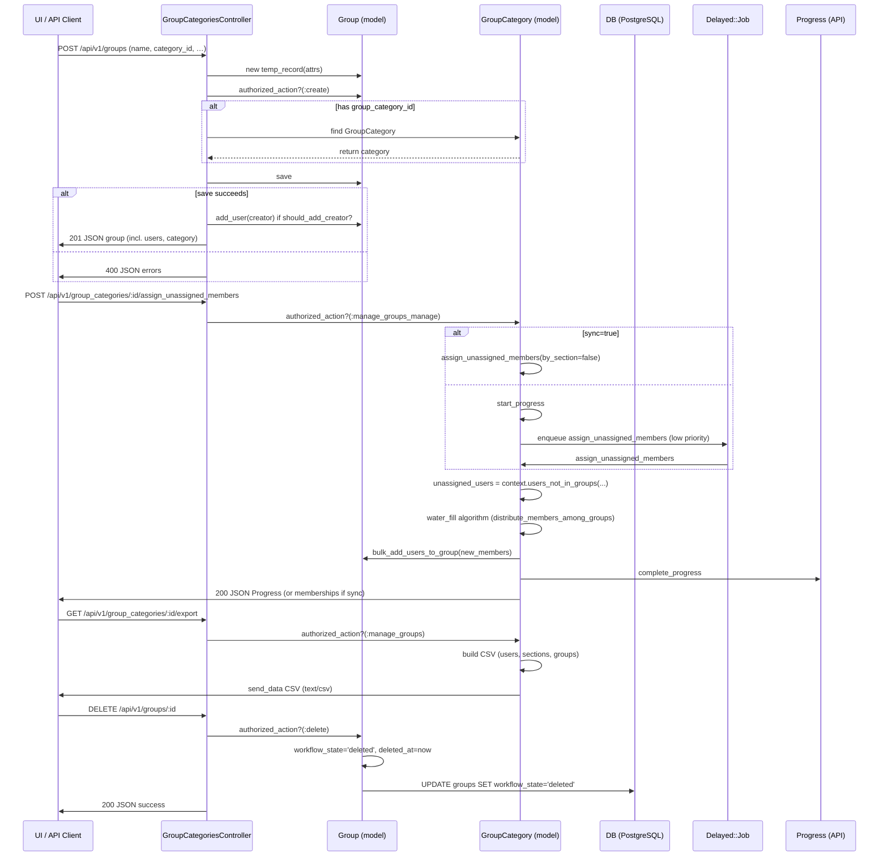

# Group & Collaboration Management

## Overview
The **Group & Collaboration Management** feature lets instructors and students create and work with *groups* and *group categories* inside a Canvas course or account.  
- A **Group** can be a community, a student‑organized study group, or a class‑assigned project group (the latter always belongs to a **GroupCategory** that enforces “one‑group‑per‑category” membership) 【app/controllers/groups_controller.rb:30‑44】.  
- Groups become the parent context for many other objects (discussions, wikis, files, conferences, etc.) 【app/controllers/groups_controller.rb:31‑38】.  
- The feature is invoked through the Canvas UI or the REST API (e.g., `POST /api/v1/groups`, `GET /api/v1/courses/:id/groups`, `POST /api/v1/group_categories/:id/assign_unassigned_members`).  
- The result is a JSON representation of groups or group categories (or an HTML page for the UI) together with any requested side‑effects such as membership creation, avatar upload, or background progress objects 【app/controllers/groups_controller.rb:71‑84】【app/controllers/group_categories_controller.rb:115‑130】.

## Behavior
- **List a user’s groups** – `GroupsController#index` returns a paginated list of the current user’s active groups, optionally filtered by `context_type` and including tabs 【app/controllers/groups_controller.rb:71‑84】.  
- **List groups in a specific context** – `GroupsController#context_index` (called when a `context` is present) returns groups for a course or account after permission check `:read_roster` 【app/controllers/groups_controller.rb:92‑115】.  
- **Show a single group** – `GroupsController#show` loads the group (`find_group`), checks `:read` permission, and renders JSON or HTML; it also handles `join` and `leave` query params, rejecting full groups (`Group#full?`) 【app/controllers/groups_controller.rb:124‑166】.  
- **Create a group** – `GroupsController#create` builds a temporary group record (`@context.groups.temp_record`) with permitted attributes, validates the caller’s storage‑quota permission, optionally sets a SIS ID (requires `manage_sis`), saves the group, adds the creator if appropriate, and returns JSON 【app/controllers/groups_controller.rb:176‑215】.  
- **Edit a group** – `GroupsController#update` (not fully shown but follows the same pattern as `create`) permits changes to name, description, join level, avatar, storage quota, members list, and SIS ID, enforcing the same permission checks 【app/controllers/groups_controller.rb:215‑…】.  
- **Join a group** – When `params[:join]` is present and the user has `:join` rights, the controller calls `Group#full?` then `Group#request_user` or `Group#add_user` depending on `join_level` 【app/controllers/groups_controller.rb:146‑158】.  
- **Leave a group** – When `params[:leave]` is present and the user has `:leave` rights, the controller destroys the user’s `GroupMembership` 【app/controllers/groups_controller.rb:160‑165】.  
- **Soft‑delete a group** – `Group#destroy` sets `workflow_state = 'deleted'` and timestamps the deletion 【app/models/group.rb:254‑262】.  
- **List group categories** – `GroupCategoriesController#index` returns paginated categories after `:manage_groups` permission, optionally including progress URLs 【app/controllers/group_categories_controller.rb:115‑130】.  
- **Create a group category** – `GroupCategoriesController#create` builds a new `GroupCategory`, runs `populate_group_category_from_params`, optionally sets a SIS ID (requires `manage_sis`), and returns JSON 【app/controllers/group_categories_controller.rb:140‑166】.  
- **Import groups via CSV** – `GroupCategoriesController#import` accepts a multipart `attachment` or raw body, creates a `Progress` object, and enqueues `GroupAndMembershipImporter` 【app/controllers/group_categories_controller.rb:191‑210】.  
- **Export groups/users to CSV** – `GroupCategoriesController#export` builds a CSV string with user, section, and group data, then streams it as `text/csv` 【app/controllers/group_categories_controller.rb:226‑260】.  
- **Assign unassigned members** – `GroupCategoriesController#assign_unassigned_members` checks permissions, then either runs synchronously (`sync=true`) or starts a background `Progress` (`assign_unassigned_members_in_background`) that calls `GroupCategory#assign_unassigned_members` 【app/controllers/group_categories_controller.rb:267‑285】.  
- **Automatic group creation** – After a `GroupCategory` is saved, `GroupCategory#auto_create_groups` may create a number of empty groups (`GroupCategory#create_groups`) based on `create_group_count` or `create_group_member_count` 【app/models/group_category.rb:299‑322】.  
- **Even distribution of members** – `GroupCategory#distribute_members_among_groups` implements a “water‑fill” algorithm that spreads members across groups while respecting `max_membership` and `group_limit` 【app/models/group_category.rb:340‑424】.  
- **Leader auto‑assignment** – If `auto_leader` is set, `GroupCategory#finish_group_member_assignment` runs `GroupLeadership#auto_assign!` for each group after member distribution 【app/models/group_category.rb:426‑440】.  

## Triggers / Entry points
| Trigger | Controller / Action | Source |
|---------|--------------------|--------|
| GET `/api/v1/users/self/groups` | `GroupsController#index` (user‑wide) | 【app/controllers/groups_controller.rb:71‑84】 |
| GET `/api/v1/courses/:id/groups` | `GroupsController#context_index` | 【app/controllers/groups_controller.rb:92‑115】 |
| GET `/api/v1/groups/:id` | `GroupsController#show` | 【app/controllers/groups_controller.rb:124‑166】 |
| POST `/api/v1/groups` | `GroupsController#create` | 【app/controllers/groups_controller.rb:176‑215】 |
| PUT `/api/v1/groups/:id` | `GroupsController#update` (not fully shown) | — |
| POST `/api/v1/group_categories` | `GroupCategoriesController#create` | 【app/controllers/group_categories_controller.rb:140‑166】 |
| GET `/api/v1/accounts/:account_id/group_categories` | `GroupCategoriesController#index` | 【app/controllers/group_categories_controller.rb:115‑130】 |
| POST `/api/v1/group_categories/:id/import` | `GroupCategoriesController#import` | 【app/controllers/group_categories_controller.rb:191‑210】 |
| GET `/api/v1/group_categories/:id/export` | `GroupCategoriesController#export` | 【app/controllers/group_categories_controller.rb:226‑260】 |
| POST `/api/v1/group_categories/:id/assign_unassigned_members` | `GroupCategoriesController#assign_unassigned_members` | 【app/controllers/group_categories_controller.rb:267‑285】 |
| Background job (Delayed::Job) | `GroupCategory#assign_unassigned_members` (via `assign_unassigned_members_in_background`) | 【app/models/group_category.rb:447‑459】 |
| Model callbacks | `Group#after_create :refresh_group_discussion_topics` | 【app/models/group.rb:84‑88】 |
| Model callbacks | `GroupCategory#after_save :auto_create_groups` | 【app/models/group_category.rb:299‑302】 |

## End‑to‑end flow (Mermaid)

## State / data touched
| Table / Model | Accessed / Modified | Source |
|---------------|---------------------|--------|
| `groups` | SELECT/INSERT/UPDATE/DELETE (soft) | `Group` model scopes (`active`, `by_name`) and controller actions (`create`, `destroy`)【app/models/group.rb:140‑152】【app/models/group.rb:254‑262】 |
| `group_categories` | SELECT/INSERT/UPDATE/DELETE | `GroupCategory` model (`auto_create_groups`, `assign_unassigned_members`)【app/models/group_category.rb:299‑322】【app/models/group_category.rb:447‑459】 |
| `group_memberships` | INSERT (add_user, bulk_add), DELETE (leave) | `Group#add_user`, `Group#bulk_add_users_to_group`【app/models/group.rb:378‑416】 |
| `users` | SELECT (membership checks, searches) | `Group#includes_user?`, `GroupCategory#users`【app/models/group.rb:71‑78】【app/controllers/group_categories_controller.rb:311‑332】 |
| `courses` / `accounts` | SELECT (context look‑ups) | `Group#context`, `GroupCategory#context` associations【app/models/group.rb:30‑33】【app/models/group_category.rb:30‑33】 |
| `progresses` | INSERT/UPDATE (background jobs) | `GroupCategory#start_progress`, `complete_progress`【app/models/group_category.rb:470‑485】 |
| `attachments` (avatars) | INSERT (avatar upload) | `Group#avatar_attachment` association, `GroupCategoriesController` includes `Api::V1::Attachment`【app/models/group.rb:115‑117】 |
| `csv` (temporary file) | READ (import) | `GroupCategoriesController#import` reads `params[:attachment]` or raw body【app/controllers/group_categories_controller.rb:191‑210】 |

## External dependencies
- **Delayed::Job** queue for background member assignment (`assign_unassigned_members_in_background`)【app/models/group_category.rb:447‑459】.  
- **Progress API** objects returned for long‑running imports/assignments【app/controllers/group_categories_controller.rb:191‑210】【app/models/group_category.rb:470‑485】.  
- **CSV library** for import/export【app/controllers/group_categories_controller.rb:191‑210】【app/controllers/group_categories_controller.rb:226‑260】.  
- **Atom** gem for group Atom feeds (`Group#to_atom`)【app/models/group.rb:447‑456】.  

## Configuration / parameters
| Config / Flag | Meaning | Source |
|---------------|---------|--------|
| Feature flag `granular_permissions_manage_groups` | Switches between legacy and granular permission blocks in `Group#set_policy` | `Group#set_policy` (multiple `given` clauses)【app/models/group.rb:511‑560】 |
| `Setting.get('max_groups_in_new_category')` | Upper bound for automatically created groups in a new category | `GroupCategory#create_group_count=`【app/models/group_category.rb:332‑337】 |
| `self_signup` values (`enabled`, `restricted`) | Controls student self‑signup behavior in a category | `GroupCategory#self_signup?`, validation in `GroupCategory`【app/models/group_category.rb:84‑106】 |
| `auto_leader` values (`first`, `random`) | Determines automatic leader assignment after member distribution | `GroupCategory#auto_leader` validation & `finish_group_member_assignment`【app/models/group_category.rb:115‑124】【app/models/group_category.rb:426‑440】 |
| `join_level` (`parent_context_auto_join`, `parent_context_request`, `invitation_only`) | Determines how users may join a group; enforced in `Group#full?` and controller join logic | `Group#full?` & `GroupsController#show` join handling【app/models/group.rb:166‑176】【app/controllers/groups_controller.rb:146‑158】 |
| `max_membership` (per‑group limit) | Optional hard cap on group size; used in `Group#full?` and distribution algorithm | `Group#full?` & `GroupCategory#distribute_members_among_groups`【app/models/group.rb:166‑176】【app/models/group_category.rb:166‑176】 |

## Edge cases & failure modes (observed in code)
- **Permission denied** – Every controller action begins with `authorized_action`; missing rights return 401/403 【app/controllers/groups_controller.rb:9‑12】【app/controllers/group_categories_controller.rb:115‑130】.  
- **Invalid parameters** – Strong parameters (`permit`) filter out unexpected fields; missing required fields cause `bad_request` (400) responses 【app/controllers/groups_controller.rb:176‑182】.  
- **SIS restrictions** – SIS IDs can only be set when the caller has `manage_sis`; otherwise a 401 JSON error is returned 【app/controllers/groups_controller.rb:202‑208】【app/controllers/group_categories_controller.rb:150‑158】.  
- **Group full** – `Group#full?` prevents joining when `max_membership` or `group_limit` is reached; the UI shows an error flash 【app/controllers/groups_controller.rb:146‑158】.  
- **Protected categories** – `GroupCategory#protected?` blocks deletion or import on system categories (`communities`, `student_organized`) 【app/models/group_category.rb:84‑92】【app/controllers/group_categories_controller.rb:215‑222】.  
- **Background job failures** – `assign_unassigned_members` rescues exceptions and marks the associated `Progress` as failed with an error message 【app/models/group_category.rb:461‑468】.  
- **CSV import errors** – If the attachment is missing or malformed, `GroupAndMembershipImporter` will raise and the progress will reflect failure (not shown in snippet but implied by the API contract).  
- **Concurrency on membership creation** – `GroupMembership.unique_constraint_retry` wraps `add_user` to retry on unique‑constraint violations 【app/models/group.rb:378‑388】.  
- **Soft delete** – Deleting a group only changes `workflow_state`; the record remains in the DB and is filtered out by the `active` scope 【app/models/group.rb:254‑262】.  

## Open questions
1. **How are large groups (thousands of members) paginated in the `users` include?** The comment in `Group` model mentions a capped collection size, but the exact pagination strategy is not visible in the provided code.  
2. **What is the exact behavior when a group’s `join_level` is changed after members exist?** The controller permits the change, but the impact on existing pending invitations or requests is not shown.  
3. **How does the system reconcile a user who belongs to multiple groups across different categories within the same course?** The policy allows multiple memberships for `student_organized` or `communities` categories, but the UI/UX handling of overlapping groups is not detailed.  
4. **What retry/back‑off strategy is used for the background `Delayed::Job` tasks if they repeatedly fail (e.g., due to DB deadlocks)?** The code only rescues generic exceptions and marks the progress as failed.  
5. **Are there any audit logs or webhook notifications emitted when groups or categories are created/updated/deleted?** The source does not reference any external event publishing.