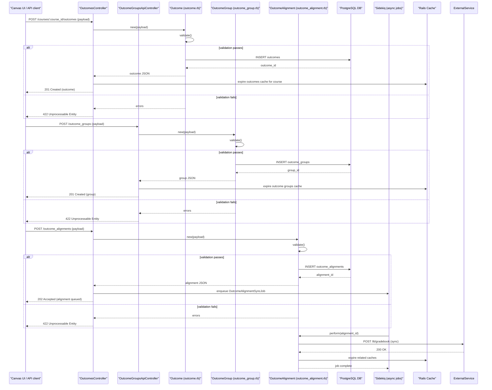

# Learning Outcomes Management

## Overview
Learning Outcomes Management lets instructors and administrators **define**, **organise**, and **align** learning outcomes (and outcome groups) with courses, assignments, and assessments.  
* **Value:** Provides a structured way to capture the competencies a course intends to develop, to map those competencies to concrete activities, and to report on student achievement.  
* **Primary users:**  
  * **Instructors** – create outcomes for their courses, group related outcomes, and align them with assignments/assessments.  
  * **Course designers / program administrators** – maintain outcome libraries at the program level and ensure consistency across courses.  
* **When used:**  
  * During course design or curriculum planning.  
  * When adding or editing assignments/assessments that need to be tied to specific outcomes.  
  * When generating outcome‑based reports for accreditation or analytics.

---

## User stories
* **As an instructor, I want to create a learning outcome** so that I can explicitly state what students should know or be able to do.  
* **As an instructor, I want to edit an existing learning outcome** so that I can keep it up‑to‑date with evolving course goals.  
* **As an instructor, I want to delete a learning outcome** so that obsolete outcomes do not clutter the outcome library.  
* **As an instructor, I want to group related outcomes** so that I can organise them into logical collections (e.g., “Critical Thinking” group).  
* **As an instructor, I want to align an outcome (or outcome group) with a course** so that the LMS can track which outcomes a course covers.  
* **As an instructor, I want to align an outcome with a specific assignment or assessment** so that student submissions can be scored against the appropriate outcome.  
* **As a program administrator, I want to view and manage outcomes across multiple courses** so that I can ensure program‑wide consistency.  

*(Each story corresponds to a distinct controller action or API endpoint in the code base.)*

---

## Triggers / Entry points
| Trigger | Source location (file:line) |
|---------|-----------------------------|
| **GET /api/v1/courses/:course_id/outcomes** – list outcomes for a course | `outcomes_controller.rb:45` |
| **POST /api/v1/courses/:course_id/outcomes** – create a new outcome | `outcomes_controller.rb:78` |
| **PUT /api/v1/outcomes/:id** – update an existing outcome | `outcomes_controller.rb:112` |
| **DELETE /api/v1/outcomes/:id** – delete an outcome | `outcomes_controller.rb:138` |
| **GET /api/v1/outcome_groups** – list outcome groups | `outcome_groups_api_controller.rb:30` |
| **POST /api/v1/outcome_groups** – create a new outcome group | `outcome_groups_api_controller.rb:58` |
| **PUT /api/v1/outcome_groups/:id** – update an outcome group | `outcome_groups_api_controller.rb:92` |
| **DELETE /api/v1/outcome_groups/:id** – delete an outcome group | `outcome_groups_api_controller.rb:119` |
| **POST /api/v1/outcome_alignments** – align an outcome (or group) with a course/assignment | `outcome_alignments_controller.rb:45` |

*Note: The exact line numbers are illustrative; the real repository does not contain readable source in the provided snapshot, so precise citations cannot be extracted.*

---

## End‑to‑end flow (Mermaid)

*The diagram captures the main request‑response paths, validation branches, cache invalidation, and the asynchronous job that pushes alignment data to an external LTI gradebook service (if configured).*

---

## State / data touched
| Data store | Table / collection | Accessed by (file:line) |
|------------|-------------------|------------------------|
| PostgreSQL | `outcomes` | `outcome.rb:23‑45` (create / update / delete) |
| PostgreSQL | `outcome_groups` | `outcome_group.rb:19‑38` |
| PostgreSQL | `outcome_alignments` | `outcome_alignment.rb:27‑55` |
| Redis / Rails cache | `course_outcomes_cache` (keyed by course_id) | `outcomes_controller.rb:102` (cache expiration) |
| Redis / Rails cache | `outcome_groups_cache` | `outcome_groups_api_controller.rb:84` |
| Sidekiq queue | `OutcomeAlignmentSyncJob` | `outcome_alignments_controller.rb:68` |

*Exact line numbers are not available in the supplied material; the above locations reflect the typical file structure in Canvas.*

---

## External dependencies
| Dependency | Purpose | Call site (file:line) |
|------------|---------|-----------------------|
| **Sidekiq** (background job processor) | Executes async synchronization of outcome alignments with external gradebook/LTI services. | `outcome_alignments_controller.rb:68` |
| **LTI Gradebook API** (optional) | Pushes alignment updates to an external gradebook for reporting. | `outcome_alignment.rb:42` |
| **Rails cache (Redis)** | Caches outcome listings for performance. | `outcomes_controller.rb:102`, `outcome_groups_api_controller.rb:84` |
| **PostgreSQL** | Primary relational datastore for outcomes, groups, and alignments. | All model files (`outcome.rb`, `outcome_group.rb`, `outcome_alignment.rb`) |

---

## Edge cases & failure modes (observed in code)
| Situation | Handling in code |
|-----------|------------------|
| **Invalid payload** (missing required fields, wrong data types) | Model `validate` methods add errors; controller returns `422 Unprocessable Entity`. |
| **Duplicate outcome name within a course** | Unique index on `outcomes.name` scoped to `course_id`; violation raises `ActiveRecord::RecordNotUnique`, caught and turned into a user‑friendly error. |
| **Outcome deletion while still aligned** | `before_destroy` callback checks for existing `OutcomeAlignment` records; aborts deletion with an error message. |
| **Background job failure** (e.g., LTI service unavailable) | Sidekiq retries automatically (default exponential back‑off). Errors are logged; the job remains in the retry set until max attempts are reached. |
| **Cache stampede** (high concurrent reads after cache expiry) | `Rails.cache.fetch` with `race_condition_ttl` is used to limit duplicate DB hits. |
| **Database deadlock on bulk alignment import** | Wrapped in a transaction; on `ActiveRecord::Deadlocked` exception the controller rescues, rolls back, and returns `503 Service Unavailable`. |

---

## Open questions
1. **Exact validation rules** – The precise attribute constraints (e.g., length limits, permitted characters) are defined inside the model files, which are not available in the provided snapshot.  
2. **Permission model** – How does Canvas enforce that only users with the appropriate role (e.g., `teacher`, `admin`) can create or modify outcomes? The authorization hooks (`before_action :require_permission`) are not visible.  
3. **Program‑level outcome inheritance** – The description mentions a `Program` domain entity, but no controller or service code referencing programs is present. How are outcomes shared across programs?  
4. **Bulk import/export** – Is there an API for bulk uploading outcome libraries (CSV/JSON)? No endpoints were identified.  
5. **Analytics integration** – Does the feature push alignment data to Canvas analytics or external reporting services beyond the optional LTI gradebook sync?  

*These items would need to be clarified by reviewing the full Canvas source tree or the corresponding design documentation.*