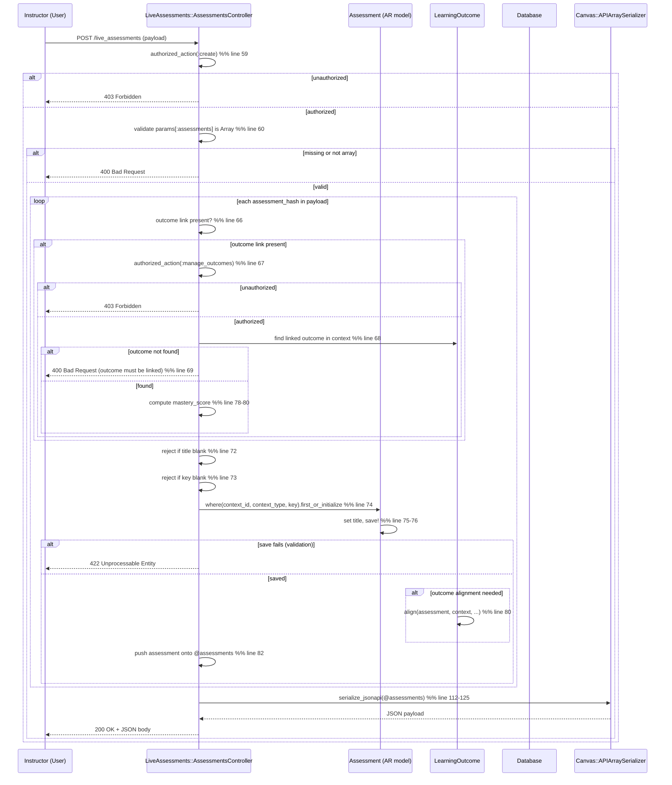

# Live Assessments

## Overview
Live Assessments deliver real‑time assessment experiences (e.g., polls, quizzes) that can be launched during a live Canvas session. An instructor (a user with the appropriate permissions on a course) creates or retrieves a live assessment by sending a JSON payload that includes a client‑supplied **key**, a **title**, and optionally a linked **outcome**. The controller persists the assessment, optionally aligns it with a learning outcome, and returns a JSON‑API representation that includes a link to fetch the assessment’s results.

## Behavior
- **Permission check** – The controller first verifies that the current user can *create* a live assessment in the current context (`Assessment.new(context: @context)`, `:create`). (`app/controllers/live_assessments/assessments_controller.rb:59`)  
- **Payload validation** – The request must contain an `assessments` array; otherwise the request is rejected. (`app/controllers/live_assessments/assessments_controller.rb:60`)  
- **Outcome handling** – If an assessment hash contains `links[:outcome]`, the controller checks that the user can *manage_outcomes* on the context and that the outcome is linked to the context; otherwise it rejects. (`app/controllers/live_assessments/assessments_controller.rb:66‑70`)  
- **Required fields** – Each assessment hash must include a non‑blank `title` and `key`; missing values cause a rejection. (`app/controllers/live_assessments/assessments_controller.rb:72‑73`)  
- **Find‑or‑create** – The system looks up an existing `Assessment` by `context_id`, `context_type`, and `key`. If none exists it initializes a new record. (`app/controllers/live_assessments/assessments_controller.rb:74`)  
- **Attribute assignment & persistence** – The assessment’s `title` is set from the payload and the record is saved (`save!`). (`app/controllers/live_assessments/assessments_controller.rb:75‑76`)  
- **Outcome alignment** – When an outcome was supplied, the controller extracts the outcome’s rubric criterion, computes a mastery score, and calls `@outcome.align` to create the alignment. (`app/controllers/live_assessments/assessments_controller.rb:77‑80`)  
- **Collect results** – All processed assessments are collected in `@assessments` and returned as JSON‑API via `serialize_jsonapi`. (`app/controllers/live_assessments/assessments_controller.rb:82‑86`)  
- **Listing assessments** – The `index` action authorizes a *read* permission, fetches assessments scoped to the context, paginates them with `Api.jsonapi_paginate`, and renders the same JSON‑API structure. (`app/controllers/live_assessments/assessments_controller.rb:101‑107`)  
- **Serialization** – `serialize_jsonapi` builds a response that contains a `links.assessments.results` URL template and an array of serialized assessments using `LiveAssessments::AssessmentSerializer`. (`app/controllers/live_assessments/assessments_controller.rb:112‑125`)

## Triggers / Entry points
| Trigger | Route / Method | Source |
|--------|----------------|--------|
| **Create / find assessments** | `POST /api/v1/courses/:course_id/live_assessments` → `LiveAssessments::AssessmentsController#create` | `app/controllers/live_assessments/assessments_controller.rb:58‑86` |
| **List assessments** | `GET /api/v1/courses/:course_id/live_assessments` → `LiveAssessments::AssessmentsController#index` | `app/controllers/live_assessments/assessments_controller.rb:101‑107` |
| **Before actions** (ensure a logged‑in user and a course context) | `before_action :require_user` / `before_action :require_context` | `app/controllers/live_assessments/assessments_controller.rb:31‑32` |

## End‑to‑end flow (Mermaid)

## State / data touched
| Data store | Action | Source |
|------------|--------|--------|
| `assessments` table (via `Assessment` AR model) | `first_or_initialize`, `save!` (create or update) | `app/controllers/live_assessments/assessments_controller.rb:74‑76` |
| `learning_outcomes` table (via `@context.linked_learning_outcomes`) | Query for outcome ID; later `align` creates a linkage record | `app/controllers/live_assessments/assessments_controller.rb:68‑70` |
| `rubric_criteria` (embedded JSON on outcome) | Read to compute `mastery_score` | `app/controllers/live_assessments/assessments_controller.rb:78‑80` |
| `assessment_results` link (URL template) | Constructed in response JSON | `app/controllers/live_assessments/assessments_controller.rb:122‑124` |
| Pagination metadata (`meta`) | Produced by `Api.jsonapi_paginate` | `app/controllers/live_assessments/assessments_controller.rb:105` |
| Caches / serializers | `Canvas::APIArraySerializer` reads from the assessment objects | `app/controllers/live_assessments/assessments_controller.rb:113‑119` |

## External dependencies
- **ActiveRecord transaction** (`Assessment.transaction`) – ensures atomic DB writes. (`app/controllers/live_assessments/assessments_controller.rb:64`)  
- **Authorization helpers** (`authorized_action`) – rely on Canvas’s permission system (defined elsewhere). (`app/controllers/live_assessments/assessments_controller.rb:59,67,102`)  
- **URL helpers** (`polymorphic_url`) – generate context‑aware URLs. (`app/controllers/live_assessments/assessments_controller.rb:105,122`)  
- **Serialization library** (`Canvas::APIArraySerializer`) – formats the JSON‑API payload. (`app/controllers/live_assessments/assessments_controller.rb:113‑119`)  
- **Pagination utility** (`Api.jsonapi_paginate`) – adds pagination links and meta. (`app/controllers/live_assessments/assessments_controller.rb:105`)  

No third‑party HTTP calls or background job queues are invoked directly in this controller.

## Configuration / parameters
- No feature‑flag checks, environment variables, or configurable constants appear in the controller code. Permissions (`:create`, `:manage_outcomes`, `:read`) are defined elsewhere in the Canvas permission system.

## Edge cases & failure modes (observed in code)
| Situation | Handling |
|-----------|----------|
| Request missing `assessments` key or not an array | `reject!` with message “missing required key :assessments”. (`app/controllers/live_assessments/assessments_controller.rb:60`) |
| Assessment hash missing `title` or `key` | `reject!` with appropriate message. (`app/controllers/live_assessments/assessments_controller.rb:72‑73`) |
| User lacks `:create` permission on Assessment | `authorized_action` returns `false`; controller returns early (no response body). (`app/controllers/live_assessments/assessments_controller.rb:59`) |
| User lacks `:manage_outcomes` permission when an outcome link is supplied | Early return (no response). (`app/controllers/live_assessments/assessments_controller.rb:67`) |
| Outcome ID not linked to the course context | `reject!` with “outcome must be linked to the context”. (`app/controllers/live_assessments/assessments_controller.rb:69`) |
| `assessment.save!` raises validation error | Exception propagates; Rails will render a 422 response (standard ActiveRecord behavior). |
| Pagination parameters missing or out of range | `Api.jsonapi_paginate` applies defaults; no explicit error handling in this controller. |
| `@outcome.align` fails (e.g., outcome deleted between lookup and alignment) | Not rescued; exception would bubble up as a 500 unless higher‑level rescue handles it. |

## Open questions
- **Idempotency of `first_or_initialize`** – When a payload contains a key that already exists, the controller updates the title and re‑saves the record. The exact semantics (whether other attributes are preserved or overwritten) depend on the `Assessment` model’s defaults, which are not visible in the provided sources.  
- **Result URL placeholder** – The response includes `'assessments.results': ".../live_assessments/{assessments.id}/results"`. It is a template string; the actual endpoint implementation is not shown, so the exact format of the results payload is unknown.  
- **Outcome alignment side‑effects** – The `align` call likely creates a `LearningOutcomeAlignment` record, but the model and callbacks are not included, so we cannot describe cascade effects (e.g., score recalculation).  
- **Pagination limits** – The maximum page size, default per‑page count, and any rate‑limiting are defined in `Api.jsonapi_paginate`, which is outside the provided files.  
- **Error response format** – The controller uses `reject!` (a Canvas helper) for validation errors; the exact JSON structure of those error responses is not shown here.