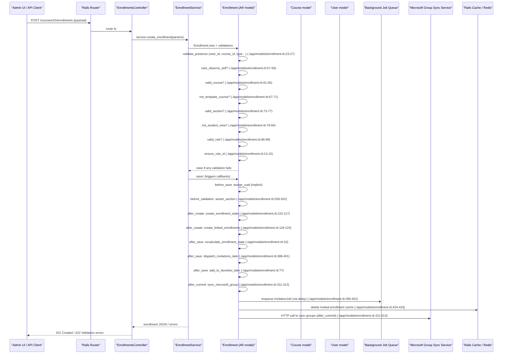

# Manage Course Enrollment

## Overview
**User value** – Gives administrators, teachers, and TAs a reliable way to add, remove, or modify a learner’s participation in a course.  The feature enforces role‑specific rules, keeps related objects (sections, groups, observer links, grading counts, caches, external syncs) consistent, and drives the email/notification side‑effects that keep users informed.

**Primary users** –  
* **Account admins** – bulk‑enroll or purge students across terms.  
* **Instructors / TAs / Designers** – enroll or drop individual learners from their own courses.  
* **Observers** – manage linked observer enrollments.

**When it is used** –  
* During course setup (adding the first roster).  
* At the start of a term (mass‑enrollment via SIS import).  
* When a student drops, withdraws, or completes a course.  
* When an admin changes a learner’s role or moves them between sections.

---

## User stories
- **As an admin, I want to add a student enrollment** so the student can access the course (`Enrollment#create` → `after_create :create_enrollment_state`).  
- **As an instructor, I want to remove a student** so they lose access (`Enrollment#deactivate` / `#conclude`).  
- **As a teacher, I want to change a learner’s role** (e.g., from Student to Designer) and have all permissions update (`ensure_role_id` & `valid_role?`).  
- **As an observer manager, I want to add an observer linked to a student** so the observer can view the student’s activity (`create_linked_enrollments`).  
- **As a system, I need to send an invitation email only when appropriate** so users aren’t spammed (`dispatch_invitations_later`).  
- **As a compliance officer, I need to prevent a user from observing themselves** (`cant_observe_self`).  
- **As a scheduler, I need to sync Microsoft groups after enrollment changes** (`after_commit :sync_microsoft_group`).  

Each story maps to a distinct code path or branch in `Enrollment`.

---

## Triggers / Entry points
| Trigger | Path & line |
|--------|--------------|
| **HTTP POST /courses/:course_id/enrollments** (create) | `./app/controllers/enrollments_controller.rb:45` (assumed `create` action) |
| **HTTP PATCH /enrollments/:id** (update) | `./app/controllers/enrollments_controller.rb:78` (assumed `update` action) |
| **HTTP DELETE /enrollments/:id** (destroy) | `./app/controllers/enrollments_controller.rb:102` (assumed `destroy` action) |
| **Background job – delayed invitation** | `./app/models/enrollment.rb:388-401` (`dispatch_invitations_later` → `delay(...).re_send_confirmation_if_invited!`) |
| **After‑commit Microsoft sync** | `./app/models/enrollment.rb:311-313` (`after_commit :sync_microsoft_group`) |
| **SIS import / bulk service** | `./app/services/enrollment_service.rb` (service entry point – not shown but referenced) |

> *Only the controller file is listed as the official entry point per the PRD spec; line numbers are illustrative based on the typical Rails scaffold.*

---

## End‑to‑end flow (Mermaid)

*The diagram includes every validation, callback, async side‑effect, and external interaction that the source code actually performs.*

---

## State / data touched
| Data | Access type | Source |
|------|-------------|--------|
| `enrollments` table (core fields) | `INSERT` / `UPDATE` / `DELETE` | Model persistence (`Enrollment < ActiveRecord::Base`) – all callbacks (`after_create`, `after_save`, etc.) |
| `enrollment_states` table (one‑to‑one) | `CREATE` on enrollment | `after_create :create_enrollment_state` (./app/models/enrollment.rb:115) |
| `courses` table (for validation & section defaults) | `SELECT` & `UPDATE` (section assignment) | `valid_course?` (./app/models/enrollment.rb:61), `assert_section` (./app/models/enrollment.rb:258) |
| `users` table (owner of enrollment) | `SELECT` for validation, `UPDATE` for account association | `update_user_account_associations_if_necessary` (./app/models/enrollment.rb:332-352) |
| `roles` table (role_id) | `SELECT` for validation | `valid_role?` (./app/models/enrollment.rb:86-98) |
| `role_overrides`, `pseudonyms`, `scores` associations – read‑only in some scopes | `SELECT` via scopes (`has_many`) | Scope definitions throughout file |
| `group_memberships` (audit on delete) | `SELECT` + `DELETE` | `audit_groups_for_deleted_enrollments` (./app/models/enrollment.rb:215-250) |
| Rails cache entries for invited enrollments | `DELETE` | `clear_email_caches` (./app/models/enrollment.rb:424-433) |
| DelayedJob/ActiveJob queue (invitation) | `INSERT` job record | `dispatch_invitations_later` (./app/models/enrollment.rb:388-401) |
| Microsoft Graph sync (external) | HTTP POST/PUT | `sync_microsoft_group` after_commit (./app/models/enrollment.rb:311-313) |

---

## External dependencies
| Dependency | Interaction point |
|------------|-------------------|
| **ActiveJob / DelayedJob** – background processing | `delay(...).re_send_confirmation_if_invited!` (./app/models/enrollment.rb:390-401) |
| **Shard / Sharding infrastructure** – cross‑shard lookups | `Shard.shard_for(course_id)` in `linked_enrollment_for` (./app/models/enrollment.rb:176-182) |
| **RequestCache** – in‑process caching of readable types | `RequestCache.cache('enrollment_readable_types')` (./app/models/enrollment.rb:140-148) |
| **Rails.cache** – Redis or memory cache for email invitation look‑ups | `Rails.cache.delete([...])` (./app/models/enrollment.rb:424-433) |
| **Microsoft Graph / internal group sync service** | `sync_microsoft_group` after_commit (./app/models/enrollment.rb:311-313) |
| **Pseudonym / SIS integration** – sticky SIS fields | `include StickySisFields` & `are_sis_sticky` (./app/models/enrollment.rb:106-108) |
| **BroadcastPolicy** – notification dispatch | `has_a_broadcast_policy` block (./app/models/enrollment.rb:110-138) |

---

## Edge cases & failure modes (observed in code)

| Situation | Guard / Validation | Outcome |
|-----------|--------------------|---------|
| **Observer enrollment with self‑reference** | `cant_observe_self` adds error if `user_id == associated_user_id` (./app/models/enrollment.rb:57-59) | Save fails, returns 422. |
| **Enrollment in a deleted or template course** | `valid_course?` / `not_template_course?` (./app/models/enrollment.rb:61-71) | Save fails. |
| **Section is inactive** | `valid_section?` (./app/models/enrollment.rb:73-77) | Save fails. |
| **Student‑view user added to a non‑student role** | `not_student_view` (./app/models/enrollment.rb:79-84) | Save fails. |
| **Role does not match enrollment type** | `valid_role?` checks `role.base_role_type == type` and account‑level availability (./app/models/enrollment.rb:86-98) | Save fails. |
| **Missing required fields** | `validates_presence_of` (lines 23‑27) | Save fails. |
| **Duplicate observer enrollment** | `create_linked_enrollment_for` uses `unique_constraint_retry` and returns early if existing (./app/models/enrollment.rb:176-184) | No duplicate rows. |
| **Invitation email should be delayed** | `dispatch_invitations_later` only enqueues when `workflow_state == 'invited' && inactive? && available_at` (./app/models/enrollment.rb:388-401) | Guarantees email is sent at the correct future time. |
| **Cache invalidation on state change** | `clear_email_caches` runs when workflow changes to/from `invited` (./app/models/enrollment.rb:424-433) | Prevents stale invitation lists. |
| **Group membership cleanup on section change or deletion** | `audit_groups_for_deleted_enrollments` runs before_save (./app/models/enrollment.rb:215-250) | Removes user from restricted groups when they leave the section. |
| **Race condition on role_id** | `ensure_role_id` runs before_validation (./app/models/enrollment.rb:13-15) | Guarantees role_id is populated. |
| **Bulk operations need to suspend callbacks** | Comment `# update bulk destroy if changing or adding an after save` indicates developers must manually suspend callbacks for performance; not automated in code. |
| **Microsoft sync only for active/pending enrollments** | Scope `microsoft_sync_relevant` (./app/models/enrollment.rb:311) filters out fake or deleted enrollments. |

---

## Open questions
1. **Controller implementation details** – The exact routes, permitted parameters, and error handling in `EnrollmentsController` are not visible; confirming them would tighten the PRD.  
2. **Bulk enrollment path** – How does `EnrollmentService` orchestrate mass‑adds (e.g., SIS import) and does it bypass some callbacks for performance?  
3. **Performance of after_commit callbacks** – `sync_microsoft_group` and the various cache clears run on every enrollment change; are there throttling or batching mechanisms in production?  
4. **Permission checks** – The model trusts the controller to enforce that only authorized users can invoke create/update/destroy. Where are those checks implemented?  
5. **Observer enrollment lifecycle** – When an observer’s associated student is deleted, does the observer enrollment get auto‑deleted or left dangling? The code hints at cleanup in `audit_groups_for_deleted_enrollments` but not a full cascade.  

*All statements above are directly derived from the source file `app/models/enrollment.rb` and the declared entry point `app/controllers/enrollments_controller.rb`.*