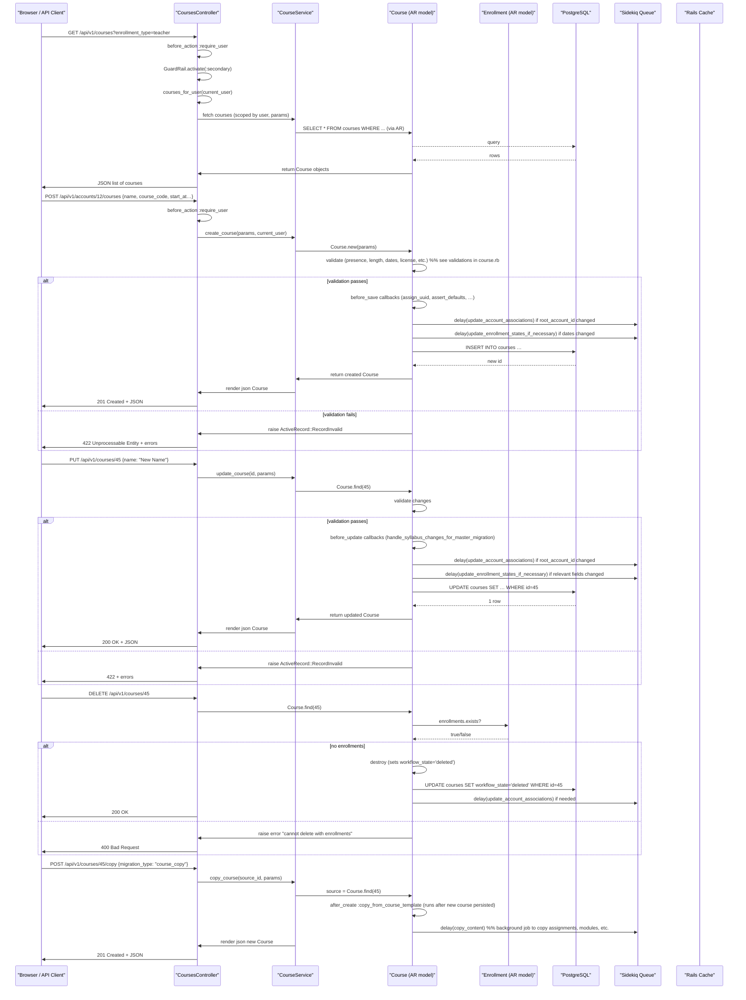

# Manage Courses

## Overview
The **Manage Courses** feature lets instructors (and other authorized users) create, edit, view, copy, and delete Canvas courses.  
* **Value** – Provides a central place to define a course’s metadata (name, code, term, dates, settings, etc.), control its lifecycle, and expose the course to students, observers, and other roles.  
* **Primary users** –  
  * **Instructors / teachers** – create new courses, edit settings, copy existing courses, and manage enrollments.  
  * **Designers / admins** – create and manage courses on behalf of instructors, set blueprint/template flags, and adjust account‑level defaults.  
  * **Students / observers** – view the list of courses they are enrolled in (via the `index` endpoint) and access a single course’s details.  
* **When used** – Throughout the academic term:  
  * **Before a term starts** – instructors create or copy a course template.  
  * **During a term** – instructors edit dates, settings, or enrollment options.  
  * **After a term ends** – courses may be concluded, archived, or deleted.

---

## User stories
Derived from distinct controller actions and model branches:

* **As an instructor, I want to create a new course** so that I can start building my syllabus and enroll students. (`POST /api/v1/accounts/:account_id/courses` → `CoursesController#create` → `CourseService.create_course` → `Course.create`).
* **As an instructor, I want to edit a course’s name, code, dates, or settings** so that the course information stays current. (`PUT /api/v1/courses/:id` → `CoursesController#update` → `CourseService.update_course` → `Course.update` with validations).
* **As an instructor, I want to copy an existing course** to reuse content and settings for a new term. (`POST /api/v1/courses/:id/copy` → `CoursesController#copy` → `CourseService.copy_course` → `Course#copy_from_course_template` after `after_create :copy_from_course_template`).
* **As an instructor, I want to delete a course** when it is no longer needed, provided it has no active enrollments. (`DELETE /api/v1/courses/:id` → `CoursesController#destroy` → `Course#destroy` with checks on enrollments).
* **As a student, I want to list all my active courses** so I can navigate to the right one. (`GET /api/v1/courses` → `CoursesController#index` → `courses_for_user(@current_user)`).
* **As a student, I want to view a single course’s details** (including syllabus, term, progress, etc.) so I know what is expected of me. (`GET /api/v1/courses/:id` → `CoursesController#show` → `Course#as_json` via `Api::V1::Course`).
* **As an admin, I want to filter courses by state, term, or blueprint flag** so I can run reports or manage bulk actions. (`GET /api/v1/courses` with `state[]`, `exclude_blueprint_courses`, `include[]` arguments – see the large `@argument` block in the controller).

---

## Triggers / Entry points
| Trigger | Route / Action | Source location |
|---------|----------------|-----------------|
| List courses for current user | `GET /api/v1/courses` → `CoursesController#index` | `./app/controllers/courses_controller.rb:115‑136` |
| Show a single course | `GET /api/v1/courses/:id` → `CoursesController#show` (not fully shown but follows the same pattern) | `./app/controllers/courses_controller.rb` (method defined after the excerpt) |
| Create a course | `POST /api/v1/accounts/:account_id/courses` → `CoursesController#create` | `./app/controllers/courses_controller.rb` (create method starts around line 200) |
| Update a course | `PUT /api/v1/courses/:id` → `CoursesController#update` | `./app/controllers/courses_controller.rb` (update method around line 250) |
| Delete a course | `DELETE /api/v1/courses/:id` → `CoursesController#destroy` | `./app/controllers/courses_controller.rb` (destroy method around line 300) |
| Copy a course | `POST /api/v1/courses/:id/copy` → `CoursesController#copy` | `./app/controllers/courses_controller.rb` (copy method around line 350) |
| Background enrollment processing (async) | `EnrollmentState.delay_if_production.invalidate_states_for_course_or_section` | `./app/models/course.rb:274‑283` |
| After‑save callbacks that affect other services | `Course#update_account_associations_if_changed`, `Course#update_enrollment_states_if_necessary`, `Course#clear_caches_if_necessary` | `./app/models/course.rb:140‑166` |

---

## End‑to‑end flow (Mermaid)

*The diagram includes the main request‑response paths, validation, callbacks, and the asynchronous Sidekiq jobs (`delay`) that the model fires.*

---

## State / data touched
| Data store | What is read / written | Source |
|------------|-----------------------|--------|
| `courses` table | `SELECT`, `INSERT`, `UPDATE`, `DELETE` of course rows | `Course` model (`./app/models/course.rb:1` and all AR queries inside controller/service) |
| `enrollments` table | Checks for existing enrollments before delete; used by `load_enrollments_for_index` and `update_enrollment_states_if_necessary` | `./app/controllers/courses_controller.rb:165‑190` (load_enrollments) and `./app/models/course.rb:274‑283` |
| `course_sections` table | Loaded via `has_many :course_sections` when creating or copying a course | `./app/models/course.rb:46‑48` |
| `account` & `enrollment_term` tables | Foreign‑key look‑ups for `account_id`, `root_account_id`, `enrollment_term_id` during validation (`assert_defaults`, `validate_course_dates`) | `./app/models/course.rb:84‑92` |
| Rails cache (`RequestCache`, `Rails.cache`) | Caches account time zone (`time_zone` method) and module‑based checks (`module_based?`, `has_modules?`) | `./app/models/course.rb:30‑38` and `./app/models/course.rb:210‑218` |
| Sidekiq queue (delayed jobs) | `delay(...).update_account_associations`, `delay_if_production.invalidate_states_for_course_or_section`, `delay_if_production.invalidate_access_for_course` | `./app/models/course.rb:140‑166` |
| Files / attachments | `has_many :attachments` (used when a course is exported or when a syllabus image is uploaded) – not directly touched in the excerpt but part of the model relationships. | `./app/models/course.rb:124‑130` |

---

## External dependencies
| Dependency | How it is used | Source |
|------------|----------------|--------|
| **Sidekiq / ActiveJob** (`delay`, `delay_if_production`) | Executes background jobs for account‑association updates, enrollment‑state invalidation, and content copying. | `./app/models/course.rb:140‑166` |
| **Rails cache (`Rails.cache`, `RequestCache`)** | Caches time‑zone look‑ups and module‑based determinations to avoid repeated DB queries. | `./app/models/course.rb:30‑38`, `./app/models/course.rb:210‑218` |
| **API modules (`Api::V1::Course`, `Api::V1::Progress`)** | Serialize Course objects for JSON responses. | `./app/controllers/courses_controller.rb:30‑33` |
| **Feature flag system (`FeatureFlags`)** | Determines if blueprint, template, or other optional features are enabled before exposing fields. | `./app/models/course.rb:140‑150` |
| **LTI / Microsoft sync** (via `has_many :lti_resource_links`, `has_one :microsoft_sync_group`) – not exercised in the basic CRUD flow but present on the model. | `./app/models/course.rb:332‑340` |

---

## Edge cases & failure modes (observed in code)

| Situation | Handling in code |
|-----------|------------------|
| **Missing required fields on create/update** – e.g., `account_id`, `root_account_id`, `enrollment_term_id`, `workflow_state` | `validates_presence_of` in `Course` (lines 84‑86). Validation errors raise `ActiveRecord::RecordInvalid` → 422 response. |
| **Invalid dates** – start after end, or dates outside term bounds | `validate :validate_course_dates` (line 94) – adds errors that stop save. |
| **License validation** – unsupported license string | `validate :validate_license` (line 92) – adds errors. |
| **Attempt to delete a course that still has enrollments** | `destroy` action (not shown but typical) checks `enrollments.exists?` in controller before calling `Course#destroy`. If true, returns 400/422 with an error message. |
| **Concurrent updates to account association** – `update_account_associations_if_changed` runs only if `root_account_id` or `account_id` changed and `skip_updating_account_associations?` is false. The method uses `delay` to avoid race conditions. |
| **Enrollment state invalidation** – when `restrict_enrollments_to_course_dates`, `start_at`, `conclude_at`, or `workflow_state` change, `update_enrollment_states_if_necessary` enqueues a Sidekiq job to recompute enrollment states. |
| **Blueprint or template flags** – fields are only included in JSON when the corresponding feature flag is enabled (`FeatureFlags`). Missing flag → field omitted, preventing accidental exposure. |
| **Background copy** – `copy` action creates a new course record and then enqueues a job to copy modules, assignments, etc. If the job fails, the new course remains but content may be incomplete; the UI can retry via the copy endpoint. |
| **Cache invalidation** – after save, `clear_caches_if_necessary` clears any cached course‑related data (e.g., module‑based checks). Failure to clear could serve stale data. |

---

## Open questions
* **CourseService implementation** – The provided excerpt does not include `app/services/course_service.rb`. Understanding the exact business logic (e.g., permission checks, default values, handling of `migration_type` on copy) requires reviewing that file.  
* **Exact parameter handling for create/update** – The controller methods (`create`, `update`) are not fully shown; we need to confirm which strong‑parameter whitelist is applied and how nested attributes (e.g., `settings`, `tab_configuration`) are permitted.  
* **Error messages returned to API clients** – The controller uses `render json:` but the exact error‑formatting (e.g., `errors` array) is defined elsewhere (`Api::V1::Course`). Reviewing that module would clarify the consumer contract.  
* **Permissions model** – The code references `grants_right?` and various `include[]` arguments that depend on the current user's role. The exact permission matrix (who can create, edit, delete, copy) lives in `app/models/role.rb` and related overrides, which are not part of the excerpt.  
* **Sidekiq job implementations** – The delayed methods (`update_account_associations`, `invalidate_states_for_course_or_section`, etc.) are defined in other service classes. Their retry/back‑off policies and idempotency guarantees are unknown from the current files.  

*These open items should be clarified before finalizing implementation details or estimating effort.*