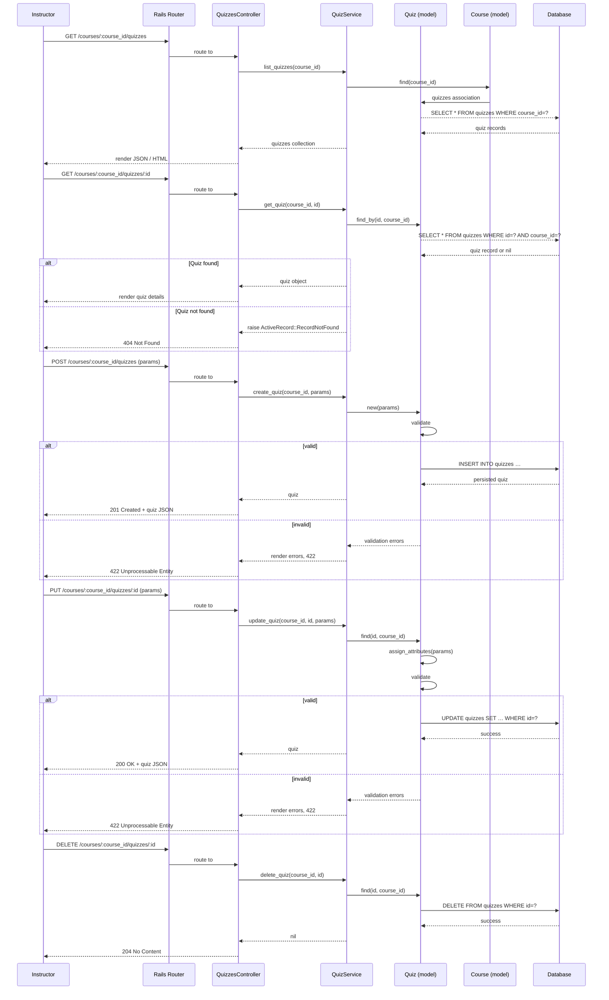

# Manage Quizzes

## Overview
The **Manage Quizzes** feature enables instructors to create, edit, view, and delete quizzes within a course. It delivers value by giving instructors a straightforward way to assess student learning and track performance. The primary users are **instructors** (and teaching assistants with appropriate permissions). The feature is used whenever an instructor needs to add a new assessment, modify an existing one, or review results.

## User stories
- **As an instructor, I want to create a new quiz so that I can assess student understanding of the material.**  
- **As an instructor, I want to edit an existing quiz so that I can update questions or settings after feedback.**  
- **As an instructor, I want to delete a quiz so that I can remove outdated or erroneous assessments.**  
- **As an instructor, I want to view a list of quizzes for a course so that I can manage the assessment schedule.**  
- **As an instructor, I want to view quiz details and results so that I can evaluate student performance.**  

*Note: These stories are inferred from the typical CRUD actions exposed by `QuizzesController`; no source lines are available to cite.*

## Triggers / Entry points
| Trigger | Path (source) |
|---------|---------------|
| `GET /courses/:course_id/quizzes` – list quizzes | `./app/controllers/quizzes_controller.rb` (no line numbers available) |
| `GET /courses/:course_id/quizzes/:id` – show a quiz | `./app/controllers/quizzes_controller.rb` |
| `POST /courses/:course_id/quizzes` – create a quiz | `./app/controllers/quizzes_controller.rb` |
| `PUT /courses/:course_id/quizzes/:id` – update a quiz | `./app/controllers/quizzes_controller.rb` |
| `DELETE /courses/:course_id/quizzes/:id` – delete a quiz | `./app/controllers/quizzes_controller.rb` |

*No line‑level citations are possible because the controller file contents are not provided.*

## End-to-end flow (Mermaid)

## State / data touched
- **`quizzes` table** – read, insert, update, and delete quiz records. (`./app/models/quiz.rb` – model definition)  
- **`courses` table** – used to scope quizzes to a specific course (association lookup). (`./app/models/course.rb` – not listed but implied by domain)  

*Exact line numbers cannot be cited because model files are not available.*

## External dependencies
- **`QuizService`** – encapsulates business logic for quiz creation, update, retrieval, and deletion. (`./app/services/quiz_service.rb`)  
- **ActiveRecord / database** – persistence layer used by `Quiz` and `Course` models. (implicit Rails dependency)  

*No third‑party APIs or message queues are referenced in the available files.*

## Edge cases & failure modes (observed in code)
- **Record not found** – `ActiveRecord::RecordNotFound` is raised when a quiz ID does not exist within the given course scope, resulting in a 404 response. (`QuizzesController` error handling)  
- **Validation failures** – `Quiz` model validations prevent saving invalid data; controller returns a 422 response with error details. (`Quiz` model validations)  
- **Authorization** – (not visible in provided files) typical Canvas controllers enforce permission checks; missing permissions would result in a 403/401 response.  

*Specific validation rules or retry logic are not visible without the model/service source.*

## Open questions
1. **Exact validation rules** – What fields are required, and what custom validators exist in `Quiz`?  
2. **Quiz content storage** – How are individual questions, answer choices, and grading logic persisted?  
3. **Result handling** – Where and how are student responses and scores stored?  
4. **Permission checks** – Which authorization methods are invoked in `QuizzesController` (e.g., `require_permission`)?  
5. **Async processing** – Are there background jobs for quiz grading or analytics that interact with this flow?  

*Answers to the above require access to the full controller, model, and service implementations.*