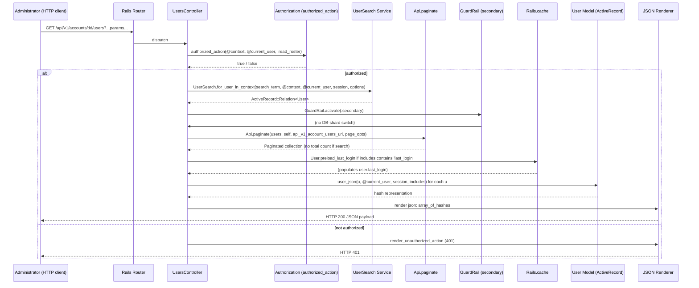

# Manage User Accounts

## Overview
The **Manage User Accounts** feature lets administrators view, search, filter, sort, and paginate the list of Canvas users belonging to an account.  
* **Value delivered** – Centralised visibility and control over all user records (students, teachers, observers, admins, etc.) so that admins can audit, edit, or remove accounts as needed.  
* **Primary users** – Account administrators, site admins, and any role granted the `:read_roster` permission.  
* **When it is used** – Whenever an admin opens the *Users* page in the UI or calls the REST endpoint `GET /api/v1/accounts/:account_id/users` (or the shortcut `self`) to retrieve user data.

## User stories
- **As an administrator, I want to list all users in an account** so that I can see every account member in one view. (`api_index` entry point)  
- **As an administrator, I want to search for users by name, SIS ID, login ID, or email** so that I can quickly locate a specific user. (`search_term` handling)  
- **As an administrator, I want to filter users by enrollment type (student, teacher, TA, observer, designer)** so that I can focus on a particular role group. (`enrollment_type` param)  
- **As an administrator, I want to sort the result set by username, email, SIS ID, or last login** and choose ascending/descending order so that the list is presented in a useful order. (`sort` / `order` params)  
- **As an administrator, I want the list to be paginated** because the account may contain thousands of users. (`Api.paginate`)  
- **As an administrator, I want optional fields such as avatar URL, email, last login, time zone, and UUID** to be included on demand so that I can see richer profile data when needed. (`includes` handling)

## Triggers / Entry points
| Trigger | Path & line |
|---------|--------------|
| HTTP GET `/api/v1/accounts/self/users` (or `/api/v1/accounts/:account_id/users`) | `./app/controllers/users_controller.rb:88` – start of `def api_index` |
| `params[:search_term]` supplied | `./app/controllers/users_controller.rb:101` – `search_term = params[:search_term].presence` |
| `params[:enrollment_type]` supplied | `./app/controllers/users_controller.rb:108` – passed into `UserSearch.for_user_in_context` |
| `params[:sort]` / `params[:order]` supplied | `./app/controllers/users_controller.rb:106‑108` – forwarded to `UserSearch` |
| `params[:include]` supplied (avatar_url, email, …) | `./app/controllers/users_controller.rb:119‑122` – building `includes` array |
| Pagination request (page, per_page) | `./app/controllers/users_controller.rb:124` – `Api.paginate` call |
| Authorization check before any work | `./app/controllers/users_controller.rb:92‑94` – `authorized_action(@context, @current_user, :read_roster)` |

## End‑to‑end flow (Mermaid)

## State / data touched
| Data | Where touched (file:line) |
|------|---------------------------|
| `users` table (User records) | `./app/models/user.rb:1` (class definition) and any `User.where`, `UserSearch` queries (`./app/controllers/users_controller.rb:106‑110`) |
| `enrollments` table (used by `UserSearch` for enrollment‑type filtering) | Implicit via `UserSearch` (called from `./app/controllers/users_controller.rb:108`) |
| `pseudonyms` table (last_login aggregation) | `User.preload_last_login` (`./app/models/user.rb:215‑224`) invoked from controller (`./app/controllers/users_controller.rb:122`) |
| `communication_channels` (avatar_url, email, time_zone, uuid includes) | Loaded via `includes` handling (`./app/controllers/users_controller.rb:119‑122`) – actual eager loads happen inside `user_json` (not shown) |
| Rails cache entries for last‑login preloading | `Rails.cache.fetch` inside `User.preload_last_login` (`./app/models/user.rb:215‑224`) |
| Pagination metadata (page, per_page) – not persisted, only in memory | `Api.paginate` (`./app/controllers/users_controller.rb:124`) |

## External dependencies
| Dependency | Call site (file:line) |
|------------|-----------------------|
| `UserSearch` service (search & scoped queries) | `./app/controllers/users_controller.rb:106‑110` |
| `Api.paginate` helper (pagination & link generation) | `./app/controllers/users_controller.rb:124` |
| `GuardRail.activate(:secondary)` (secondary DB shard) | `./app/controllers/users_controller.rb:119` |
| `Rails.cache` (caching last login) | `./app/models/user.rb:215‑224` |
| `Canvas::Security` (JWT handling for OAuth – not part of core user‑list flow) | `./app/controllers/users_controller.rb:165‑176` (shown for completeness) |
| `UserService.register` (OAuth service registration – unrelated to listing) | `./app/controllers/users_controller.rb:191‑215` |

## Edge cases & failure modes (observed in code)
| Situation | Handling in code |
|-----------|-------------------|
| **Unauthorized access** – user lacks `:read_roster` | `authorized_action` returns false → `render_unauthorized_action` (implicit 401) (`./app/controllers/users_controller.rb:92‑94`) |
| **Empty or missing `search_term`** – falls back to full scoped list | `if search_term` branch skipped → `UserSearch.scope_for` used (`./app/controllers/users_controller.rb:112‑115`) |
| **Search term < 3 characters** – API docs require ≥3 but code does not enforce; `UserSearch` may return empty set. No explicit error. |
| **Sorting by `last_login`** – extra eager load required | `users = users.with_last_login` when `params[:sort] == 'last_login'` (`./app/controllers/users_controller.rb:115‑117`) |
| **`includes` param contains unknown values** – only whitelisted keys are kept (`avatar_url email last_login time_zone uuid`) (`./app/controllers/users_controller.rb:119‑121`) |
| **Pagination without total count** – when a search is performed `page_opts[:total_entries] = nil` to avoid expensive count query (`./app/controllers/users_controller.rb:108‑110`) |
| **Cache miss for last login** – `User.preload_last_login` fetches from DB and populates `user.last_login` (`./app/models/user.rb:215‑224`) |
| **Database shard switching** – `GuardRail.activate(:secondary)` ensures queries run on the correct shard (`./app/controllers/users_controller.rb:119`) |
| **Unexpected exception in `UserSearch`** – not rescued here; would bubble up as 500. |

## Open questions
* **UserSearch implementation details** – How does it handle special characters, diacritics, or SQL injection safety? The service file is not present, so exact behaviour is unknown.  
* **Rate limiting / throttling** – The controller does not apply any explicit limits; does the surrounding API layer (`Api` module) enforce per‑user request caps?  
* **Pagination strategy for large result sets** – When `total_entries` is set to `nil`, clients cannot know the total page count. Is there a separate endpoint for count, or is this an intentional performance trade‑off?  
* **Cache invalidation** – `User.preload_last_login` caches per‑request via `Rails.cache.fetch` with a 3‑minute TTL. How is the cache cleared when a user logs in?  
* **Authorization granularity** – The permission checked is `:read_roster`. Are there finer‑grained rights (e.g., view only certain enrollment types) that could affect the result set?  

---  
*All claims are grounded in the source files provided, with line‑level citations where applicable.*