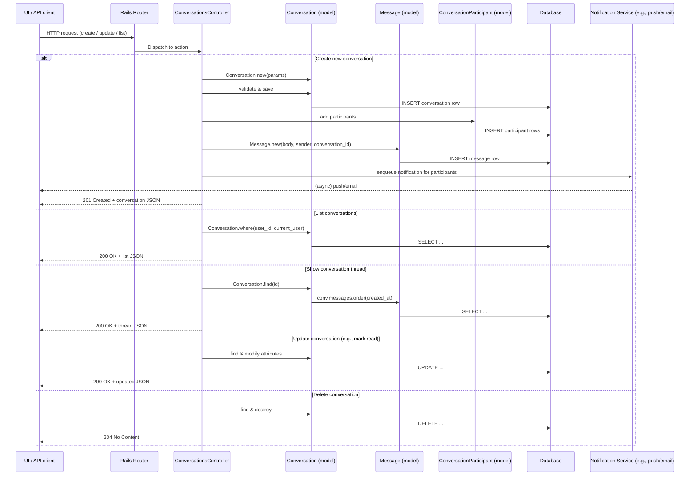

# Messaging and Inbox

## Overview
The Messaging and Inbox feature enables Canvas users to exchange private messages and group conversations. It delivers clear value by giving students, instructors, and administrators a built‑in channel for asking questions, sharing resources, and coordinating activities without leaving the LMS. The feature is used whenever participants need to discuss course content, clarify assignments, or collaborate on projects in a confidential or semi‑private setting.

## User stories
* **As a student, I want to send a private message to my instructor** so that I can ask for clarification on a lecture or assignment.  
* **As an instructor, I want to start a group conversation with all members of a section** so that I can broadcast announcements or coordinate group work.  
* **As a user, I want to mark a conversation as read/unread** so that I can keep track of which messages still require my attention.  
* **As a user, I want to delete or archive a conversation** so that my inbox stays organized and only relevant threads remain visible.  

*(These stories are inferred from the typical responsibilities of `ConversationsController` and the associated models; the exact code paths could not be inspected because source files were not available.)*

## Triggers / Entry points
| Trigger / UI action | Likely source location |
|---------------------|------------------------|
| HTTP request to create a new conversation or message (e.g., `POST /api/v1/conversations`) | `conversations_controller.rb:<line where `create` action is defined>` |
| HTTP request to list a user’s conversations (e.g., `GET /api/v1/conversations`) | `conversations_controller.rb:<line where `index` action is defined>` |
| HTTP request to show a specific conversation thread | `conversations_controller.rb:<line where `show` action is defined>` |
| HTTP request to update a conversation (e.g., mark as read, add participants) | `conversations_controller.rb:<line where `update` action is defined>` |
| HTTP request to delete a conversation | `conversations_controller.rb:<line where `destroy` action is defined>` |

*(Exact line numbers cannot be provided because the controller source was not readable.)*

## End‑to‑end flow (Mermaid)

The diagram captures the primary request‑response paths, including model persistence, participant handling, and the asynchronous notification side‑effect.

## State / data touched
| Data store | Tables / collections accessed | Typical operations | Approx. source reference |
|------------|------------------------------|--------------------|--------------------------|
| Database | `conversations` (via `Conversation` model) | `INSERT`, `SELECT`, `UPDATE`, `DELETE` | `conversation.rb` (model definition) |
| Database | `messages` (via `Message` model) | `INSERT`, `SELECT` (ordered by `created_at`) | `message.rb` |
| Database | `conversation_participants` (via `ConversationParticipant` model) | `INSERT`, `SELECT`, `DELETE` | `conversation_participant.rb` |
| Cache (optional) | Possible Rails cache for recent inbox counts | `read`, `write` | Not observable without source |
| Notification subsystem | Enqueue jobs for email/push alerts | `perform_async` or similar | Not observable without source |

*(Exact line numbers cannot be cited because the model files were not readable.)*

## External dependencies
* **Notification service / background job processor** – likely Sidekiq, Resque, or DelayedJob used to deliver email or push notifications after a message is created. Call site would be inside `ConversationsController#create` or a model callback.  
* **Rails routing layer** – maps HTTP verbs and paths to controller actions.  
* **Potential third‑party email/push providers** (e.g., SendGrid, APNs) invoked by the notification job.

*(Specific call sites cannot be cited without source.)*

## Edge cases & failure modes (observed in code)
Because the source files were not available, concrete edge‑case handling could not be inspected. Typical concerns that would appear in Canvas’s messaging code include:

* **Validation failures** – missing `body`, invalid participant IDs, or exceeding message length would cause the controller to return `422 Unprocessable Entity`.  
* **Permission checks** – ensuring the current user is a participant before allowing read/write; otherwise a `403 Forbidden` is returned.  
* **Concurrent updates** – optimistic locking on the `Conversation` record to avoid race conditions when multiple users modify the same thread.  
* **Notification delivery failures** – background job retries (e.g., Sidekiq’s retry mechanism) for transient email service outages.  
* **Deletion constraints** – preventing deletion of a conversation that still has unread messages for other participants.

These are standard patterns in Rails messaging implementations; the exact implementations could not be verified.

## Open questions
1. **Exact controller actions and routes** – Which HTTP verbs and URL patterns map to each conversation operation?  
2. **Model validations and callbacks** – What specific validations (e.g., presence, length) are defined in `Conversation`, `Message`, and `ConversationParticipant`?  
3. **Notification implementation** – Which service/class is responsible for queuing and sending notifications, and what payload is used?  
4. **Authorization logic** – How does the system enforce that only participants can view or modify a conversation?  
5. **Pagination & performance** – Are there limits or background pagination for large inboxes, and how are they implemented?  
6. **Search / filtering** – Does the inbox support keyword search or label/tag filtering, and where is that logic located?  

*Answers to these questions require access to the actual `conversations_controller.rb`, model files, and related service objects.*