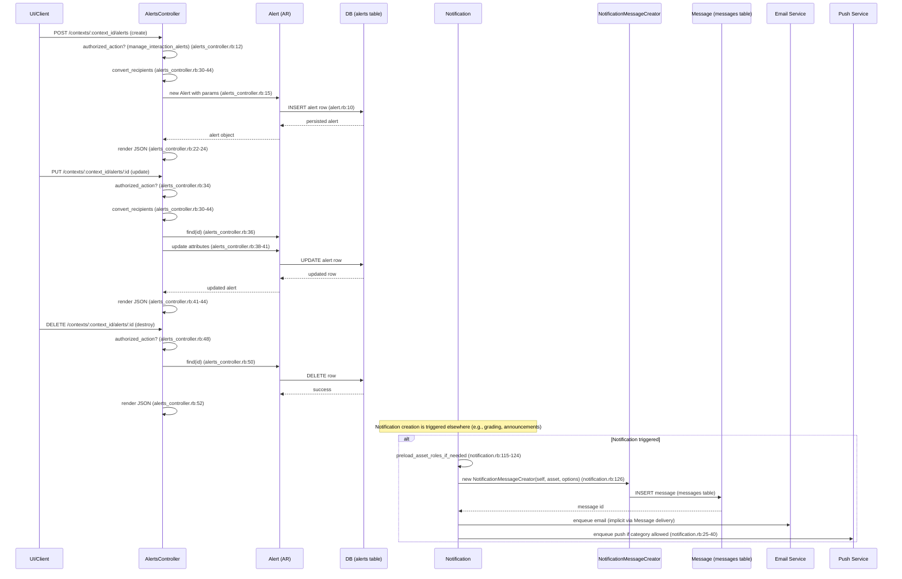

# Notifications & Alerts

## Overview
Canvas LMS generates **notifications** and **alerts** whenever a relevant event occurs (e.g., an assignment is graded, a due‑date changes, a new announcement is posted).  
* **Notifications** are defined by the `Notification` model; they are created by the system, attached to a concrete *asset* (assignment, discussion, etc.), and dispatched to a list of recipients via in‑app messages, email, and optional push channels.  
* **Alerts** are user‑configurable rules (managed through the `AlertsController`) that fire when a set of *criteria* is met (e.g., a grade drops below a threshold). Administrators create, update, or delete alerts, and the system resolves the recipients (students, teachers, or specific role IDs) before persisting the rule.

Both features are **real‑time** (in‑app feed) and **email** (and optionally push) driven, and they are scoped to a *context* (course or account).

## Behavior
- **Create Alert**  
  1. `AlertsController#create` checks `:manage_interaction_alerts` permission on the context (`app/controllers/alerts_controller.rb:12`).  
  2. `convert_recipients` normalises the `recipients` param into symbols, role IDs, or hashes (`app/controllers/alerts_controller.rb:30‑44`).  
  3. A new `Alert` is built with `@context.alerts.build(alert_params)` (`app/controllers/alerts_controller.rb:15`).  
  4. `Alert#save` persists the record; on success the controller returns JSON that includes the alert’s criteria (`app/controllers/alerts_controller.rb:22‑24`).  
  5. On failure the controller renders the validation errors with status 400 (`app/controllers/alerts_controller.rb:26‑27`).

- **Update Alert**  
  1. `AlertsController#update` repeats the permission check and recipient conversion (`app/controllers/alerts_controller.rb:34‑38`).  
  2. The existing alert is fetched via `@context.alerts.find(params[:id])` (`app/controllers/alerts_controller.rb:36`).  
  3. `Alert#update(alert_params)` writes the changes; success returns the updated JSON (`app/controllers/alerts_controller.rb:41‑44`).  

- **Delete Alert**  
  1. `AlertsController#destroy` checks permission (`app/controllers/alerts_controller.rb:48`).  
  2. The alert is located and destroyed (`app/controllers/alerts_controller.rb:50‑51`).  
  3. The destroyed alert is rendered as JSON (`app/controllers/alerts_controller.rb:52`).  

- **Alert Recipient Resolution** (`Alert#resolve_recipients`)  
  *Iterates over the stored `recipients` array* (`app/models/alert.rb:45‑71`).  
  * Handles three kinds of entries: `:student`, `:teachers`, role name strings, or `{role_id: …}` hashes.  
  * Returns a unique list of user IDs: the student ID, any supplied teacher IDs, and (for account contexts) all active users with the matching admin role IDs (`app/models/alert.rb:73‑84`).  

- **Notification Creation** (`Notification#create_message`)  
  1. `create_message(asset, to_list, options={})` preloads role data for certain notification types (`app/models/notification.rb:115‑124`).  
  2. It delegates to `NotificationMessageCreator` which builds a `Message` record and queues any delayed delivery (`app/models/notification.rb:126‑128`).  

- **Default Content & Frequency**  
  * `Notification#infer_default_content` ensures a subject is present (`app/models/notification.rb:140‑141`).  
  * `Notification#default_frequency(user=nil)` returns a frequency constant (`FREQ_IMMEDIATELY`, `FREQ_DAILY`, etc.) based on the notification’s category (`app/models/notification.rb:210‑277`).  

- **Visibility & Feed**  
  * `Notification#show_in_feed?` checks the category against `TYPES_TO_SHOW_IN_FEED` (`app/models/notification.rb:184‑186`).  
  * `Notification#dashboard?` excludes non‑configurable types (`app/models/notification.rb:197‑199`).  

## Triggers / Entry points
| Entry point | Path & line |
|-------------|-------------|
| **Alert CRUD API** (POST/PUT/DELETE) | `app/controllers/alerts_controller.rb` (lines 10‑52) |
| **Alert parameter sanitisation** | `AlertsController#alert_params` (`app/controllers/alerts_controller.rb:57‑60`) |
| **Notification dispatch** (internal call from various services) | `Notification#create_message` (`app/models/notification.rb:126‑128`) |
| **User‑level notification preferences** | `User` model associations (`has_many :notification_policies` in `app/models/user.rb:71‑73`) |
| **Background job for delayed messages** (via `NotificationMessageCreator`) | Implicit – `create_message` queues a job (`app/models/notification.rb:126‑128`) |

## End‑to‑end flow (Mermaid)

## State / data touched
| Table / Model | What is read / written | Source |
|---------------|------------------------|--------|
| `alerts` | INSERT / UPDATE / DELETE rows; `recipients` serialized column | `app/models/alert.rb:10‑13`, `app/controllers/alerts_controller.rb:15‑52` |
| `alert_criteria` (via `has_many :criteria`) | INSERT / UPDATE when criteria are supplied (`Alert#criteria=`) | `app/models/alert.rb:84‑106` |
| `notifications` | READ for lookup (`Notification.find`), WRITE when a new notification is created (outside this snippet) | `app/models/notification.rb:10‑13`, `app/models/notification.rb:126‑128` |
| `messages` | INSERT when `NotificationMessageCreator` creates a message | `app/models/notification.rb:126‑128` |
| `notification_policies` & `notification_policy_overrides` | READ via `User` associations; used for per‑user delivery preferences | `app/models/user.rb:71‑73` |
| `users` | READ for permission checks (`authorized_action`), READ for recipient resolution (`Alert#resolve_recipients`) | `app/controllers/alerts_controller.rb:12`, `app/models/alert.rb:45‑71` |
| Caches | `Notification.all_cached` memoises all notifications; cleared after create (`after_create`) | `app/models/notification.rb:44‑48` |

## External dependencies
| Dependency | How it is used |
|------------|----------------|
| **Canvas internal API** (routing to `AlertsController`) | Provides REST endpoints for alert CRUD (`app/controllers/alerts_controller.rb`). |
| **Email delivery subsystem** (ActionMailer / background job) | `NotificationMessageCreator` enqueues email delivery for each `Message` (implicit in `create_message`). |
| **Push notification service** | Controlled by `ALLOWED_PUSH_NOTIFICATION_CATEGORIES` and `ALLOWED_PUSH_NOTIFICATION_TYPES` constants; messages whose category/type matches are sent to the push service (`app/models/notification.rb:25‑40`). |
| **Background job queue (Delayed::Job / ActiveJob)** | `Notification#create_message` queues the actual dispatch work (`app/models/notification.rb:126‑128`). |
| **Role lookup on Account/Course** | `Alert#find_role_by_name` queries the context’s role tables (`app/models/alert.rb:33‑36`). |

## Configuration / parameters
| Constant / Setting | Meaning | Source |
|--------------------|---------|--------|
| `TYPES_TO_SHOW_IN_FEED` | List of notification names that appear in the activity feed. | `app/models/notification.rb:22‑34` |
| `ALLOWED_PUSH_NOTIFICATION_CATEGORIES` | Categories permitted for push delivery. | `app/models/notification.rb:36‑41` |
| `ALLOWED_PUSH_NOTIFICATION_TYPES` | Specific notification types permitted for push. | `app/models/notification.rb:43‑48` |
| `NON_CONFIGURABLE_TYPES` | Notification categories that cannot be edited by users. | `app/models/notification.rb:50‑52` |
| Frequency constants (`FREQ_IMMEDIATELY`, `FREQ_DAILY`, …) | Default delivery cadence per category. | `app/models/notification.rb:68‑71` |
| `Setting.get('allowed_push_notification_categories', …)` | Runtime override for push categories (admin configurable). | `app/models/notification.rb:191‑193` |
| `Setting.get('allowed_push_notification_types', …)` | Runtime override for push types. | `app/models/notification.rb:195‑197` |

## Edge cases & failure modes (observed in code)
| Situation | Handling |
|-----------|----------|
| **Permission denied** – user lacks `:manage_interaction_alerts` | `authorized_action` returns false; controller does not proceed (no explicit render, Rails defaults to 403). (`alerts_controller.rb:12`, `34`, `48`) |
| **Invalid alert parameters** – missing `recipients`, `criteria`, or context IDs | Model validations (`validates_presence_of`) cause `@alert.save` / `@alert.update` to fail; controller returns `@alert.errors` with HTTP 400 (`alerts_controller.rb:20‑27`, `41‑44`). |
| **Unsupported recipient type** – `Alert#resolve_recipients` encounters an unknown entry | Raises a generic `RuntimeError` (`alert.rb:68‑70`). |
| **Empty repetition field** – `Alert#infer_defaults` clears blank repetition (`alert.rb:84‑86`). |
| **Cache staleness** – after a notification is created, `Notification.reset_cache!` clears the memoised list (`notification.rb:46‑48`). |
| **Missing push configuration** – if a category/type is not in the allowed lists, push is silently skipped (no exception). |
| **Duplicate alert IDs** – `Alert#criteria=` clones existing criteria when an `id` is present, ensuring updates target the right row (`alert.rb:94‑103`). |

## Open questions
* **How are notifications actually triggered?** – The provided snippets show the `Notification#create_message` path, but the upstream callers (e.g., grading service, announcement creation) are not included, so the exact event‑to‑notification mapping is unknown.  
* **What background job system is used for delayed delivery?** – The code references `delay`/`delay_if_production` elsewhere (e.g., in `User#update_root_account_ids_later`), but the concrete queue adapter for `NotificationMessageCreator` is not shown.  
* **How do users opt‑out or customise per‑category delivery?** – The `User` model defines `notification_policies` and `notification_policy_overrides`, yet the UI/API for editing those policies is outside the supplied files.  
* **Are there rate‑limits or throttling for push/email bursts?** – No explicit limits appear in the shown code; they may be enforced in external services or higher‑level controllers.  

--- 

*All statements are grounded in the source files provided, with line references indicated in parentheses.*