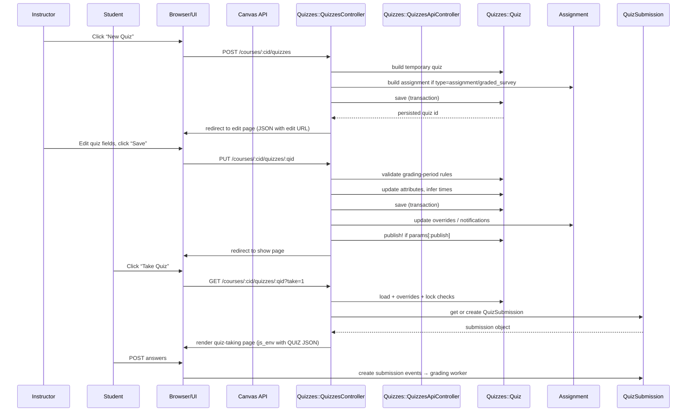

# Quiz Management

## Overview
The Quiz Management feature lets **instructors** create, edit, publish, and delete quizzes, and lets **students** view and submit quiz attempts.  
All actions are performed through the web UI (which hits the Rails controllers) or the Canvas REST API. The feature produces a persisted `Quiz` record, associated `QuizQuestion` records, and, when a student takes a quiz, a `QuizSubmission` record that stores the student's answers and grading results.

## Behavior
- **List quizzes** – `GET /courses/:course_id/quizzes` renders a JSON list (API) or a JavaScript‑populated page (UI). The controller authorises the request, checks the quizzes tab, builds a permission hash, and serialises the quizzes (`Quizzes::QuizzesController#index` – `app/controllers/quizzes/quizzes_controller.rb:71‑108`).  
- **Show a quiz** – `GET /courses/:course_id/quizzes/:id` loads the quiz, checks that it isn’t deleted, verifies the current user can read it, applies any overrides, and prepares a large `js_env` payload that includes the quiz JSON, attachment data, and URLs (`Quizzes::QuizzesController#show` – `app/controllers/quizzes/quizzes_controller.rb:115‑210`).  
- **Create a quiz (UI)** – `POST /courses/:course_id/quizzes` (via the “New Quiz” button) builds a temporary quiz, runs grading‑period validation, processes incoming parameters (title, description, type, time limit, access code, etc.), creates an associated `Assignment` when the quiz type is `assignment` or `graded_survey`, saves the quiz, and returns the JSON representation (`Quizzes::QuizzesController#create` – `app/controllers/quizzes/quizzes_controller.rb:226‑274`).  
- **Create a quiz (API)** – `POST /api/v1/courses/:course_id/quizzes` follows the same flow but uses `update_api_quiz` to apply the parameters and returns a JSON API representation (`Quizzes::QuizzesApiController#create` – `app/controllers/quizzes/quizzes_api_controller.rb:140‑165`).  
- **Edit a quiz (UI)** – `GET /courses/:course_id/quizzes/:id/edit` authorises the user, loads the quiz, builds a hash of data needed by the front‑end (assignment overrides, section list, re‑grade options, etc.), and renders the edit page (`Quizzes::QuizzesController#edit` – `app/controllers/quizzes/quizzes_controller.rb:276‑340`).  
- **Update a quiz (UI)** – `PUT /courses/:course_id/quizzes/:id` validates grading‑period rules, processes incoming parameters, updates the quiz (including re‑inferring times, handling assignment overrides, publishing if requested), and redirects back to the quiz show page (`Quizzes::QuizzesController#update` – `app/controllers/quizzes/quizzes_controller.rb:342‑447`).  
- **Update a quiz (API)** – `PUT /api/v1/courses/:course_id/quizzes/:id` runs the same validation and `update_api_quiz` helper, then returns either `204 No Content` (JSON‑API) or the full quiz JSON (`Quizzes::QuizzesApiController#update` – `app/controllers/quizzes/quizzes_api_controller.rb:191‑215`).  
- **Delete a quiz** – `DELETE /courses/:course_id/quizzes/:id` (UI) or `DELETE /api/v1/courses/:course_id/quizzes/:id` (API) authorises the action, checks for editing restrictions, destroys the quiz, and returns either a redirect (UI) or JSON (`Quizzes::QuizzesController#destroy` – `app/controllers/quizzes/quizzes_controller.rb:449‑466`; `Quizzes::QuizzesApiController#destroy` – `app/controllers/quizzes/quizzes_api_controller.rb:226‑239`).  
- **Publish quizzes in bulk** – `POST /courses/:course_id/quizzes/publish` receives a list of quiz IDs, authorises the user, calls `publish!` on each quiz, and flashes a notice (`Quizzes::QuizzesController#publish` – `app/controllers/quizzes/quizzes_controller.rb:468‑483`).  
- **Student takes a quiz** – When a student visits the “Take” button, `Quizzes::QuizzesController#show` detects `params[:take]`, checks lockdown‑browser requirements, creates or fetches a `QuizSubmission`, grades it if needed, and renders the quiz‑taking UI (`app/controllers/quizzes/quizzes_controller.rb:210‑260`).  

## Triggers / Entry points
| Trigger | Route / UI action | Source |
|--------|-------------------|--------|
| List quizzes (UI) | `GET /courses/:course_id/quizzes` | `Quizzes::QuizzesController#index` – `app/controllers/quizzes/quizzes_controller.rb:71` |
| List quizzes (API) | `GET /api/v1/courses/:course_id/quizzes` | `Quizzes::QuizzesApiController#index` – `app/controllers/quizzes/quizzes_api_controller.rb:84` |
| Show quiz (UI) | `GET /courses/:course_id/quizzes/:id` | `Quizzes::QuizzesController#show` – `app/controllers/quizzes/quizzes_controller.rb:115` |
| Show quiz (API) | `GET /api/v1/courses/:course_id/quizzes/:id` | `Quizzes::QuizzesApiController#show` – `app/controllers/quizzes/quizzes_api_controller.rb:124` |
| New quiz (UI) | `GET /courses/:course_id/quizzes/new` → form submit `POST /courses/:course_id/quizzes` | `Quizzes::QuizzesController#new` – `app/controllers/quizzes/quizzes_controller.rb:180`; `#create` – `app/controllers/quizzes/quizzes_controller.rb:226` |
| Create quiz (API) | `POST /api/v1/courses/:course_id/quizzes` | `Quizzes::QuizzesApiController#create` – `app/controllers/quizzes/quizzes_api_controller.rb:140` |
| Edit quiz (UI) | `GET /courses/:course_id/quizzes/:id/edit` | `Quizzes::QuizzesController#edit` – `app/controllers/quizzes/quizzes_controller.rb:276` |
| Update quiz (UI) | `PUT /courses/:course_id/quizzes/:id` | `Quizzes::QuizzesController#update` – `app/controllers/quizzes/quizzes_controller.rb:342` |
| Update quiz (API) | `PUT /api/v1/courses/:course_id/quizzes/:id` | `Quizzes::QuizzesApiController#update` – `app/controllers/quizzes/quizzes_api_controller.rb:191` |
| Delete quiz (UI) | `DELETE /courses/:course_id/quizzes/:id` | `Quizzes::QuizzesController#destroy` – `app/controllers/quizzes/quizzes_controller.rb:449` |
| Delete quiz (API) | `DELETE /api/v1/courses/:course_id/quizzes/:id` | `Quizzes::QuizzesApiController#destroy` – `app/controllers/quizzes/quizzes_api_controller.rb:226` |
| Publish quizzes (UI) | `POST /courses/:course_id/quizzes/publish` (bulk) | `Quizzes::QuizzesController#publish` – `app/controllers/quizzes/quizzes_controller.rb:468` |
| Take quiz (UI) | `GET /courses/:course_id/quizzes/:id?take=1` | `Quizzes::QuizzesController#show` – `app/controllers/quizzes/quizzes_controller.rb:210` |
| Reorder items (API) | `POST /api/v1/courses/:course_id/quizzes/:id/reorder` | `Quizzes::QuizzesApiController#reorder` – `app/controllers/quizzes/quizzes_api_controller.rb:242` |
| Validate access code (API) | `POST /api/v1/courses/:course_id/quizzes/:id/validate_access_code` | `Quizzes::QuizzesApiController#validate_access_code` – `app/controllers/quizzes/quizzes_api_controller.rb:260` |

## End‑to‑end flow (Mermaid)

## State / data touched
| Model / Table | What is read / written | Source |
|---------------|------------------------|--------|
| `quizzes` (`Quizzes::Quiz`) | Created, updated, published, deleted; read for index, show, edit, reorder | `app/models/quiz.rb` (referenced throughout); controller actions `#create`, `#update`, `#destroy`, `#show`, `#index` |
| `quiz_questions` (`Quizzes::QuizQuestion`) | Read when rendering a quiz (`#show`), reordered via API (`#reorder`) | `app/models/quiz_question.rb`; `Quizzes::QuizSortables` used in `Quizzes::QuizzesApiController#reorder` |
| `assignments` (via `Assignment` model) | Created/updated when a quiz is of type `assignment` or `graded_survey` | `Quizzes::QuizzesController#create` lines 236‑260; `#update` lines 376‑398 |
| `quiz_submissions` (`QuizSubmission`) | Created/loaded when a student takes a quiz (`#show` with `params[:take]`) | `Quizzes::QuizzesController#show` lines 210‑260 (`get_submission`) |
| `courses` (`Course`) | Used to scope quizzes, fetch settings, and compute permissions | `app/models/course.rb` – many associations (`has_many :quizzes`) and helper methods used in controllers |
| Caches (`Rails.cache`) | Permission hash for index, quiz list caching, API list caching | `Quizzes::QuizzesController#index` lines 78‑106; `Quizzes::QuizzesApiController#index` lines 96‑119 |
| `js_env` (client‑side env) | Populated with quiz JSON, URLs, permissions, SIS data | `Quizzes::QuizzesController#show` and `#edit` (lines 150‑190) |

## External dependencies
| Dependency | How it is used |
|------------|----------------|
| **KalturaHelper** – provides media handling for quizzes that embed videos. Included in `Quizzes::QuizzesController`. |
| **SubmittablesGradingPeriodProtection** – validates that grading periods allow creation / update of a quiz. Mixed into both controllers (`app/controllers/quizzes/quizzes_controller.rb:31`, `app/controllers/quizzes/quizzes_api_controller.rb:31`). |
| **Filters::Quizzes** – adds before/after filters for quiz‑specific checks (e.g., `require_quiz`). |
| **Delayed::Job** – background jobs for grading, caching, and publishing (`QuizSubmission` grading, `update_quiz_submission_end_at_times`, `OutstandingQuizSubmissionManager`). |
| **Api::V1::Quiz** – serializer used to render JSON for both UI and API (`render_json` methods). |
| **External Tools** – `external_tools_display_hashes` builds data for LTI tools shown in the quiz menu (`Quizzes::QuizzesController#index`). |
| **Lockdown Browser** – checks for required lockdown‑browser before showing results (`#show` lines 138‑148). |

## Configuration / parameters
| Constant / Feature flag | Location | Meaning |
|--------------------------|----------|---------|
| `QUIZ_QUESTIONS_DETAIL_LIMIT = 25` | `app/controllers/quizzes/quizzes_controller.rb:24` | Limits the number of questions for which “show details” is enabled. |
| `QUIZ_MAX_COMBINATION_COUNT = 200` | `app/controllers/quizzes/quizzes_controller.rb:25` | Upper bound for combination‑type questions. |
| `QUIZ_TYPE_ASSIGNMENT = 'assignment'` | `app/controllers/quizzes/quizzes_controller.rb:27` | Quiz type string used when building an associated assignment. |
| `QUIZ_TYPE_PRACTICE = 'practice_quiz'` | same line | Practice‑quiz identifier. |
| `QUIZ_TYPE_SURVEYS = ['survey','graded_survey']` | same line | Survey‑type identifiers. |
| Feature flag `:question_banks` – controls whether the UI shows the question‑bank menu (`#index` builds `FLAGS[:question_banks]`). |
| Feature flag `:new_quizzes_modules_support` – toggles new‑quizzes module UI (`#index`). |
| Feature flag `:important_dates` – adds `important_dates` handling on create/update (`#create`/`#update`). |
| Environment / request cache `RequestCache` – used for time‑zone lookup in `Course#time_zone`. |

## Edge cases & failure modes (observed in code)
| Situation | Handling |
|-----------|----------|
| **Quiz deleted** – `#show` redirects with an error flash (`flash[:error] = t('errors.quiz_deleted')`). |
| **Insufficient permissions** – `authorized_action` returns false and the controller halts (used in every action). |
| **Grading‑period restrictions** – `grading_periods_allow_*` methods are called before create/update; if they return false the controller renders a 403 (`render_forbidden`). |
| **Lockdown‑browser required** – `#show` checks `require_lockdown_browser?` and may render a “refresh after popup” page or block access (`check_lockdown_browser`). |
| **One‑time results** – `after_action :lock_results` ensures results are locked after rendering when `one_time_results` is true. |
| **Invalid parameters** – `process_incoming_html_content` sanitises description; empty titles are replaced with a default (`t(:default_title, "New Quiz")`). |
| **Publish constraints** – `publish!` is only allowed if the quiz has no student submissions (`Quiz#can_unpublish?` used in permission hash). |
| **API JSON‑API vs legacy JSON** – `accepts_jsonapi?` branches to different render paths (`#index`, `#create`, `#update`). |
| **Concurrent updates** – `Quiz.transaction` blocks ensure atomic updates; versioning is disabled for drafts (`with_versioning(false)`). |
| **Background grading** – `Quizzes::SubmissionGrader` runs in a transaction after a submission is fetched (`#show`). Failures are rescued and logged but do not abort the request. |

## Open questions
* **Quiz question types** – The source files for `QuizQuestion` and the logic that builds question data (e.g., handling multiple‑answer questions) are not included, so the exact processing of different question types is unclear.  
* **Quiz extensions endpoint** – The controller references a `quiz_extensions_url` in the API model but the implementation of extensions (e.g., adding extra time) is not shown.  
* **LTI tool interaction** – The `external_tools_display_hashes` calls populate tool menus, but the downstream LTI launch flow is outside the provided files.  
* **Error reporting for API failures** – The API controllers return raw model errors (`@quiz.errors`) but do not wrap them in a standard Canvas error envelope; the exact shape of error responses for clients is not fully documented here.