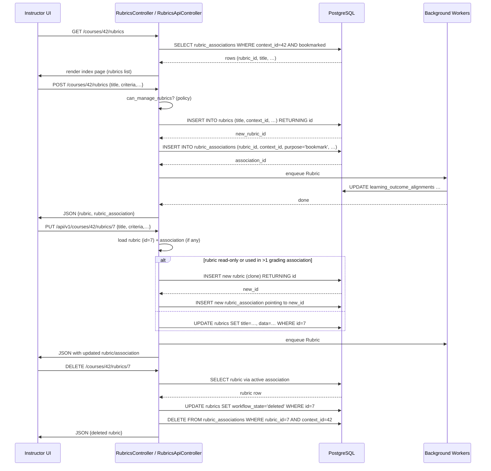

# Rubric Management

## Overview
The Rubric Management feature lets instructors create, edit, view, associate, and delete rubrics that define grading criteria for assignments. Rubrics are stored as `Rubric` records, can be linked to assignments, courses, or accounts through `RubricAssociation`, and are used to record student evaluations via `RubricAssessment`. The feature is exposed both through the Canvas web UI (HTML/JS) and a REST‑API (`/api/v1/rubrics`).

## Behavior
- **Permission check** – Every action first verifies that the current user has the appropriate rights on the context (`manage_rubrics`, `read_rubrics`, or `manage_assignments`). (`app/controllers/rubrics_controller.rb:15‑19`, `app/controllers/rubrics_api_controller.rb:31‑33`)
- **Index** – Lists bookmarked rubric associations for the context, collates them by rubric title, and renders either `user_index` (for a user context) or the default view. (`app/controllers/rubrics_controller.rb:27‑38`)
- **Show** – Finds a bookmarked `RubricAssociation` by `rubric_id`, raises 404 if missing, and makes the rubric available to the view. (`app/controllers/rubrics_controller.rb:40‑53`)
- **Create** – Delegates to `update` (the same code path is used for create and update). (`app/controllers/rubrics_controller.rb:71‑73`)
- **Update** –  
  1. Extracts permitted `rubric_association` params. (`app/controllers/rubrics_controller.rb:84‑86`)  
  2. Resolves the association object (`RubricAssociation.get_association_object`). (`app/controllers/rubrics_controller.rb:88`)  
  3. Checks whether the user can manage the rubric or the association object (`can_manage_rubrics_or_association_object?`). (`app/controllers/rubrics_controller.rb:90‑95`)  
  4. Loads the target rubric (`@rubric`) either from the association or directly by `params[:id]`. (`app/controllers/rubrics_controller.rb:98‑104`)  
  5. **Branch:** If the rubric does not exist **or** the update would change a rubric that is not editable (e.g., read‑only, belongs to a different account), a **new** rubric is built and linked to the original via `rubric_id`. (`app/controllers/rubrics_controller.rb:108‑119`)  
  6. If the user has update rights, `Rubric#update_with_association` is called, which updates the rubric data and creates/updates the `RubricAssociation`. (`app/controllers/rubrics_controller.rb:124‑130`)  
  7. Returns a JSON hash containing the rubric and its association (including permissions). (`app/controllers/rubrics_controller.rb:132‑140`)
- **Destroy** – Finds the rubric via an active `RubricAssociation` scoped to the context, checks `delete_associations` and `manage_rubrics` permissions, then calls `Rubric#destroy_for` which deletes the rubric and all its associations. (`app/controllers/rubrics_controller.rb:152‑165`)
- **API Index** – Returns a paginated JSON list of active rubrics for the context after `manage_rubrics` permission check. (`app/controllers/rubrics_api_controller.rb:45‑48`)
- **API Show** – Looks up a bookmarked `RubricAssociation` for the requested rubric ID, returns 404 if not found, then builds the response JSON including optional `assessments` and `associations` based on `include[]` params. (`app/controllers/rubrics_api_controller.rb:58‑71`)
- **Rubric model** –  
  * Validates presence of `context_id`, `context_type`, `workflow_state`; validates title length. (`app/models/rubric.rb:31‑36`)  
  * `default_values` ensures a unique title within the same context. (`app/models/rubric.rb:71‑88`)  
  * Soft‑delete via `workflow_state = 'deleted'` and cascades deletion of associations. (`app/models/rubric.rb:94‑101`)  
  * `update_with_association` updates rubric fields, criteria, and creates a new `RubricAssociation` when needed. (`app/models/rubric.rb:158‑170`)  
  * `will_change_with_update?` determines whether an incoming update would modify the rubric’s title, points, or criteria. (`app/models/rubric.rb:226‑236`)  
  * `touch_associations` propagates alignment updates to bookmarked associations after a rubric change. (`app/models/rubric.rb:115‑119`)
- **RubricAssessment model** –  
  * Validates required fields (`assessment_type`, `rubric_id`, etc.). (`app/models/rubric_assessment.rb:31‑33`)  
  * Before save, populates `artifact_attempt` for submissions and HTML‑ifies comment fields. (`app/models/rubric_assessment.rb:45‑55`)  
  * After save, updates any pending `assessment_requests` and, if the association is used for grading, updates the linked artifact’s score. (`app/models/rubric_assessment.rb:57‑78`)  
  * `track_outcomes` enqueues outcome‑result updates unless the assessment is a peer review or provisional grade. (`app/models/rubric_assessment.rb:38‑41`)  
  * Permissions are defined so that assessors, the assessed user, and users with manage rights on the association can read/create/update/delete as appropriate. (`app/models/rubric_assessment.rb:115‑149`)

## Triggers / Entry points
| Trigger | Path |
|--------|------|
| UI request to list rubrics (`GET /courses/:course_id/rubrics`) | `app/controllers/rubrics_controller.rb:27` |
| UI request to view a rubric (`GET /courses/:course_id/rubrics/:id`) | `app/controllers/rubrics_controller.rb:40` |
| UI request to create a rubric (`POST /courses/:course_id/rubrics`) | `app/controllers/rubrics_controller.rb:71` |
| UI request to update a rubric (`PUT /courses/:course_id/rubrics/:id`) | `app/controllers/rubrics_controller.rb:115` |
| UI request to delete a rubric (`DELETE /courses/:course_id/rubrics/:id`) | `app/controllers/rubrics_controller.rb:152` |
| API list rubrics (`GET /api/v1/courses/:course_id/rubrics`) | `app/controllers/rubrics_api_controller.rb:45` |
| API show rubric (`GET /api/v1/courses/:course_id/rubrics/:id`) | `app/controllers/rubrics_api_controller.rb:58` |
| API create rubric (`POST /api/v1/courses/:course_id/rubrics`) – handled by the same `update` path | `app/controllers/rubrics_controller.rb:71` |
| API update rubric (`PUT /api/v1/courses/:course_id/rubrics/:id`) | `app/controllers/rubrics_controller.rb:115` |
| API delete rubric (`DELETE /api/v1/courses/:course_id/rubrics/:id`) | `app/controllers/rubrics_controller.rb:152` |
| Background job to update outcome alignments after rubric change (`Rubric#touch_associations`) | `app/models/rubric.rb:115‑119` |
| Background job to create outcome results after assessment (`RubricAssessment#track_outcomes`) | `app/models/rubric_assessment.rb:38‑41` |

## End‑to‑end flow (Mermaid)

## State / data touched
| Table / Model | Operation | Source |
|---------------|-----------|--------|
| `rubrics` | INSERT, UPDATE, soft‑DELETE (`workflow_state='deleted'`) | `RubricsController#create/update/destroy` (`app/controllers/rubrics_controller.rb:71‑119`, `152‑165`) |
| `rubric_associations` | INSERT (bookmark, grading), UPDATE, DELETE (when rubric destroyed) | `Rubric#associate_with`, `Rubric#update_with_association`, `Rubric#destroy_for` (`app/models/rubric.rb:158‑170`, `94‑101`) |
| `rubric_assessments` | INSERT (when a grader saves an assessment) | `RubricAssessment` callbacks (`app/models/rubric_assessment.rb:45‑78`) |
| `learning_outcome_alignments` | UPDATE (when rubric criteria change) | `Rubric#update_alignments` → `LearningOutcome.update_alignments` (`app/models/rubric.rb:115‑119`) |
| `learning_outcome_results` | INSERT/UPDATE (outcome tracking) | `RubricAssessment#track_outcomes` → `create_outcome_result` (`app/models/rubric_assessment.rb:38‑41`, `71‑106`) |
| `assessment_requests` | UPDATE (mark completed) | `RubricAssessment#update_assessment_requests` (`app/models/rubric_assessment.rb:57‑78`) |
| Caches (e.g., `RequestCache` for time zone) | Read | `Course#time_zone` (`app/models/course.rb:30‑38`) – not directly rubric‑related but used in UI rendering. |
| Feature‑flag checks (`non_scoring_rubrics`, `account_level_mastery_scales`) | Read | `RubricsController#index` (`js_env … NON_SCORING_RUBRICS` line 31) and `Rubric#update_mastery_scales` (`app/models/rubric.rb:241‑254`) |

## External dependencies
| Dependency | Use |
|------------|-----|
| **Feature flags** (`non_scoring_rubrics`, `account_level_mastery_scales`) – read via `@domain_root_account.feature_enabled?`. (`app/controllers/rubrics_controller.rb:31`, `app/models/rubric.rb:241`) |
| **Background job system** (`delay_if_production`, `delay`) – used to enqueue alignment updates and outcome processing. (`app/models/rubric.rb:115‑119`, `app/models/rubric_assessment.rb:38‑41`) |
| **HTML sanitization** (`format_message`, `HtmlTextHelper`) – used when storing long descriptions or comment HTML. (`app/models/rubric.rb:140‑150`, `app/models/rubric_assessment.rb:49‑55`) |
| **LearningOutcome model** – consulted for outcome‑based criteria and alignment updates. (`app/models/rubric.rb:140‑155`, `app/models/rubric_assessment.rb:71‑106`) |
| **Polymorphic associations** (`artifact` can be `Submission`, `Assignment`, or `ModeratedGrading::ProvisionalGrade`) – used when persisting assessments. (`app/models/rubric_assessment.rb:23‑27`) |

## Configuration / parameters
| Parameter | Location | Meaning |
|-----------|----------|---------|
| `skip_updating_points_possible` (attr_writer) | `Rubric` (`app/models/rubric.rb:9‑11`) | When true, the rubric’s `points_possible` is left unchanged during an association update. |
| `NON_SCORING_RUBRICS` feature flag | `RubricsController#index` (`js_env … NON_SCORING_RUBRICS`) | Enables UI support for rubrics that do not contribute to a grade. |
| `account_level_mastery_scales` feature flag | `Rubric#update_mastery_scales` (`app/models/rubric.rb:241‑254`) | When enabled, rubric criteria are automatically synced to the account‑level mastery scale. |
| `rubric_association[use_for_grading]`, `hide_score_total`, `purpose` | Strong‑parameter whitelist in `RubricsController#update` (`app/controllers/rubrics_controller.rb:84‑86`) | Control whether the rubric contributes to grade calculation, whether the total score is shown, and whether the association is for grading or bookmarking. |
| `include[]` query param (API) | `RubricsApiController#show` (`app/controllers/rubrics_api_controller.rb:58‑71`) | Determines which related objects (`assessments`, `associations`, etc.) are embedded in the JSON response. |
| `style` query param (API) | `RubricsApiController#show` (`app/controllers/rubrics_api_controller.rb:58‑71`) | When `assessments` are included, `style=full` returns full rating data; `style=comments_only` returns only comments. |

## Edge cases & failure modes (observed in code)
- **Read‑only rubrics** – If a rubric is marked `read_only` (i.e., used for grading by more than one object), `RubricsController#update` will **clone** the rubric instead of updating it. (`app/controllers/rubrics_controller.rb:108‑119`)  
- **Permission denial** – If the user lacks the required rights, `authorized_action` renders an unauthorized response and the controller returns early. (`app/controllers/rubrics_controller.rb:15‑19`, `app/controllers/rubrics_api_controller.rb:31‑33`)  
- **Invalid ID** – Both UI and API actions validate that the rubric ID matches `Api::ID_REGEX`; otherwise a `RecordNotFound` (404) is raised. (`app/controllers/rubrics_controller.rb:44‑48`)  
- **Missing association** – `RubricsController#show` raises 404 if the bookmarked association cannot be found. (`app/controllers/rubrics_controller.rb:49‑52`)  
- **Style without assessments** – API validation (`RubricsApiController#validate_args`) adds an error if `style` is supplied but no assessment include is requested. (`app/controllers/rubrics_api_controller.rb:108‑115`)  
- **Multiple include values of the same category** – Validation rejects more than one `assessment` or `association` include type. (`app/controllers/rubrics_api_controller.rb:118‑124`)  
- **Background job failures** – Alignment and outcome updates are enqueued with `delay_if_production`; failures would be retried by the job system but are not rescued in the controller.  
- **Concurrent updates** – `Rubric#will_change_with_update?` compares the incoming criteria with the stored normalized criteria to decide whether a new rubric is needed, preventing silent overwrites when another process has already changed the rubric. (`app/models/rubric.rb:226‑236`)  

## Open questions
- **`RubricAssociation` model source** – The provided files reference `RubricAssociation` (e.g., `RubricAssociation.generate`) but the class definition is not included, so the exact fields, callbacks, and validation rules are unknown.  
- **`skip_updating_points_possible` semantics** – The flag is passed through the controller to the model, but the model only stores it on the association (`RubricAssociation#skip_updating_points_possible`) and never appears to affect any calculation in the shown code. Its intended effect on point‑total updates remains unclear.  
- **How “bookmark” purpose differs in UI** – The UI sets `purpose` to `"bookmark"` for non‑grading display, but the downstream handling (e.g., UI rendering logic) is outside the supplied source.  
- **Interaction with mastery scales** – When `account_level_mastery_scales` is enabled, `Rubric#update_mastery_scales` updates criteria, but the trigger for calling this method (e.g., after a rubric edit) is not shown in the excerpt.  
- **Deletion cascade for assessments** – `Rubric#destroy_for` deletes associations but does not explicitly delete `RubricAssessment` records; they are dependent‑destroyed via `RubricAssociation` (`has_many :rubric_assessments, :through => :rubric_associations, :dependent => :destroy`), but the exact order and any side‑effects are not visible.  

*All statements are grounded in the source files listed above, with line numbers cited where relevant.*