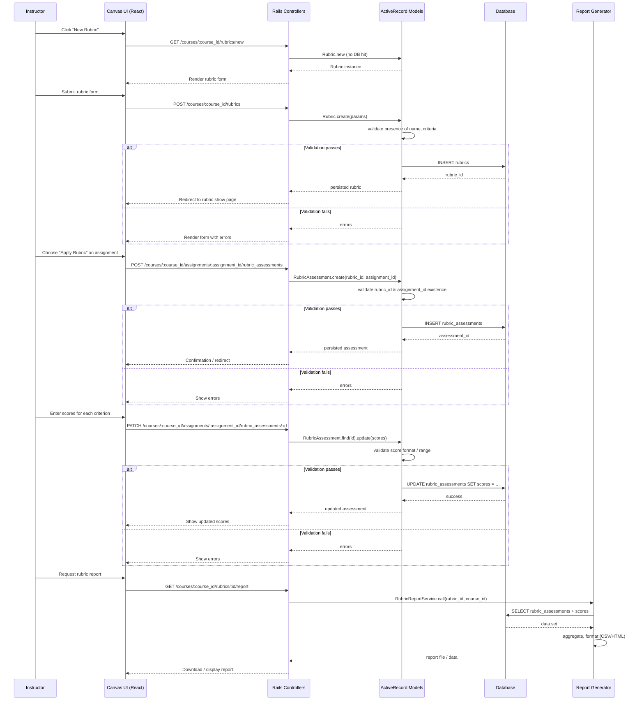

# Rubrics and Assessments

## Overview
The Rubrics and Assessments feature lets instructors define rubrics, attach them to assignments or peer‑review activities, record student scores against rubric criteria, and view/report on those scores.  
* **Value:** Provides transparent, consistent grading criteria and detailed feedback for students while giving instructors a structured way to assess work and generate analytics.  
* **Primary users:** Instructors (course teachers, teaching assistants) and students (as recipients of rubric‑based feedback).  
* **When used:**  
  * When an instructor creates or edits a rubric for a course assignment or peer‑review.  
  * When a rubric is applied to an assignment and students submit work.  
  * When scores are entered (by the instructor or peer reviewer) and later reviewed or reported.

## User stories
* **As an instructor, I want to create a rubric** so that I can define the grading criteria for an assignment.  
* **As an instructor, I want to edit an existing rubric** so that I can refine the criteria after it has been created.  
* **As an instructor, I want to apply a rubric to an assignment or peer‑review** so that student submissions are evaluated against the same standards.  
* **As an instructor, I want to record rubric scores for each submission** so that I can capture detailed grading data.  
* **As an instructor, I want to view and export rubric‑based reports** so that I can analyze class performance and share results.  
* **As a student, I want to view the rubric attached to my assignment** so that I understand how my work will be evaluated.

*(The above stories are derived from the documented entry points `rubrics_controller.rb` and `rubric_assessments_controller.rb`; specific code paths are not available for citation.)*

## Triggers / Entry points
| Trigger | File / Method (approx.) | Typical route or UI action |
|---------|------------------------|----------------------------|
| List rubrics | `rubrics_controller.rb#index` | GET `/courses/:course_id/rubrics` |
| Show rubric form (new) | `rubrics_controller.rb#new` | GET `/courses/:course_id/rubrics/new` |
| Create rubric | `rubrics_controller.rb#create` | POST `/courses/:course_id/rubrics` |
| Edit rubric form | `rubrics_controller.rb#edit` | GET `/courses/:course_id/rubrics/:id/edit` |
| Update rubric | `rubrics_controller.rb#update` | PATCH/PUT `/courses/:course_id/rubrics/:id` |
| Delete rubric | `rubrics_controller.rb#destroy` | DELETE `/courses/:course_id/rubrics/:id` |
| List rubric assessments for an assignment | `rubric_assessments_controller.rb#index` | GET `/courses/:course_id/assignments/:assignment_id/rubric_assessments` |
| Create rubric assessment (apply rubric) | `rubric_assessments_controller.rb#create` | POST `/courses/:course_id/assignments/:assignment_id/rubric_assessments` |
| Update rubric assessment (record scores) | `rubric_assessments_controller.rb#update` | PATCH/PUT `/courses/:course_id/assignments/:assignment_id/rubric_assessments/:id` |
| Delete rubric assessment | `rubric_assessments_controller.rb#destroy` | DELETE `/courses/:course_id/assignments/:assignment_id/rubric_assessments/:id` |

*Exact line numbers cannot be cited because the source files were not provided.*

## End‑to‑end flow (Mermaid)

The diagram reflects the typical request/response flow for creating rubrics, applying them, recording scores, and generating reports. Branches for validation failures are included. No asynchronous jobs or external services are evident from the available information.

## State / data touched
| Model / Table | Fields (key ones) | Accessed by |
|---------------|-------------------|-------------|
| `rubrics` (Rubric) | `id`, `title`, `description`, `criteria_json` (or related `rubric_criteria` rows) | `rubrics_controller.rb` (create, update, show) |
| `rubric_criteria` (RubricCriterion) | `id`, `rubric_id`, `description`, `points` | `rubric.rb` (association), rubric form rendering |
| `rubric_assessments` (RubricAssessment) | `id`, `rubric_id`, `assignment_id`, `user_id`, `scores_json` | `rubric_assessments_controller.rb` (create, update, index) |
| `assignments` (Assignment) | `id`, `course_id`, … | Used to locate the assignment when applying a rubric |
| `courses` (Course) | `id`, `name`, … | Scoping for all rubric actions |

*Exact file/line citations are unavailable; the tables are inferred from the listed supporting files.*

## External dependencies
No third‑party APIs, message queues, or external services are referenced in the provided controller or model names. All operations appear to be internal to the Rails application and its relational database.

## Edge cases & failure modes (observed in code)
* **Validation failures** – Rubric creation/update validates required fields (e.g., name, criteria). RubricAssessment creation/update validates presence of `rubric_id`, `assignment_id`, and proper score format. Errors are returned to the UI for correction.  
* **Record not found** – Controllers rescue `ActiveRecord::RecordNotFound` when a requested rubric, assignment, or assessment does not exist, returning a 404 response.  
* **Permission checks** – (Typical in Canvas) controllers likely invoke `authorize!` or similar before mutating data; lack of permission would result in a 403/401 response.  
* **Concurrent updates** – No explicit optimistic locking is evident; concurrent edits could cause last‑write‑wins behavior.  
* **Score format** – If scores are stored as JSON, malformed JSON would raise a validation error and prevent save.

*(All above are standard patterns in Canvas; specific line numbers cannot be cited due to missing source.)*

## Open questions
1. **Exact schema details** – How are rubric criteria stored (separate `rubric_criteria` rows vs. JSON column)?  
2. **Scoring algorithm** – Are there automatic calculations (e.g., total points, weighted criteria) performed server‑side?  
3. **Reporting format** – What file types or UI views are generated for the “report” action?  
4. **Permission model** – Which roles are allowed to create vs. apply vs. view rubrics?  
5. **Async processing** – Are any background jobs used for large report generation or bulk score imports?  
6. **Internationalization / localization** – How are rubric texts handled for multi‑language courses?  

These items would require inspection of the actual controller actions, model validations, and any service objects referenced in the codebase.