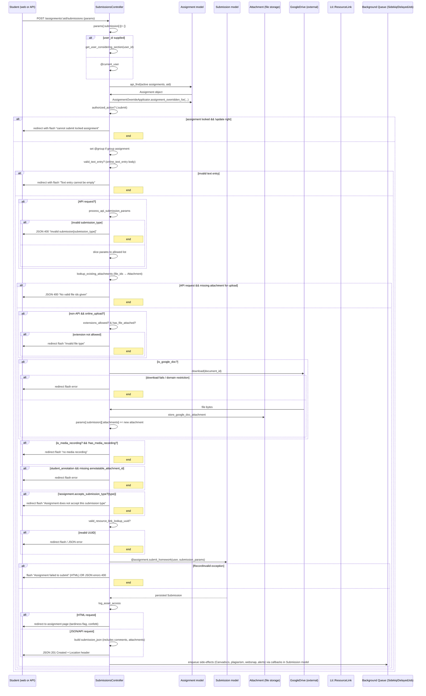

# Submit Assignments

## Overview
| **What value does it deliver?** | Provides a reliable, secure, and flexible way for students to turn in work and for instructors to receive, grade, and audit those submissions. |
| **Who uses it?** | • **Students** – to submit assignments (text, URL, file upload, media, LTI launch, or annotation). • **Instructors / Graders** – to receive submissions, view details, grade, and run audit reports. • **Observers / Admins** – to view submission details when permitted. |
| **When is it used?** | Whenever an assignment that accepts online turn‑in is active. It is invoked from the web UI (HTML form), the Canvas API, or internal tools (e.g., group‑submission helpers). |

---

## User stories
* **As a student**, I want to submit an assignment so that my work is recorded in Canvas.  
  *Trigger:* `POST /courses/:course_id/assignments/:assignment_id/submissions` → `SubmissionsController#create` (`./app/controllers/submissions_controller.rb:71‑78`).

* **As a student**, I want to choose the submission type (text entry, URL, file upload, media, LTI launch, annotation) so the assignment matches the instructor’s requirements.  
  *Trigger:* `submission[submission_type]` validated against `API_SUBMISSION_TYPES` (`./app/controllers/submissions_controller.rb:115‑124`).

* **As a student**, I want to attach one or more previously‑uploaded files (or upload new ones) so that supporting material is included.  
  *Trigger:* `submission[file_ids]` → `lookup_existing_attachments` (`./app/controllers/submissions_controller.rb:260‑277`).

* **As a student**, I want to submit a Google Doc (when allowed) and have Canvas fetch the file for me.  
  *Trigger:* `is_google_doc?` → `submit_google_doc` (`./app/controllers/submissions_controller.rb:197‑210`).

* **As a student**, I want to submit a media recording (audio/video) and have Canvas store the reference.  
  *Trigger:* `is_media_recording?` & `has_media_recording?` (`./app/controllers/submissions_controller.rb:221‑229`).

* **As a student**, I want to submit an annotation on a provided document, linking the attachment ID.  
  *Trigger:* `submission_type == 'student_annotation'` validation (`./app/controllers/submissions_controller.rb:236‑242`).

* **As a student**, I want to submit on behalf of another user (e.g., a group member) when I have grading permission.  
  *Trigger:* `submission[user_id]` handling (`./app/controllers/submissions_controller.rb:84‑92`).

* **As an instructor**, I want to be prevented from accepting a submission when the assignment is locked, unless I have update rights.  
  *Trigger:* `@assignment.locked_for?` check (`./app/controllers/submissions_controller.rb:106‑110`).

* **As an instructor**, I want to see an error if the supplied `resource_link_lookup_uuid` does not exist.  
  *Trigger:* `valid_resource_link_lookup_uuid?` (`./app/controllers/submissions_controller.rb:447‑466`).

* **As an instructor**, I want to receive a notification (flash message or JSON response) when a submission succeeds or fails.  
  *Trigger:* `respond_to` block after `@assignment.submit_homework` (`./app/controllers/submissions_controller.rb:311‑352`).

* **As an observer**, I want to view a student’s submission when I have observer rights.  
  *Trigger:* `can_view_details?` policy (`./app/models/submission.rb:447‑459`).

---

## Triggers / Entry points
| Trigger | File & line(s) |
|---------|----------------|
| **POST** `/courses/:course_id/assignments/:assignment_id/submissions` – creates a submission (web UI or API) | `./app/controllers/submissions_controller.rb:71‑78` |
| **GET** `/courses/:course_id/assignments/:assignment_id/submissions` – index (HTML redirect or ZIP generation) | `./app/controllers/submissions_controller.rb:31‑41` |
| **GET** `/courses/:course_id/assignments/:assignment_id/submissions/:id` – show submission details | `./app/controllers/submissions_controller.rb:43‑61` |
| **PUT/PATCH** `/courses/:course_id/assignments/:assignment_id/submissions/:id` – update (delegates to `SubmissionsBaseController#update`) | `./app/controllers/submissions_controller.rb:354‑361` |
| **POST** `/submissions/:submission_id/redo` – redo a submission | `./app/controllers/submissions_controller.rb:363‑371` |
| **GET** `/submissions/:submission_id/audit_events` – fetch audit events | `./app/controllers/submissions_controller.rb:373‑398` |
| **Internal** – background job `SubmissionService` (not shown) may be invoked after `submit_homework` for plagiarism, Canvadocs, etc. | `./app/services/submission_service.rb` (referenced via callbacks in `Submission` model) |

---

## End‑to‑end flow (Mermaid)

*The diagram includes the main success path, validation branches, and the asynchronous side‑effects that are triggered by `Submission` callbacks (e.g., `submit_to_plagiarism_later`, `queue_websnap`, `create_alert`).*

---

## State / data touched
| Data store | Access pattern | Location |
|------------|----------------|----------|
| **assignments** (read) | `api_find(@context.assignments.active, ...)` | `./app/controllers/submissions_controller.rb:84‑86` |
| **assignments** (write) | `@assignment.submit_homework` updates `submissions_count`, `graded_count` via callbacks | `./app/models/submission.rb:after_create/after_update` |
| **submissions** (create / update) | `@assignment.submit_homework(@submission_user, submission_params)` | `./app/controllers/submissions_controller.rb:311‑327` |
| **users** (read) | `get_user_considering_section(user_id)` or `@current_user` | `./app/controllers/submissions_controller.rb:84‑92` |
| **groups** (read) | `@assignment.group_category.group_for(@submission_user)` | `./app/controllers/submissions_controller.rb:98‑100` |
| **attachments** (read) | `lookup_existing_attachments` → `@submission_user.attachments.active.where(id: id)` | `./app/controllers/submissions_controller.rb:260‑267` |
| **attachments** (write) | `Attachment.copy_attachments_to_submissions_folder` | `./app/controllers/submissions_controller.rb:292‑295` |
| **attachments** (write – Google Doc) | `store_google_doc_attachment` → `Attachments::Storage.store_for_attachment` | `./app/controllers/submissions_controller.rb:332‑340` |
| **lti_resource_links** (read) | `Lti::ResourceLink.find_by(lookup_uuid: ...)` | `./app/controllers/submissions_controller.rb:447‑452` |
| **submission_comments** (read via `includes`) | `submission_json(... includes = %|submission_comments attachments|)` | `./app/controllers/submissions_controller.rb:340‑352` |
| **audit events** (read) | `AnonymousOrModerationEvent.events_for_submission` | `./app/controllers/submissions_controller.rb:382‑390` |
| **caches** (write) | `Rails.cache.delete(['submitted_count', assignment].cache_key)` etc. (via callbacks) | `./app/models/submission.rb:215‑224` |
| **background queues** (write) | `delay_if_production` calls (e.g., `self.assignment.delay_if_production.multiple_module_actions`) | `./app/models/submission.rb:442‑452` |

---

## External dependencies
| Dependency | Reason for call | Location |
|------------|----------------|----------|
| **Google Drive** (`google_drive_connection.download`) | Fetches a Google Doc for `google_doc` submissions. | `./app/controllers/submissions_controller.rb:332‑340` |
| **LTI Resource Link** (`Lti::ResourceLink.find_by`) | Validates `resource_link_lookup_uuid` for LTI‑based submissions. | `./app/controllers/submissions_controller.rb:447‑452` |
| **Attachment storage service** (`Attachments::Storage.store_for_attachment`) | Persists the downloaded Google Doc as a Canvas attachment. | `./app/controllers/submissions_controller.rb:337‑340` |
| **Sidekiq / DelayedJob** (via `delay_if_production`) | Enqueues asynchronous work: Canvadocs, plagiarism, websnap, alerts, planner overrides. | Various callbacks in `./app/models/submission.rb` (e.g., `after_save :queue_websnap`, `after_save :submit_to_plagiarism_later`) |
| **Canvas internal services** (`SubmissionService`, `Canvadocs`, `Turnitin`, `Vericite`) | Triggered by `after_save` callbacks for plagiarism and annotation processing. | `./app/models/submission.rb` (callbacks) |
| **I18n / translation** (`t('errors...')`) | Generates user‑visible error messages. | Throughout controller (`./app/controllers/submissions_controller.rb`) |

---

## Edge cases & failure modes (observed in code)

| Situation | Handling in code |
|-----------|------------------|
| **Assignment locked** | If `@assignment.locked_for?(@submission_user)` and the current user lacks `:update`, a flash notice is set and the user is redirected (`./app/controllers/submissions_controller.rb:106‑110`). |
| **Invalid submission type** | `allowed_api_submission_type?` checks both the whitelist (`API_SUBMISSION_TYPES`) and assignment acceptance; on failure returns JSON 400 (`./app/controllers/submissions_controller.rb:140‑146`). |
| **Missing required fields** (e.g., empty body for `online_text_entry`) | `valid_text_entry?` flashes error and redirects (`./app/controllers/submissions_controller.rb:254‑259`). |
| **Missing file attachment for `online_upload`** | `verify_api_call_has_attachment` renders JSON 400 (`./app/controllers/submissions_controller.rb:277‑283`). |
| **Disallowed file extensions** | `extensions_allowed?` checks `@assignment.allowed_extensions` and redirects with flash on mismatch (`./app/controllers/submissions_controller.rb:291‑301`). |
| **Google Doc download failure or domain restriction** | Returns `nil, error_message`; controller flashes error and redirects (`./app/controllers/submissions_controller.rb:332‑345`). |
| **Missing media recording** | Flash error and redirect (`./app/controllers/submissions_controller.rb:224‑229`). |
| **Missing `annotatable_attachment_id` for student annotation** | Flash error and redirect (`./app/controllers/submissions_controller.rb:236‑242`). |
| **Invalid `resource_link_lookup_uuid`** | `valid_resource_link_lookup_uuid?` renders JSON 400 for API or flash+redirect for HTML (`./app/controllers/submissions_controller.rb:447‑466`). |
| **RecordInvalid exception from `submit_homework`** | Catches exception, flashes error for HTML or returns JSON errors with status 400 (`./app/controllers/submissions_controller.rb:311‑322`). |
| **Permission checks** | `authorized_action(@assignment, @submission_user, :submit)` and later `authorized_action(user_sub, @current_user, :grade)` guard against unauthorized submissions or grade‑on‑behalf actions (`./app/controllers/submissions_controller.rb:92‑100`). |
| **Duplicate submissions** | `Submission` model validates uniqueness of `assignment_id` scoped to `user_id` (implicit via `find_or_create_submission` logic) – duplicate creates a new version rather than error, but `submit_homework` will update the existing record. |
| **Late policy & timestamps** | `submitted_at` can be overridden by graders (`submission[submitted_at]`), validated by permission check (`authorized_action(user_sub, @current_user, :grade)`). |
| **Async failures** (e.g., plagiarism service down) | Errors are captured in callbacks (`rescue GoogleDrive::WorkflowError`, `GoogleDrive::ConnectionException`) and logged; the submission still succeeds, but the side‑effect is omitted (`./app/controllers/submissions_controller.rb:352‑368`). |

---

## Open questions
1. **Large file handling** – The controller checks extensions but does not enforce size limits; size validation likely lives in the attachment upload endpoint (`SubmissionsApiController#create_file`) which is not shown. How does Canvas enforce max upload size for `online_upload` submissions?  
2. **Multiple submission attempts** – The code permits re‑submitting (`@assignment.submit_homework` creates or updates a `Submission`). What UI/UX cues are presented to the student when re‑submitting, and how are `attempt` counters managed? (`Submission#attempt` is touched in callbacks but not detailed here).  
3. **Mixed‑type assignments** – If an assignment allows several `submission_types`, does the UI enforce a single type per submission, or can a student change type on a redo? The controller validates the type against the assignment each request, but the UX flow is not visible.  
4. **Group submissions** – When `@assignment.has_group_category?` is true, the code looks up the group (`@group = @assignment.group_category.group_for(@submission_user)`). How are group‑level permissions and file ownership handled for subsequent submissions?  
5. **Auditing & compliance** – The `audit_events` endpoint returns users, tools, and quizzes related to a submission. Are there any retention policies or GDPR considerations for this data?  
6. **Rate limiting / throttling** – No explicit throttling is present in the controller. Does Canvas rely on a higher‑level API gateway or Rack middleware to protect against abuse?  

*These questions would need clarification from the broader Canvas codebase or product documentation.*