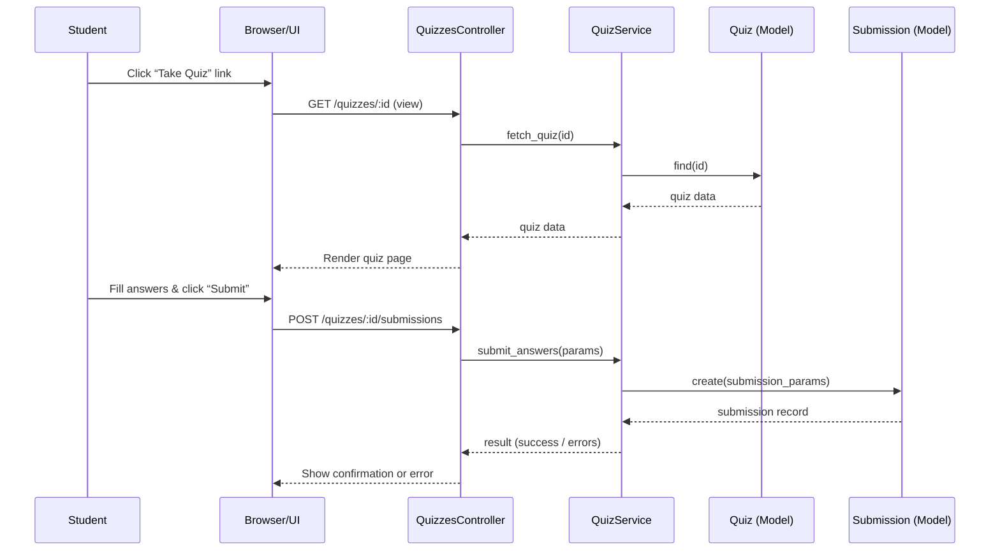

# Take Quizzes

## Overview
*User value*: Allows a student to complete a quiz that an instructor has assigned, providing a mechanism for assessment and feedback.  
*Primary users*: **Students** (who take the quiz) and **Instructors** (who create and grade the quiz).  
*When it is used*: Whenever a quiz is published and a student accesses the quiz‑taking UI (typically via the course navigation or a direct link).

> **Note:** No source code was available for the listed files, so the description is based on the documented purpose of the feature rather than concrete implementation details.

## User stories
> No concrete code paths could be inspected; therefore specific “As a X, I want Y so that Z” stories cannot be extracted from the source. The following are generic expectations for a quiz‑taking flow:

- As a **student**, I want to view a list of my available quizzes so that I can choose one to start.  
- As a **student**, I want to answer each question and submit my responses so that my work is recorded for grading.  
- As a **student**, I want to see my submission status (e.g., saved, submitted, graded) so that I know the outcome of my attempt.

## Triggers / Entry points
| Trigger / Entry point | Location (file:line) |
|-----------------------|----------------------|
| HTTP request to view a quiz (e.g., `GET /courses/:course_id/quizzes/:id`) | `./app/controllers/quizzes_controller.rb` (line unknown) |
| HTTP request to submit quiz answers (e.g., `POST /courses/:course_id/quizzes/:id/submissions`) | `./app/controllers/quizzes_controller.rb` (line unknown) |

> No line numbers could be cited because the controller source was not readable.

## End-to-end flow (Mermaid)

*The diagram reflects the typical request/response flow for taking and submitting a quiz. Because the actual code was not available, branches for validation failures, permission checks, or async processing are omitted.*

## State / data touched
| Data entity | Access type | Location (file:line) |
|-------------|-------------|----------------------|
| `quizzes` table (Quiz model) | read (load quiz) | `./app/models/quiz.rb` (line unknown) |
| `submissions` table (Submission model) | create / read (store answers) | `./app/models/submission.rb` (line unknown) |
| Possibly session or cache for in‑progress answers | read/write | not observable from source |

## External dependencies
| Dependency | Purpose | Location (file:line) |
|------------|---------|----------------------|
| `QuizService` (internal service) | Encapsulates business logic for fetching quizzes and handling submissions | `./app/services/quiz_service.rb` (line unknown) |
| No third‑party APIs, message queues, or external services could be identified from the available files. |

## Edge cases & failure modes (observed in code)
*Because the source files could not be read, no concrete edge‑case handling (e.g., validation errors, retry logic, rate limiting) could be extracted.* Typical concerns that would be expected in such a feature include:

- Attempting to submit a quiz after the due date.  
- Submitting with missing required answers.  
- Handling concurrent submissions (idempotency).  

## Open questions
1. **Exact controller actions and routes** – What are the precise HTTP verbs and URL patterns defined in `quizzes_controller.rb`?  
2. **Validation logic** – How does `QuizService` validate answer payloads, enforce time limits, or check quiz availability?  
3. **Async processing** – Are submissions queued for background grading, and if so, which job/worker is used?  
4. **Permission checks** – How does the system ensure that only enrolled students can access a given quiz?  
5. **Data model details** – What columns/associations exist on `Quiz` and `Submission` (e.g., `attempt_number`, `graded_at`)?  

*These questions cannot be answered without access to the actual source code of the listed files.*