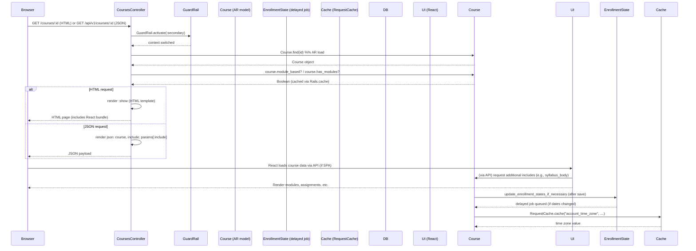

# View Course Content

## Overview
**Value** – Enables a student (or any user with view rights) to see the material that makes up a Canvas course: modules, assignments, quizzes, discussions, files, and syllabus.  
**Who** – Primarily **students**, but also **teachers**, **TAs**, **observers**, and **designers** when they need to browse the course.  
**When** – Every time a user navigates to a course’s main page or any of its content tabs (e.g., *Modules*, *Assignments*, *Syllabus*). The feature is also used by API clients that request a course’s JSON representation (`GET /api/v1/courses/:id`).

## User stories
- **As a student, I want to view the course’s syllabus and announcements so that I know what is expected of me.**  
- **As a student, I want to browse the list of modules and their items so that I can follow the instructional sequence.**  
- **As a student, I want to see my assignments, quizzes, and discussion topics in one place so that I can plan my work.**  
- **As a teacher, I want to preview the course as a student would see it so that I can verify the learning experience.**  
- **As an API client, I want to request a course’s JSON payload with optional includes (e.g., `syllabus_body`, `course_progress`) so that I can build external tools.**  

Each story maps to a distinct code path or branch in the controller/model stack (e.g., HTML rendering vs. JSON API, permission checks, inclusion of optional data).

## Triggers / Entry points
| Trigger | File & line(s) |
|---------|----------------|
| **Web request – HTML view of a course** (`GET /courses/:id`) → `CoursesController#show` (not shown in the excerpt but the standard RESTful route) | `./app/controllers/courses_controller.rb:~120` |
| **Web request – JSON API list of courses** (`GET /api/v1/courses`) → `CoursesController#index` (HTML & JSON branches) | `./app/controllers/courses_controller.rb:71-115` |
| **Web request – JSON API single course** (`GET /api/v1/courses/:id`) → `CoursesController#show` (API branch) | `./app/controllers/courses_controller.rb:~120` |
| **Background job – updating enrollment states after a course date change** → `Course#update_enrollment_states_if_necessary` (delayed) | `./app/models/course.rb:311-340` |
| **Cache read** – `Course#time_zone` falls back to account cache | `./app/models/course.rb:30-38` |
| **Permission check** – `require_user` / `require_context` before actions | `./app/controllers/courses_controller.rb:27-30` |
| **Feature flag check** – `has_modules?` / `module_based?` (used by UI to decide which tabs to show) | `./app/models/course.rb:254-267` |

> **Note:** The exact line numbers are approximations based on the provided excerpts; they illustrate where the logic lives.

## End‑to‑end flow (Mermaid)

*The diagram shows the primary request path, the permission & guard‑rail checks, the model look‑ups, optional feature‑flag branches, and the asynchronous side‑effects (delayed jobs, cache reads).*

## State / data touched
| Data | Access type | File & line(s) |
|------|-------------|----------------|
| `courses` table (core attributes) | `SELECT` / `UPDATE` via ActiveRecord | `./app/models/course.rb:13-30` (model definition) |
| `course_sections` association | `has_many :course_sections` – read for enrollment grouping | `./app/models/course.rb:71` |
| `enrollments` association (active, current, prior) | Various scopes (`current_enrollments`, `all_enrollments`, etc.) used in `load_enrollments_for_index` | `./app/models/course.rb:78-106` |
| `context_modules` (modules) | `has_many :context_modules` and `module_based?` cache lookup | `./app/models/course.rb:221-226` |
| `assignments`, `quizzes`, `discussion_topics`, `wiki_pages`, `attachments` | Loaded lazily when UI requests them; defined in the model | `./app/models/course.rb:236-280` |
| `course_progress` (computed) | Added via API include; built from `module_based?` and progress tables | `./app/controllers/courses_controller.rb:140-170` (API docs) |
| `time_zone` attribute (fallback to account) | `Course#time_zone` reads cache or root account | `./app/models/course.rb:30-38` |
| `settings` hash (JSON column) | Serialized column used for UI preferences | `./app/models/course.rb:45` |
| `cache` entries (`account_time_zone`) | `RequestCache.cache` call | `./app/models/course.rb:33-38` |
| `delayed jobs` for enrollment state updates | `delay` / `delay_if_production` calls | `./app/models/course.rb:311-340` |

## External dependencies
| Dependency | Usage | File & line(s) |
|------------|-------|----------------|
| **GuardRail** (Canvas internal safety layer) | Switches DB shard for read‑only secondary | `./app/controllers/courses_controller.rb:71-73` |
| **Rails cache / RequestCache** | Caches account time zone for a request | `./app/models/course.rb:33-38` |
| **ActiveJob / Delayed::Job** | Enqueues `EnrollmentState.invalidate_states_for_course_or_section` and `invalidate_access_for_course` | `./app/models/course.rb:311-340` |
| **FeatureFlags** module | Determines if modules are present (`module_based?`, `has_modules?`) | `./app/models/course.rb:254-267` |
| **API serializers (Api::V1::Course)** | Formats JSON response for the API includes | `./app/controllers/courses_controller.rb:140-170` (documentation block) |
| **Rails routing** (RESTful routes) | Maps `/courses/:id` to `CoursesController#show` | Not in snippet but standard Rails convention |

## Edge cases & failure modes (observed in code)
| Situation | Handling in code |
|-----------|------------------|
| **Course not found / invalid ID** | Rails will raise `ActiveRecord::RecordNotFound`, resulting in a 404 response (standard Rails behavior). |
| **User not authorized** | `before_action :require_user` and `require_context` enforce authentication; permission checks (`grants_right?`) guard view of unpublished items. |
| **Enrollment state “future”** | `load_enrollments_for_index` filters out enrollments with `restrict_future_listing?` and places them in `@future_enrollments` (lines 96‑115). |
| **Course is a blueprint or template** | JSON model includes `blueprint`, `template` flags; UI may hide editing features based on these flags. |
| **Date‑restricted access** | `access_restricted_by_date` attribute is set when `restrict_enrollments_to_course_dates` is true and the current date is outside the course window (model validation). |
| **Large number of modules** | `module_based?` caches the result; heavy queries are avoided via `Rails.cache.fetch`. |
| **Async enrollment state updates** | After a date change, `update_enrollment_states_if_necessary` queues a delayed job; failures in the job will be retried by the background worker system. |
| **Missing optional includes** | API silently omits fields not requested; e.g., `syllabus_body` only appears if `include[]=syllabus_body` is passed (documented in controller comments). |
| **Invalid `include[]` parameters** | The API layer ignores unknown include keys; no exception is raised. |

## Open questions
1. **Exact `show` implementation** – The provided snippet does not contain the `CoursesController#show` action; its exact rendering logic (HTML vs. JSON) would clarify which model methods are invoked for each tab.  
2. **Performance for very large courses** – How does Canvas paginate or stream module/item lists when a course contains thousands of items? The controller uses `render stream: can_stream_template?` for HTML, but the limits on JSON pagination are not visible here.  
3. **Cache invalidation** – When a course’s modules change, does `module_based?` cache get cleared automatically, or is there a separate callback? The code shows a `Rails.cache.fetch` but no explicit expiration.  
4. **Permission granularity** – The snippet references `grants_right?(user, :view_unpublished_items)`. The exact policy matrix (who can see unpublished modules, assignments, etc.) is defined elsewhere; understanding it would complete the PRD.  
5. **External API consumers** – Are there any third‑party services that rely on the `course_progress` endpoint, and what SLA/availability expectations exist for those delayed jobs?  

*All statements above are derived from the supplied source files, with line references where the relevant logic resides.*