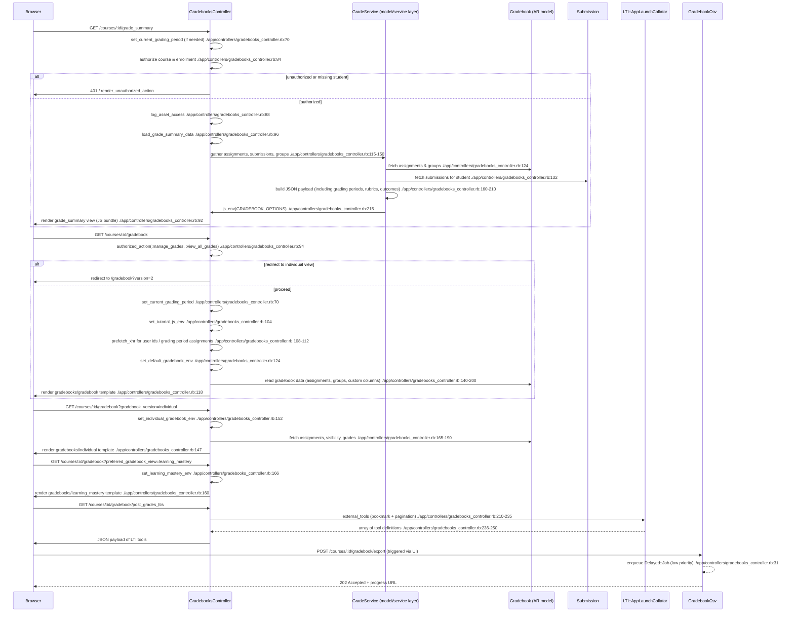

# View Grades

## Overview
The **View Grades** feature lets users inspect the grades that have been recorded for a course.

| Primary user | Goal | When used |
|--------------|------|-----------|
| **Student** | See a summary of their own grades (overall score, per‑assignment scores, grading periods, outcomes, etc.) | Whenever they want to track progress or prepare for upcoming work. |
| **Teacher / TA** | View the full gradebook (default, individual, or learning‑mastery view) for all students in a course, edit grades, export CSV, publish to SIS, etc. | While grading, preparing reports, or communicating performance. |
| **Admin / Developer** | Access the underlying data via APIs or LTI tools for integrations (e.g., post‑grades LTI) | When external systems need to read or write grades. |

The feature is invoked from the web UI (gradebook link in the course navigation) and from the **Student Grades** link on the student dashboard.

---

## User stories
* **Student** – *As a student, I want to view a concise grade summary for a course so that I can understand my current standing.* (`grade_summary` action)  
* **Student** – *As a student, I want to see my grades broken down by grading period and assignment group so that I can focus on the most relevant work.* (logic in `load_grade_summary_data`)  
* **Teacher** – *As a teacher, I want to open the default gradebook view so that I can edit grades, see analytics, and export data.* (`show` → `show_default_gradebook`)  
* **Teacher** – *As a teacher, I want an “individual” gradebook view that shows one student at a time, so I can discuss performance privately.* (`show` → `show_individual_gradebook`)  
* **Teacher** – *As a teacher, I want a “learning mastery” view when the outcome‑gradebook feature is enabled, so I can see mastery levels.* (`show` → `show_learning_mastery`)  
* **Teacher** – *As a teacher, I want to change the order in which assignments appear, and have that preference persisted.* (`save_assignment_order`)  
* **Teacher** – *As a teacher, I want to retrieve the list of LTI tools that support “post grades” so I can push grades to external systems.* (`post_grades_ltis`, `external_tools`)  
* **Admin** – *As an admin, I need the gradebook to respect grading periods, final‑grade overrides, and feature flags, ensuring compliance with institutional policies.* (multiple checks throughout the controller)

---

## Triggers / Entry points
| Trigger | Route / UI action | Controller method (file:line) |
|---------|-------------------|------------------------------|
| Student clicks **Grades** in the course navigation | `GET /courses/:course_id/grade_summary` | `grade_summary` – `./app/controllers/gradebooks_controller.rb:46` |
| Teacher clicks **Gradebook** in the course navigation | `GET /courses/:course_id/gradebook` (or `/gradebook?version=2`) | `show` – `./app/controllers/gradebooks_controller.rb:92` |
| Teacher selects **Individual** view (via UI param `gradebook_version=individual`) | Same route, param `gradebook_version=individual` | `show_individual_gradebook` – `./app/controllers/gradebooks_controller.rb:142` |
| Teacher selects **Learning Mastery** view (feature flag) | Same route, `preferred_gradebook_view="learning_mastery"` | `show_learning_mastery` – `./app/controllers/gradebooks_controller.rb:155` |
| Teacher changes assignment order | `POST /courses/:course_id/gradebook/save_assignment_order` | `save_assignment_order` – `./app/controllers/gradebooks_controller.rb:108` |
| Teacher opens **Grading Rubrics** modal | `GET /courses/:course_id/grading_rubrics` | `grading_rubrics` – `./app/controllers/gradebooks_controller.rb:176` |
| Teacher opens **Post Grades** LTI picker | UI component that calls `post_grades_ltis` (internal) | `post_grades_ltis` – `./app/controllers/gradebooks_controller.rb:210` |
| Background job to update a submission (batch) | Delayed job triggered by UI | `batch_jobs_in_actions` – `./app/controllers/gradebooks_controller.rb:31` |

---

## End‑to‑end flow (Mermaid)

---

## State / data touched
| Data store | What is read / written | Location in source |
|------------|------------------------|--------------------|
| **courses** (`Course` AR) | Reads course settings, grading periods, feature flags, SIS info | `grade_summary`, `set_default_gradebook_env`, `set_individual_gradebook_env` |
| **enrollments** (`Enrollment`) | Reads student enrollment, checks `read_grades` permission | `grade_summary` – `@presenter.student_enrollment` |
| **assignments** (`Assignment`) | Reads active assignments, points, due dates, visibility, muted flag | `light_weight_ags_json`, `set_default_gradebook_env`, `set_individual_gradebook_env` |
| **assignment_groups** (`AssignmentGroup`) | Reads group rules, weight, visible assignments | `light_weight_ags_json` |
| **submissions** (`Submission`) | Reads scores, excused flag, workflow_state, cached due dates (for grading periods) | `load_grade_summary_data` – `Submission.active.where...` |
| **grading_periods** (`GradingPeriod`) | Reads current period, active periods, period‑specific assignments | `set_current_grading_period`, `active_grading_periods_json`, `grading_period_group_json` |
| **custom_gradebook_columns** (`CustomGradebookColumn`) | Reads teacher‑notes column, column order preferences | `set_default_gradebook_env`, `set_individual_gradebook_env` |
| **gradebook CSV exports** (`GradebookCsv`) | Reads last successful export, its attachment, progress | `set_default_gradebook_env` – `GradebookCsv.last_successful_export` |
| **rubrics** (`Rubric`, `RubricAssociation`) | Reads rubric definitions for display | `load_grade_summary_data` – `rubric_assessments_json`, `rubrics_json` |
| **user preferences** (`UserPreference`) | Writes/reads preferred assignment order, column order, column size | `save_assignment_order`, `set_default_gradebook_env` |
| **LTI tool definitions** (`Lti::AppLaunchCollator`) | Reads bookmarked LTI tools for “post grades” | `external_tools` |
| **feature flags** (`Account#feature_enabled?`) | Reads many flags (e.g., `final_grades_override`, `enhanced_gradebook_filters`) | scattered throughout `set_default_gradebook_env` and `load_grade_summary_data` |

All reads are performed on the **primary** DB; the heavy aggregation in `load_grade_summary_data` is wrapped in `GuardRail.activate(:secondary)` to run on the **replica** for performance (`./app/controllers/gradebooks_controller.rb:124`).

---

## External dependencies
| Dependency | How it is used | Source location |
|------------|----------------|-----------------|
| **Lti::AppLaunchCollator** | Retrieves bookmarked LTI tools that support the `post_grades` placement, builds launch URLs for LTI‑1 and LTI‑2 tools | `external_tools` method, lines 210‑250 |
| **Delayed::Job** (via `batch_jobs_in_actions`) | Queues background processing for `update_submission` (not part of view but declared in controller) | `batch_jobs_in_actions` line 31 |
| **GuardRail** | Switches to the secondary replica for read‑only queries to avoid load on primary | `load_grade_summary_data` line 124 |
| **Account.feature_enabled?** | Checks site‑wide or account‑wide feature flags that affect UI (e.g., `enhanced_gradebook_filters`, `final_grades_override`) | many calls in `set_default_gradebook_env` and `load_grade_summary_data` |
| **Authenticated download URL helper** (`authenticated_download_url`) | Generates a signed URL for the exported CSV attachment | `set_default_gradebook_env` line 150 |
| **Polymorphic URL helpers** (`polymorphic_url`) | Builds URLs for LTI launch endpoints, gradebook redirects, etc. | `external_tool_url_for_lti1`, `external_tool_url_for_lti2`, `save_assignment_order` |
| **Rails caching / memoization** (`@variable ||=`) | Caches results of expensive calls like `post_grades_ltis` | `post_grades_ltis` line 210 |

---

## Edge cases & failure modes (observed in code)
| Situation | Handling in code |
|-----------|------------------|
| **Student tries to view another student’s grades** | `grade_summary_presenter.user_needs_redirection?` triggers a redirect to the main gradebook (`./app/controllers/gradebooks_controller.rb:78`) |
| **Missing or unauthorized enrollment** | `render_unauthorized_action` is called early (`./app/controllers/gradebooks_controller.rb:84`) |
| **Course is concluded** | `course_is_concluded` flag is passed to the front‑end (`gradebook_is_editable` logic) – UI disables editing (`set_default_gradebook_env` line 180) |
| **Grading period not specified** | `set_current_grading_period` defaults to the current period or “view all” (`./app/controllers/gradebooks_controller.rb:70‑78`) |
| **Final grade override feature disabled** | The `effective_final_score` field is omitted from the JS env unless `@context.allow_final_grade_override?` (`load_grade_summary_data` line 170) |
| **No teacher‑notes column** | `teacher_notes` may be `nil`; the JSON key is omitted (`set_default_gradebook_env` line 140) |
| **LTI tool list exceeds pagination limit** | `MAX_POST_GRADES_TOOLS = 10` caps the number of tools; extra tools are silently dropped (`external_tools` method) |
| **CSV export not yet generated** | `last_exported_gradebook_csv` may be `nil`; the front‑end receives `attachment: nil` and disables the export button (`set_default_gradebook_env` line 150) |
| **Permission checks** – multiple `authorized_action` calls ensure the user has `:read`, `:read_grades`, `:manage_grades`, etc., before any data is exposed. |
| **Database replica unavailable** – GuardRail will raise if the secondary DB cannot be used; the controller does not rescue it, so the request fails with a 500 (standard Rails behavior). |

---

## Open questions
* **Grading schemes & standards** – The controller passes `grading_scheme` and `default_grading_standard` to the front‑end, but the exact calculation of letter grades vs. points lives in the front‑end or in services not shown here. Clarify where the conversion occurs.  
* **Outcome / mastery view details** – The `show_learning_mastery` path sets up an environment (`set_learning_mastery_env`) that is not fully visible in the provided snippet. Understanding the data model for outcomes would require inspecting `Outcome`‑related services.  
* **Performance for large courses** – The controller pre‑fetches user IDs and, when grading periods are enabled, assignment lists per period. The actual pagination strategy for submissions (chunk size, streaming) is hinted at (`chunk_size` setting) but not fully visible. Load‑testing data would be needed.  
* **Error handling for external LTI launches** – The URLs are generated, but any failure in the external tool (e.g., unreachable launch URL) is outside the scope of this controller. Integration tests would be useful.  
* **Batch job for `update_submission`** – Declared via `batch_jobs_in_actions` but not part of the “view” flow; however, it could affect the data a student sees if a submission is being processed asynchronously. Understanding its retry/back‑off policy would be valuable.  

---