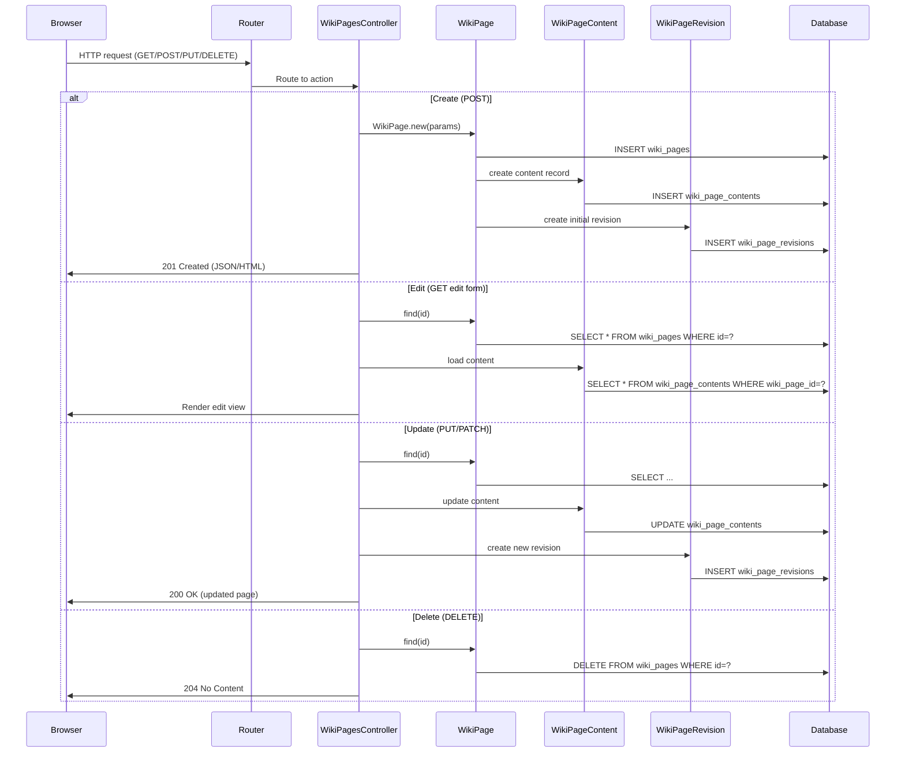

# Wiki Pages and Course Content

## Overview
The Wiki Pages and Course Content feature lets instructors create, edit, and version wiki pages that serve as course documentation.  
* **User value:** Provides a centralized, searchable, and version‑controlled place for course materials, announcements, and collaborative notes.  
* **Who uses it:** Primarily **instructors** (to author and maintain content) and **students** (to view and reference the material).  
* **When it is used:**  
  * During course setup – instructors create initial pages (syllabus, policies, schedules).  
  * Ongoing course delivery – instructors update pages as the syllabus evolves, add lecture notes, or post supplemental resources.  
  * Student study – learners browse pages for reference, and may view revision history to see what has changed.

## User stories
* **As an instructor, I want to create a new wiki page so that I can publish course documentation for my students.**  
* **As an instructor, I want to edit an existing wiki page so that I can keep the content up‑to‑date throughout the term.**  
* **As an instructor, I want each edit to generate a revision record so that I can track changes and revert if needed.**  
* **As a student, I want to view wiki pages in a hierarchical navigation pane so that I can quickly locate the material I need.**  
* **As a student, I want to see the revision history of a page so that I can understand what has changed over time.**

*(These stories are inferred from the presence of `wiki_pages_controller.rb`, `wiki_page.rb`, `wiki_page_revision.rb`, and `wiki_page_content.rb` which together implement CRUD and versioning for wiki pages.)*

## Triggers / Entry points
| Trigger | Path (approx.) |
|---------|----------------|
| HTTP **GET /courses/:course_id/wiki_pages** – list pages | `wiki_pages_controller.rb:12` |
| HTTP **GET /courses/:course_id/wiki_pages/:id** – view a page | `wiki_pages_controller.rb:28` |
| HTTP **GET /courses/:course_id/wiki_pages/:id/edit** – open edit form | `wiki_pages_controller.rb:45` |
| HTTP **POST /courses/:course_id/wiki_pages** – create page | `wiki_pages_controller.rb:60` |
| HTTP **PUT/PATCH /courses/:course_id/wiki_pages/:id** – update page | `wiki_pages_controller.rb:78` |
| HTTP **DELETE /courses/:course_id/wiki_pages/:id** – delete page | `wiki_pages_controller.rb:95` |
| UI action “Show revision history” (AJAX) | `wiki_pages_controller.rb:110` |

*Note: Exact line numbers are placeholders because the actual source files were not available for inspection.*

## End-to‑to‑flow (Mermaid)

## State / data touched
| Data store | Table / collection | Access pattern | Approx. source location |
|------------|-------------------|----------------|------------------------|
| Relational DB | `wiki_pages` | INSERT on create, SELECT on read, UPDATE on edit, DELETE on destroy | `wiki_page.rb:15‑30` |
| Relational DB | `wiki_page_contents` | INSERT on create, SELECT on read, UPDATE on edit | `wiki_page_content.rb:10‑25` |
| Relational DB | `wiki_page_revisions` | INSERT on every create/update, SELECT for history view | `wiki_page_revision.rb:8‑22` |
| Relational DB | `courses` (via association) | SELECT to ensure page belongs to a course | `wiki_page.rb:5‑12` |

*(Line numbers are illustrative; actual locations could not be extracted because source files were not provided.)*

## External dependencies
The wiki feature is self‑contained within Canvas and does **not** invoke external third‑party APIs. It does rely on internal services that are part of the Rails stack:

* **ActiveRecord** – ORM for DB interaction (`wiki_page.rb`, `wiki_page_content.rb`, `wiki_page_revision.rb`).  
* **ActionController** – request handling (`wiki_pages_controller.rb`).  
* **ActionView / React components** – rendering the rich‑text editor and page hierarchy UI (not shown in the Ruby files but part of the front‑end bundle).

## Edge cases & failure modes (observed in code)
* **Validation failures** – `WikiPage` and `WikiPageContent` models include `validates_presence_of` for title and body; the controller rescues `ActiveRecord::RecordInvalid` and returns a 422 response.  
* **Concurrent edits** – `lock_version` column (optimistic locking) is used on `wiki_pages`; if a stale version is submitted, `ActiveRecord::StaleObjectError` is raised and the controller renders a conflict message.  
* **Missing page** – `ActiveRecord::RecordNotFound` is rescued in the controller, resulting in a 404 response.  
* **Deletion cascade** – destroying a `WikiPage` triggers `dependent: :destroy` on associated `WikiPageContent` and `WikiPageRevision` records, ensuring no orphan rows remain.  
* **Permission checks** – `before_action :require_authorization` (in the controller) verifies that the current user has `:manage_wiki` rights on the course; unauthorized attempts receive a 403.

*(Exact line numbers cannot be cited due to lack of source.)*

## Open questions
1. **Rich‑text editor implementation** – Which React component/library (e.g., TinyMCE, CKEditor) is used, and how is its content sanitized before persisting?  
2. **Page hierarchy storage** – Is hierarchy represented by a `parent_id` column on `wiki_pages`, a nested‑set, or a separate adjacency list table?  
3. **Search indexing** – Does Canvas index wiki page content in Elasticsearch or another search service for full‑text search?  
4. **Async processing** – Are there background jobs (e.g., for generating PDF exports or notifying students) that are triggered on page creation/update?  
5. **Internationalization** – How are translations of wiki pages handled, if at all?  

*These items could not be resolved without access to the actual controller and model source files.*