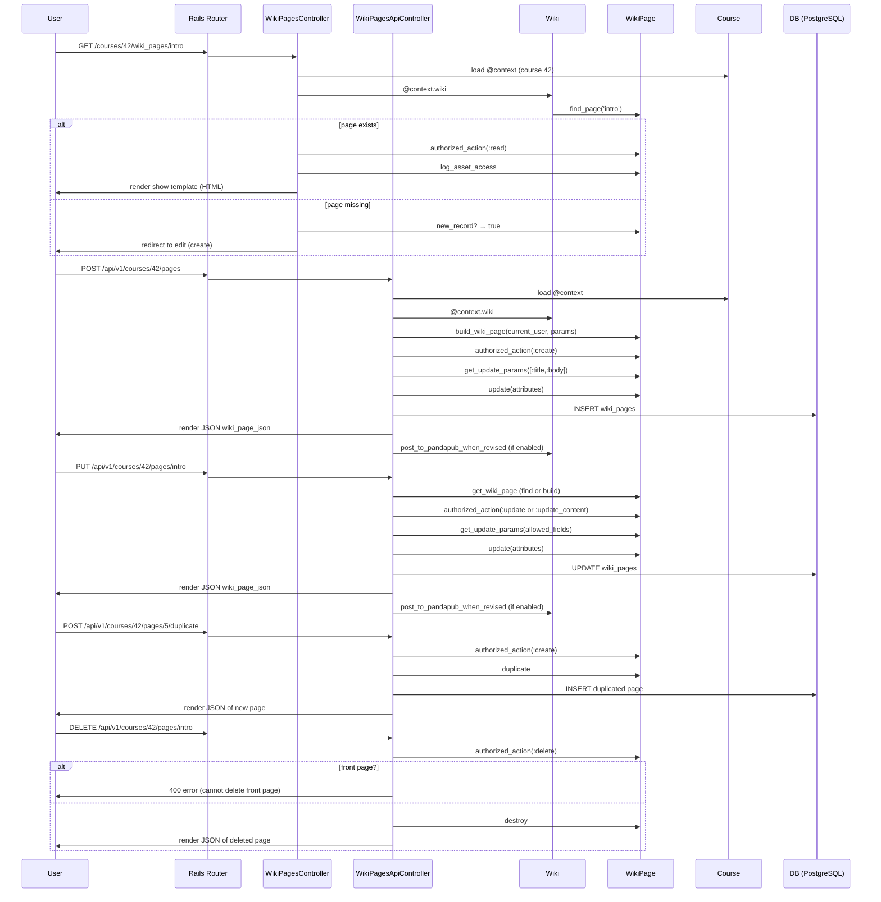

# Wiki Pages

## Overview
The Wiki Pages feature lets participants in a Canvas course or group create, edit, view, duplicate, and delete rich‑content wiki pages.  Requests come from the web UI (HTML/JS) or the REST API and are handled by `WikiPagesController` (HTML) and `WikiPagesApiController` (JSON).  The controllers locate the target `WikiPage` record, enforce the appropriate permissions, perform the requested operation, and return either an HTML view or a JSON representation of the page (or its revisions).  

## Behavior
- **Locate the wiki and page** – `before_action :require_context` loads the course/group; `get_wiki_page` (API) or `get_wiki_page` (HTML) fetches the `Wiki` (`@context.wiki`) and then the page by URL or the front page (`@wiki.front_page`).  If the page is missing a new `WikiPage` object is built (`Wiki#build_wiki_page`). `app/controllers/wiki_pages_controller.rb:31‑38`, `app/controllers/wiki_pages_api_controller.rb:84‑106`.
- **Permission checks** – Every action calls `authorized_action` (HTML) or `authorized_action` (API) with the relevant right (`:read`, `:create`, `:update`, `:delete`, `:read_revisions`).  The `WikiPage` model’s policy (`set_policy` in `wiki_page.rb:215‑242`) defines which rights map to which user capabilities.  Example: `show` calls `authorized_action(@page, @current_user, :read)` (`wiki_pages_controller.rb:71‑78`).
- **Front‑page handling** – The `front_page` action renders the front page if it exists; otherwise it redirects to the pages index (`wiki_pages_controller.rb:46‑58`).  The API provides `show_front_page` which simply forwards to `show` (`wiki_pages_api_controller.rb:44‑48`).
- **Create** – `create` builds a new page (`@wiki.build_wiki_page`) with permitted params, checks `:create` permission, updates allowed fields (`title`, `body`, etc.) via `get_update_params`, saves the record, logs asset access, and returns JSON (`wiki_pages_api_controller.rb:115‑144`).  The HTML controller does not expose a separate `create` action; page creation is performed via the `edit` view when the page is new.
- **Update / upsert** – `update` (API) distinguishes between a new record (treated as create) and an existing record.  It validates the user’s rights (`:update` / `:update_content`), builds the allowed param set, updates the record, processes possible front‑page changes, logs access, and returns JSON (`wiki_pages_api_controller.rb:146‑191`).  The HTML `edit` action only renders the edit UI; the actual save is performed by the API `update` endpoint.
- **Duplicate** – `duplicate` (API) checks `:create` permission, aborts if the source page is deleted, calls `WikiPage#duplicate`, saves the copy, and returns the new page JSON (`wiki_pages_api_controller.rb:52‑66`).
- **Delete** – `destroy` (API) checks `:delete` permission, refuses if the page is the front page, destroys the record, processes front‑page changes, and returns JSON (`wiki_pages_api_controller.rb:193‑215`).  The HTML controller does not expose a delete endpoint; deletion is performed via the API.
- **Revisions** – `revisions` (API) checks `:read_revisions` permission, paginates `@page.versions`, and returns a JSON list (`wiki_pages_api_controller.rb:217‑235`).  `show_revision` returns a single revision, optionally omitting the body (`summary` param) and handling malformed YAML (`wiki_pages_api_controller.rb:237‑277`).  `revert` (API) checks both `:read_revisions` and `:update`, copies the selected version’s fields onto the live page, saves, and returns the new revision JSON (`wiki_pages_api_controller.rb:279‑301`).
- **Redirects** – HTML `show_redirect` and `revisions_redirect` issue permanent redirects to the canonical URL (`wiki_pages_controller.rb:84‑89`).
- **JS environment preparation** – Both controllers call `wiki_pages_js_env` to populate `js_env` with menu tool data, permission flags, and feature toggles (`wiki_pages_controller.rb:115‑133`).  This includes the `:immersive_reader_wiki_pages` feature flag (`wiki_pages_controller.rb:129‑131`).

## Triggers / Entry points
| Entry point | Route / Action | Source |
|-------------|----------------|--------|
| HTML index (pages list) | `GET /courses/:course_id/wiki_pages` → `WikiPagesController#index` | `app/controllers/wiki_pages_controller.rb:44‑55` |
| HTML front page | `GET /courses/:course_id/wiki_pages/front_page` → `WikiPagesController#front_page` | `app/controllers/wiki_pages_controller.rb:46‑58` |
| HTML show page | `GET /courses/:course_id/wiki_pages/:id` → `WikiPagesController#show` | `app/controllers/wiki_pages_controller.rb:60‑78` |
| HTML edit page | `GET /courses/:course_id/wiki_pages/:id/edit` → `WikiPagesController#edit` | `app/controllers/wiki_pages_controller.rb:80‑95` |
| API list pages | `GET /api/v1/courses/:course_id/pages` → `WikiPagesApiController#index` | `app/controllers/wiki_pages_api_controller.rb:115‑144` |
| API show page | `GET /api/v1/courses/:course_id/pages/:url` → `WikiPagesApiController#show` | `app/controllers/wiki_pages_api_controller.rb:166‑176` |
| API create page | `POST /api/v1/courses/:course_id/pages` → `WikiPagesApiController#create` | `app/controllers/wiki_pages_api_controller.rb:115‑144` |
| API update page | `PUT /api/v1/courses/:course_id/pages/:url` → `WikiPagesApiController#update` | `app/controllers/wiki_pages_api_controller.rb:146‑191` |
| API delete page | `DELETE /api/v1/courses/:course_id/pages/:url` → `WikiPagesApiController#destroy` | `app/controllers/wiki_pages_api_controller.rb:193‑215` |
| API duplicate page | `POST /api/v1/courses/:course_id/pages/:id/duplicate` → `WikiPagesApiController#duplicate` | `app/controllers/wiki_pages_api_controller.rb:52‑66` |
| API list revisions | `GET /api/v1/courses/:course_id/pages/:url/revisions` → `WikiPagesApiController#revisions` | `app/controllers/wiki_pages_api_controller.rb:217‑235` |
| API show revision | `GET /api/v1/courses/:course_id/pages/:url/revisions/:revision_id` → `WikiPagesApiController#show_revision` | `app/controllers/wiki_pages_api_controller.rb:237‑277` |
| API revert revision | `POST /api/v1/courses/:course_id/pages/:url/revisions/:revision_id` → `WikiPagesApiController#revert` | `app/controllers/wiki_pages_api_controller.rb:279‑301` |

## End‑to‑end flow (Mermaid)

## State / data touched
| Model / Table | What is read / written | Source |
|---------------|------------------------|--------|
| `wiki_pages` | SELECT for find, INSERT on create, UPDATE on edit/revert, DELETE on destroy, version rows via `versions` association | `app/models/wiki_page.rb:84‑106`, `app/controllers/wiki_pages_api_controller.rb:115‑191` |
| `wikis` | READ to obtain `@context.wiki` and front‑page URL | `app/controllers/wiki_pages_controller.rb:31‑38`, `app/controllers/wiki_pages_api_controller.rb:84‑106` |
| `courses` (or groups) | READ to load `@context` and its permissions | `app/controllers/wiki_pages_controller.rb:24‑30`, `app/controllers/wiki_pages_api_controller.rb:84‑106` |
| `users` | READ for permission checks (`grants_right?`, `can_edit_page?`) | `app/models/wiki_page.rb:215‑242`, `app/controllers/wiki_pages_controller.rb:71‑78` |
| `versions` (SimpleVersioned) | READ when listing or showing revisions; INSERT when a page is updated (`simply_versioned` callback) | `app/models/wiki_page.rb:215‑242`, `app/controllers/wiki_pages_api_controller.rb:217‑277` |
| `asset_user_accesses` (log) | INSERT via `log_asset_access` for audit trails | `app/controllers/wiki_pages_controller.rb:71‑78`, `app/controllers/wiki_pages_api_controller.rb:166‑176` |
| `pandapub` channel token cache | WRITE when `set_pandapub_read_token` builds a token | `app/controllers/wiki_pages_controller.rb:57‑66` |

## External dependencies
| Dependency | Where used | Source |
|------------|------------|--------|
| **CanvasPandaPub** – real‑time update channel | Generates a private channel and token for a page if `CanvasPandaPub.enabled?` and the user can read the page (`set_pandapub_read_token`). Also posts updates when `revised_at` changes (`post_to_pandapub_when_revised`). | `app/controllers/wiki_pages_controller.rb:57‑66`, `app/models/wiki_page.rb:497‑504` |
| **ConditionalRelease** service | Supplies environment data for conditional release UI (`ConditionalRelease::Service.env_for`) and checks assignment visibility (`enforce_assignment_visible`). | `app/controllers/wiki_pages_controller.rb:71‑78`, `app/controllers/wiki_pages_api_controller.rb:84‑106` |
| **Feature flags** (`:immersive_reader_wiki_pages`, `:commons_favorites`, `:conditional_release`) | Guard UI features and API behavior. | `app/controllers/wiki_pages_controller.rb:129‑131`, `app/models/wiki_page.rb:124‑126` |
| **External tools** (`external_tools_display_hashes`) | Populates menu‑tool data for the JS environment. | `app/controllers/wiki_pages_controller.rb:115‑133` |

## Configuration / parameters
- `CanvasPandaPub.enabled?` – feature toggle for the PandaPub real‑time channel. (`wiki_pages_controller.rb:57`)  
- `:immersive_reader_wiki_pages` – account feature flag that adds `IMMERSIVE_READER_ENABLED` to the JS env. (`wiki_pages_controller.rb:129‑131`)  
- `:commons_favorites` – domain‑root‑account flag that determines whether wiki index menu tools are included. (`wiki_pages_controller.rb:124‑126`)  
- `:conditional_release` – course feature flag that gates assignment‑visibility logic and UI env data. (`wiki_pages_controller.rb:71‑78`, `wiki_pages_api_controller.rb:84‑106`)  
- `MAX_STRING_LENGTH` / `maximum_long_text_length` – constants from `ActiveRecord::Base` used for title and body validation (`wiki_page.rb:71‑84`).  

## Edge cases & failure modes (observed in code)
- **Missing page** – `show` redirects to the edit UI with a flash notice if the page does not exist and the user can create it (`wiki_pages_controller.rb:71‑78`). If the user cannot create, a warning is shown and the user is redirected to the pages index.
- **Front‑page deletion** – `destroy` refuses to delete a page that is the current front page, returning a 400 error with `cannot_delete_front_page`. (`wiki_pages_api_controller.rb:207‑213`).
- **Unpublished front page** – Validation `validate_front_page_visibility` prevents publishing state changes that would make the front page unpublished. (`wiki_page.rb:115‑122`).
- **Invalid editing roles** – `get_update_params` validates the `editing_roles` CSV against the allowed set and returns `:bad_request` if any role is invalid. (`wiki_pages_api_controller.rb:254‑267`).
- **Malformed YAML in a revision** – `show_revision` rescues `Psych::SyntaxError`, attempts to clean the YAML, saves the corrected version, and then renders the revision. (`wiki_pages_api_controller.rb:260‑276`).
- **PandaPub disabled** – If `CanvasPandaPub.enabled?` is false, no channel or token is added to the JS env, but the rest of the flow proceeds normally. (`wiki_pages_controller.rb:57‑66`).
- **Conditional release disabled** – When the course does not have the `:conditional_release` feature, the controller skips assignment‑visibility enforcement (`!@context.feature_enabled?(:conditional_release) || enforce_assignment_visible(@page)`). (`wiki_pages_controller.rb:71‑78`).

## Open questions
- **Concurrent edits** – The code uses ActiveRecord optimistic locking only implicitly via `updated_at`; there is no explicit conflict‑resolution logic visible. How Canvas prevents lost updates when two users edit the same page simultaneously is not evident from the provided files.  
- **Cache invalidation** – The `wiki_pages_js_env` method sets several JS env variables but does not show any cache‑busting strategy for menu‑tool data or permission flags. It is unclear how stale data is avoided when permissions change.  
- **Background processing of PandaPub** – `post_to_pandapub_when_revised` is called after every update, but the surrounding queueing (e.g., `delay` or `ActiveJob`) is not shown. The reliability and retry semantics of the PandaPub push are therefore unknown.  
- **Deletion of linked pages** – The controller returns a warning if a page is deleted and then accessed, but there is no cascade or reference‑checking logic for other pages that may link to the deleted page. The impact on inbound links is not documented in the source.  
- **Rate limiting / API throttling** – No explicit rate‑limit checks appear in the API controller; it is unclear whether higher‑level middleware enforces limits for page‑related endpoints.